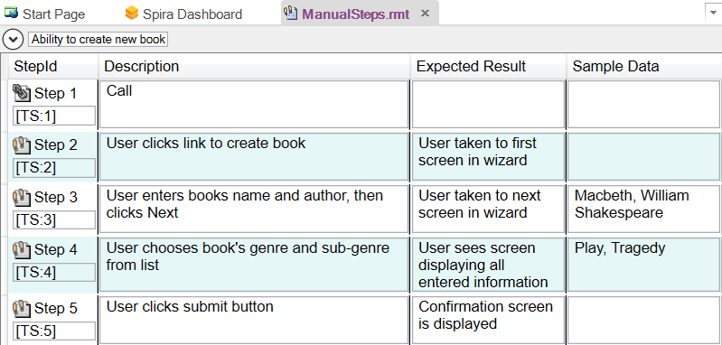

# Manual Testing

## Purpose

Manual testing is used in situations where automated testing does not make sense. This may be due to technical reasons (the application being tested does not have an API that lets tools such as Rapise interact with it) or economic reasons (e.g., this part of the application is rarely used and its user interface changes with each release).

However, Rapise can also help **accelerate and optimize** your manual testing. Rapise lets you create manual tests up to 5 times faster than creating them by hand. It integrates with Spira for test management, so you still have a central repository of version-controlled test cases. However, Rapise allows you to [edit them offline](manual_test_editor.md) when you have no connection to Spira, and also to [execute them from within Rapise](manual_playback.md).

## Usage

To begin manual testing, simply create your test as usual using the [New Test](create_a_new_test.md) dialog box.

For a purely manual test, you need to select the manual test methodology:

Then once the test has been created, click the `Tools > Manual Steps` menu. This will take you to the [Manual Editor](manual_test_editor.md) where the [Manual Test Toolbar](menu_and_toolbars.md#manual-toolbar) will be visible:

!!! note
    There will be no steps in a newly created test.

From here, you can start creating your new manual test using the [Manual Recorder](manual_testing_recording.md) and then edit the created test steps in the [Manual Editor](manual_test_editor.md). Finally, you can [save the test to Spira](spiratest_integration.md) and play it back using the [Manual Playback](manual_playback.md) screen.

In addition to being used for manual testing, the test step editor allows you to view the test steps that define the test scenario. This way, when you automate the test case, you can easily tie specific [verification points](checkpoints.md) with test steps in [Spira](spiratest_integration.md).

Finally, you can also combine manual and automated testing in the same test script, using [semi-manual](semi_manual_testing.md) testing. This allows you to automate some of the repetitive tasks in a primarily manual test case.

## Example

For a full tutorial on using manual playback, refer to the [Exploratory Testing](tutorial_exploratory_testing.md) tutorial.

In addition, a working sample of manual testing is available in [Spira](spira_dashboard.md). Simply connect to the sample **Library Information System** project and open the **Ability to Create New Book (TC2)** test case in the **Functional Tests** folder of the project. This will then display the sample manual test within Rapise:

{width="639px"}

## See Also

- [Manual Recording](manual_testing_recording.md)
- [Manual Playback](manual_testing_playback.md)
- [Exploratory Testing Tutorial](tutorial_custom_library.md)
- Dialogs, Views and Menus
    - [Manual Toolbar](menu_and_toolbars.md#manual-toolbar)
    - [Manual Test Editor](manual_test_editor.md)
    - [Manual Playback](manual_playback.md)