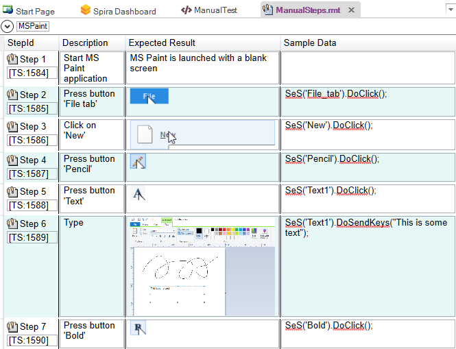
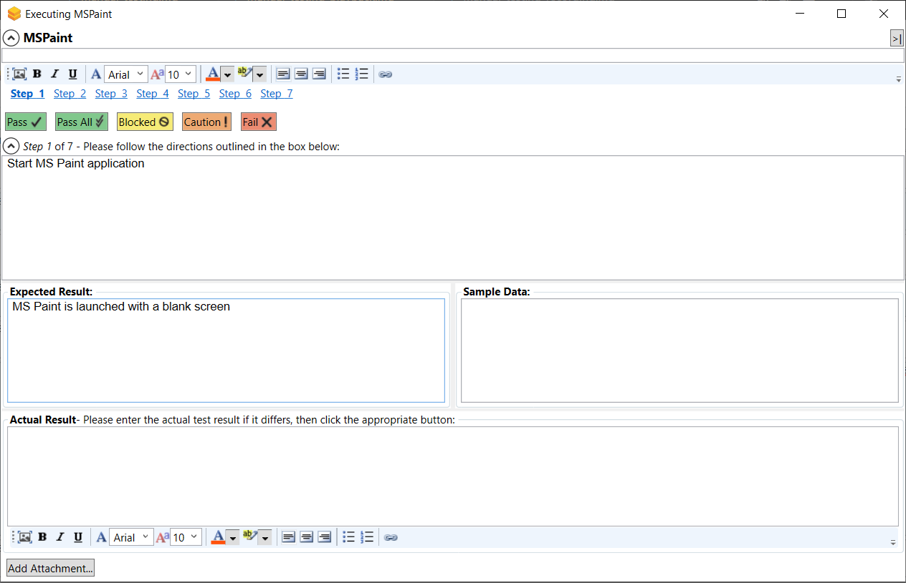

# Manual Testing: Playback

## Purpose

As described in the main [Manual Testing](manual_testing.md) topic, sometimes it is not possible to automate the testing of a specific application, however Rapise is also a powerful manual testing tool that lets you execute manual test cases stored in [SpiraTest](spiratest_integration.md).

The advantage of using Rapise to execute the manual tests (instead of just using SpiraTest itself) is that Rapise can display the [execution window](manual_playback.md) as a small minimizable dialog box that gets rid of the need to have two screens (one to display the test and one to test the application). Also Rapise provides superior [image manipulation tools](image_capture.md) over those available in a web application.

## Step 1 - Open the Manual Test

Using the MS-Paint example manual test that [we created previously](manual_testing_recording.md), open up the test in Rapise. Click on the `Tools > Manual Steps` menu and you should see the list of test steps:

Now that we have the test opened, we can start the playback.

## Step 2 - Executing the Manual Test

Choose the Release from the list of those available in the project:

{width="232px"}

Then click on the **Execute** icon to start manual test execution. That will bring up the [manual playback](manual_playback.md) screen:

On this screen, we shall follow through the steps listed in the test case. This involves opening up MS Paint, creating a new canvas, adding some lines using the pencil and then adding some text using the text tool. As you perform these steps, click on the `Pass` button to indicate that each step has passed. You can also minimize the manual playback screen by clicking the `>|` button.

Once you get to Step 6, we shall pretend that MS Paint failed to display the text correctly. Enter in the Actual Result a message to that effect:

Next we shall attach a screenshot of what actually happened and log a test failure.

## Step 3 - Capturing and Annotating a Screenshot

Click on the **Image icon** in the rich text editor associated with the **Actual Result** text box. That will bring up the [Drawing Tools](image_capture.md) screen that asks you to draw a rectangle to select a portion of the current screen to capture:

If the MS Paint application is not in the foreground, just click ++esc++ on your keyboard to abort, rearrange your windows and then try again.
Once you have selected the rectangle, the drawing tools will display your selected image in the image editor:

{width="540px"}

You can now use the annotation tools to add labels, text and other items to explain the issue that you found:

{width="540px"}

In the example above, we added a red ellipse, arrow and text to mark the issue that was seen in MS-Paint. Once you are happy with your image, click **Accept** and the image will be included in the test Actual Result:

Finally, **Fail** the Step 6 and click on the **Finish** button.

{width="453px"}

The results will be posted to [Spira](spiratest_integration.md).

## Step 4 - Viewing the Results

Now to view the results in Spira, click on the [View > View Manual Test in Spira](spira_dashboard.md) menu. That will bring up the test case in Spira. Now click on the `Failed` hyperlink in Spira and the new test run will be displayed:

{width="752px"}

If you scroll down, you can see the individual test steps that were executed, with the associated actual result (including the captured screenshot):

Congratulations! You have now successfully executed a manual test using Rapise.

## See Also
* [Manual Testing](manual_testing.md)
* [Manual Recording](manual_testing_recording.md)
