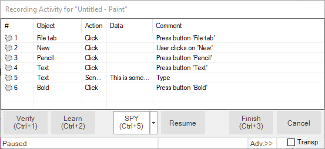
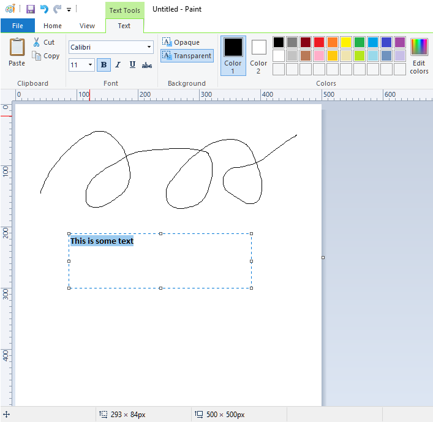
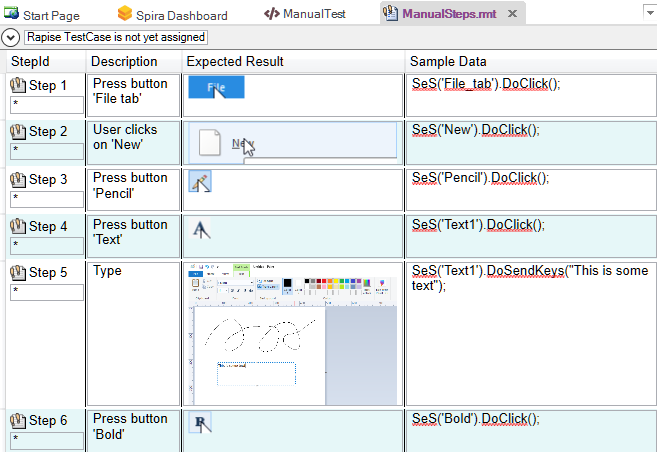
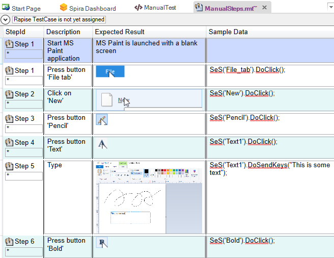
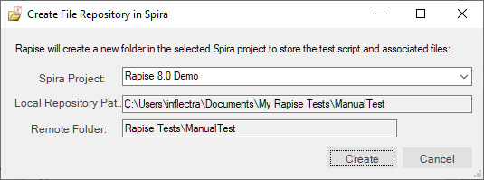
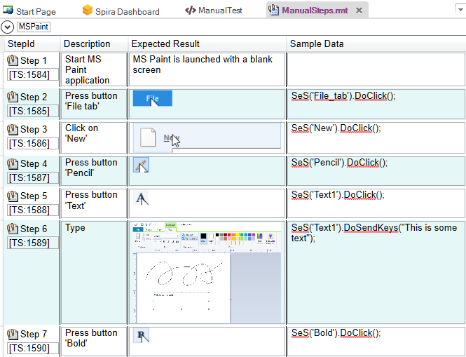
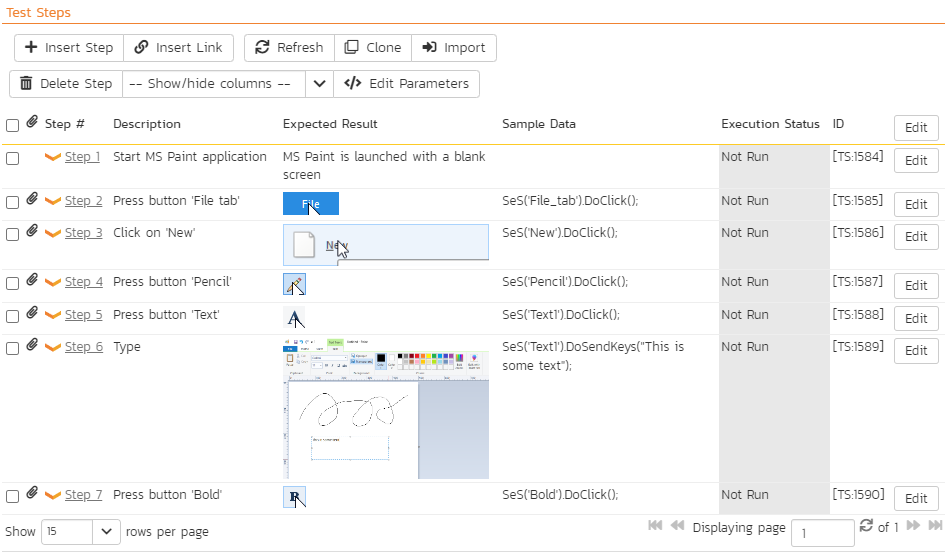

# Manual Testing: Recording

## Purpose

As described in the main [Manual Testing](manual_testing.md) topic, sometimes it is not possible to automate the testing of a specific application, however Rapise is also a powerful manual test generation system that can help you **create test cases 5x faster** than simply creating test cases by hand step by step.

This section describes how you can record a set of steps automatically by **simply using the application being tested**. Unlike an automated test however, Rapise will store a human-readable description of what was performed along with a [screenshot](image_capture.md), rather than actual computer code that can be played back by a computer.

## Step 1 - Creating a New Test

To start manual testing, simply create your test as normal using the [New Test](create_a_new_test.md) dialog box. Then once the test has been created, click on the `Tools > Manual Steps` menu and then you will be taken to the [Manual Editor](manual_test_editor.md) with the [Manual Test Toolbar](menu_and_toolbars.md#manual-toolbar) Visible:

The test step list will initially be empty.

## Step 2 - Recording Some Steps

Now you should open up the application you want to record from. In this example we shall be testing the built-in **Microsoft Paint** application. This is a good candidate for manual testing as a lot of the functionality is hard to test automatically since there is a simple drawing canvas rather than discrete buttons and data elements to test.

To make sure that we have screenshots recorded, whilst keeping the size of the screenshots reasonable, use the following recording options:

Now click the '**Record Manual**' button and choose MS-Paint from the list of running applications in [Select Application to Record](select_an_application_to_record_dialog.md) dialog and then click **'Select'** to start recording.

As you click through the application, the recording will display the list of steps and actions being captured:

In this example, we created a new canvas, chose the Pencil tool, created a drawing using the pencil, entered some text and then made it bold:

When you click **Finish** to complete the recording, Rapise will now display the list of populated manual test steps with the embedded screen captures:

You will notice that the description of each test step will use the form "User [action] at [coordinates] in '[object name]'" and the expected result will include the screenshot of what the user was doing. In addition, the sample data will contains the equivalent Rapise automation code for reference. This can be useful later if you decide to automate this test.

## Step 3 - Editing the Steps

Typically you may want to **add some additional steps** (e.g. we added a line to describe the process of starting up MS Paint), **delete any duplicate/unnecessary steps** and **reword them** so that they make the most sense to the tester. In our example we used the [manual editing](manual_test_editor.md) screen to update the steps as follows:

Click **Save** to make sure the updates are all saved locally. Now before you can [execute these tests](manual_testing_playback.md), you will need to Save them to [Spira](spiratest_integration.md) (our web-based test management system).

## Step 4 - Saving to Spira

Click on the option to **Save to Spira**, you will be asked to confirm the creation of the document folder in Spira that will hold the test files:

Click on '**Create'** and then the manual test will be saved to Spira. You will see that this process adds the unique Spira test step IDs to each step. They are displayed using the format [TS:xxx]. This special token [TS:xxx] can be used in `Tester.Assert` commands to relate specific [verification points](checkpoints.md) with test steps during automated testing.

Now that the test has been saved in Spira, you can click on the **'View in Browser'** option to see how the test steps look inside Spira.

Now this test case is ready for [manual playback](manual_playback.md).

## See Also
* [Manual Testing](manual_testing.md)
* [Manual Playback](manual_testing_playback.md)
