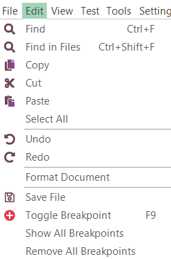
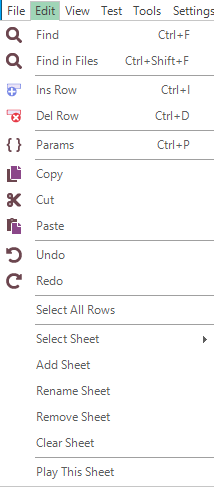
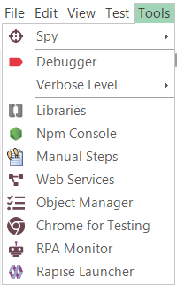
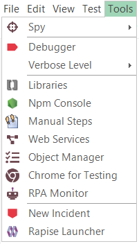

# Main Menu and Toolbars

## File

*Default*:

*Manual*:

The File menu provides quick access to all the File management functions in Rapise. Many of these are also available on the main [toolbar](#main-toolbar).

* **New Test** - creates a new Rapise test, it can be saved either to Spira or locally.
* **Open** - opens an existing test (`.sstest`) that is already available locally.
* **Open Test from Spira** - opens a test from [SpiraTest](spiratest_integration.md) test management repository and downloads to the local repository
* **Save to Spira** - saves the current test to the [Spira](spiratest_integration.md) test management system so that it updates the version in your [Spira](spiratest_integration.md) test management repository
* **Open File** - opens a single file and shows it in editor. File is not added to the current test project.
* **Recent Tests** - open one of recently used tests projects
* **Save All** (Shortcut: CTRL+S) - saves the current test project and all open documents locally. To save to a different location, use the **Save As** option in the `File > Save As`.
* **Save As**  - creates a new, differently named copy of the test project and all files explicitly included into it.
* **Exit** - exits Rapise.

-----

* **Save Manual Test to Spira**
    * Manual: Upload all modified steps to the [Spira](spiratest_integration.md) Test Case.
* **Save Manual Test Locally**
    * Manual: Save manual Test Case Steps as a local .rmt file.
* **Reload Manual Test from Spira**
    * Manual: Reload test steps from the [Spira](spiratest_integration.md) Test Case overriding local changes.

## Edit

The **Edit** menu provides tools for editing currently open script file. Menu contents depend on the active editor currently open in the [content view](content_view.md).

*Default*:

*JavaScript*:

*RVL*:

*Manual*:

* **Find**, **Find in Files** - search using the [Find and Replace Dialog](find_and_replace_dialog.md).

-----

* **Ins Row** (Shortcut: Ctrl+I)
    * RVL: Insert RVL Row before active.
* **Del Row** (Shortcut: Ctrl+D)
    * RVL: Delete active Row. If several rows selected then all of them are deleted.
* **Params** (Shortcut: Ctrl+P)
    * RVL: Show all parameters (including optional) for the currently edited action.

-----

* **Add Link**
    * Manual: Insert link to other Manual step
* **Add Step** (Shortcut: CTRL+Ins)
    * Manual: Append new manual step to the end
* **Remove Step**
    * Manual: Delete selected step.
* **Up**
    * Manual: Move selected step Up.
* **Down**
    * Manual: Move selected step Down.

-----

* **Select All**
    * JavaScript: select all text in the text editor.
* **Copy** (Shortcut: CTRL+C)
    * JavaScript: copies whatever text you have highlighted to the clipboard.
    * RVL: copy selected Rows or Cells
* **Cut** (Shortcut: CTRL+X)
    * JavaScript: erases whatever text you have highlighted, and copies it to the clipboard.
    * RVL: copy rows to the Clipboard
* **Paste** (Shortcut: CTRL+V)
    * JavaScript: pastes from the clipboard.
    * RVL: paste cells form the clipboard.

-----

* **Undo** (CTRL+Z) reverses the last deletion or insertion made.
* **Redo** button (CTRL+Y) reverses the last undo action.

-----

* **Toggle Breakpoint** (Shortcut: F9) inserts or removes a breakpoint at the current cursor position.
* **Save File**
    * JavaScript: saves the script file you are editing.

-----
* **Select All Rows**
    * RVL: Select all rows in the currently visible Sheet.
* **Select Sheet** 
    * RVL: Switch an RVL Sheet
* **Add Sheet** 
    * RVL: Create a new RVL Sheet
* **Rename Sheet** 
    * RVL: Rename the current RVL Sheet
* **Remove Sheet** 
    * RVL: Remove the current RVL Sheet
* **Clear Sheet** 
    * RVL: Clear all rows in the current RVL Sheet
* **Play This Sheet** 
    * RVL: Execute the current sheet

## View

The **View** menu contents depend on the active editor currently open in the [content view](content_view.md).

*Default*:

*Manual*:

* **Start Page** - opens the Rapise [Start Page](start_page.md).
* **Spira Dashboard** - opens [Spira Dashboard](spira_dashboard.md).
* **RVL** - opens the [RVL editor](rvl_editor.md).
* **Main** - opens the primary [test script file](understanding_the_script.md) (normally `Main.js`).
* **User** - This opens the user functions [script file](understanding_the_script.md) containing any user-defined testing functions (called `User.js`).
* **Show**
  
    

    * **View > Show > Test Files** - show and highlight [Test files](test_files_dialog.md) view
    * **View > Show > Objects** - show and highlight [Objects repository](object_tree.md) tree.
    * **View > Show > Output** - show and highlight [output view](output_view.md).
    * **View > Show > Properties** - show and highlight [properties view](properties.md)

* **Manual Steps** - open manual test steps for given step (if any). If no manual steps defined yet, create new.
* **REST** - find and open [SOAP definition file](soap_definition_editor.md) in the [content view](content_view.md). If no `.soap` file is yet defined, nothing happens.
* **SOAP** - find and open [REST definition file](rest_definition_editor.md) in the [content view](content_view.md). If no `.rest` file is yet defined, nothing happens.
* **View Manual Test in Spira**
    * Manual: Open current test in [Spira](spiratest_integration.md) web interface. Don't forget to do `File > Save to Spira` if you did any changes to manual steps locally.

## Test

The **Test** menu contents depend on the active editor currently open in the [content view](content_view.md).

*Default*:

*Manual*:

* **Play** - this item [executes](playback.md) the current test.
* **Record** - this item is used for **recording and learning**, clicking it will open the [Recording Activity Dialog](recording_activity_dialog.md).

    > Note there are some additional options available when using the **Record** button:

    * **Record** - clicking Record on its own will start Rapise recording using the currently selected libraries (this is the default action).
    * **Shift+Record** - This brings up the library selector (shown above), and is equivalent to clicking the **[] libraries** button in the ribbon before starting recording.
    * **Ctrl+Record** - This brings up the application selector (see below) and lets you change the application and library being recorded.

* **Test Settings** - display [test settings](settings_dialog.md).
* **Open Root ......** - Open the root of current test framework in this Rapise window. Only visible then we are in sub-test of any nesting level.
* **Open Parent ......** - Open parent test containing this sub-test in this Rapise window. This item is only visible when parent is not yet a framework root (i.e. we have a deeply nested test case).
* **Spira Properties** - opens the [Spira Properties dialog](spira_properties_dialog.md) that allows you to see the name of the SpiraTest project and test case that the current Rapise test is linked to.
* **Record Manual**
    * Manual: start the [Select Application to Record](select_an_application_to_record_dialog.md) dialog box. This dialog box is the same one that you'll use for automated testing, however when you click through the application under test it will record [manual test steps](manual_test_editor.md) instead of automated script code.

* **Execute Manual**
    * Manual: executes the current manual test. You will be asked to save the test case to Spira, then the latest version from Spira will be downloaded into the Rapise [manual test execution wizard](manual_playback.md) so that you can start manual testing.

* **Screenshots**
    * Manual: option will tell Rapise to capture the current screenshot when performing manual recording and include the screenshot with the recorded test step. These are two sub-options:
* **Window**
    * Manual: when checked, this will record the entire
window. Warning, this may take up large amounts of disk space. Otherwise
it will record just the object underneath the current cursor.
* **Cursor**
    * Manual: when checked, this will record the location of the mouse
pointer/cursor inside the image.

## Tools

The **Tools** menu contents depend on the active editor currently open in the [content view](content_view.md).

*Default*:

*Manual*:

* **Spy** - dropdown to select active [Spy](ses_spy_dialog.md). You use the Spy to look at the running application and find specific objects that you want to perform an [operation](actions.md) or [verification](checkpoints.md) on.
* **Debugger** - toggles [debugger](internal_debugger.md). 
* **Verbose Level**- drop-down list controls the [Verbosity Level](verbosity_levels.md).
* **Libraries** - this button opens the [Select an Application Dialog](select_an_application_to_record_dialog.md) so that you can add/change the [libraries](recording_library.md) being used to record the current test.
* **Npm Console** - show an `npm console` for the current testing [framework](../Intro/framework.md). This way you may quickly install new packages or initialize using existing `package.json`.
* **Web Services** - allows you to add a new [web service](web_service_testing.md) definition to your Rapise test. Clicking on this displays the [Add Web Service](dialog_add_web_service.md) dialog box.
* **Object Manager** - open the [Object Manager](object_manager.md) add-in; this add-in is used to copy recorded objects between test scripts.
into a [NeoLoad performance test](neoload_integration.md).
* **RPA Monitor** - open [RPA Monitor](/Manuals/Rpa/).
* **Rapise Launcher** - starts [Rapise Launcher](/Guide/spiratest_integration/#using-rapiselauncher).
* **New Incident**
    * Manual:  open the [Incident Logging](incident_logging.md) dialog box so that you can log a new incident in [SpiraTeam](spiratest_integration.md).

## Settings

Provides access to all the global settings and options in Rapise. Settings relevant to just the current test are available as [Test > Test Settings..](settings_dialog.md).

* **Global** - This brings up the [Global Settings dialog](options_dialog.md) that lets you change any of the system-wide settings for Rapise.
* **SpiraTest** - takes you to a dialog box that lets you change how Rapise is integrated with the [SpiraTest](spiratest_integration.md) test management system. It will let you change the URL, username and password used to connect.
* **Web Spy** - displays the [Web Spy Settings](web_settings.md) dialog box. This lets you change the settings.
* **Browser** - displays the [Browser Settings](browser_settings.md) dialog box. This lets you edit and select the web browser profile being used for web testing (for non-Selenium browser profiles).
* **Selenium** - displays the [Selenium settings](selenium_settings_dialog.md) dialog box. This is used to edit the different Selenium web browser profiles that can be used by Rapise.
related to using the Web Spy to inspect the DOM objects in web pages.
* **Mobile** - displays the [Mobile Settings](mobile_settings_dialog.md) dialog box. This lets you configure the different mobile devices that are available for testing by Rapise.
* **NeoLoad Integration Settings** - displays the [NeoLoad Integration Settings](neoload_settings_dialog.md) dialog. These settings may need to be changed when using Rapise with NeoLoad.
* **Java** - displays the [Install Java Access Bridge](java_awt_swing_testing.md) dialog box. Installing the Java Access Bridge lets Rapise connect to Java AWT/Swing applications so that they can be tested.

## Help

* **About** - information about the running instance of Rapise, including the version number.
* **Activation** - opens the Rapise license activation screen. This can be used to deactivate the current license so that it can be used on a different machine.
* **Help** - provides access to the interactive help system. You can also bring up the help system by pressing **F1** on the keyboard.
* **Online Help** - opens online version of the help system (updated regularly).
* **Remote Assistance** - launches GoToMeeting session with a given ID.

Read more about [Remote Assistance](https://www.inflectra.com/Support/KnowledgeBase/KB529.aspx).

## Report

The **Report** menu is available anytime you have a report (`.trp`) file visible in the [Content View](content_view.md).

* **Plain** - view test steps, assertions, and messages aligned in a table.
* **Hierarchical** - switch to hierarchical display to more clearly see what assertions, messages, and data are associated with which test steps.
* **Collapse** - collapse the report to show only the top level.  What is visible will depend on how the report is sorted.
* **Expand** - expand all report rows.
* **Images** - toggle between hiding and revealing images.
* **Export to HTML** - save the report as [HTML document](automated_reporting.md#export_as_html_dialog).
* **Export to Excel** - save the report as an Excel file.
* **Export to PDF** - save the report as an Acrobat PDF file.
* **Export to XPS** - save the report as [XML Paper Specification](https://en.wikipedia.org/wiki/Open_XML_Paper_Specification) file.
* **Choose Columns** - to hide or reveal report columns.
* **Merge Cells** - merge identical consecutive cells.
* The drop-down combo lets you choose between previously saved layouts. Selected layout is loaded using next item **Load Layout**.
* **Save Layout** - press to keep your layout changes after closing Rapise.
* **Reset Layout** - undo any changes you've made.

See Also:

* [Automated Reporting](automated_reporting.md)

## Debugger

The **Debugger** menu and [toolbar](#debugger-toolbar) is available while the [javascript debugger](internal_debugger.md) is being used.  To use the the Debugger, first enable it by toggling the the corresponding toolbar button:

then [Play](playback.md) your script.  

* **Continue** ++f5++ - continue executing the script.
* **Step In** ++f11++ - step into a function/procedure.
* **Step Out** ++shift+f11++ - continue until the current procedure is exited.
* **Step Over** ++f10++ - go to the next line in the current procedure/function.
* **Stop Debugger** ++shift+f5++ - stop executing the script and exit the debugger.

## Main Toolbar

The **Main** is the primary toolbar providing tools to help with creating and executing tests. It is always visible:

## RVL Toolbar

The **RVL** toolbar is is shown for [RVL editor](rvl_editor.md):

## Manual Toolbar

The **Manual** toolbar is shown for [manual test editor](manual_test_editor.md):

* **Select Current Release** dropdown list displays the list of releases in the current Spira project. You can then choose the appropriate release that the current test is being executed against.

## Report Viewer Toolbar

The **Report** toolbar is shown for [report viewer](report_viewer.md) :

## Debugger Toolbar

The **Report** toolbar is shown while JavaScript debug session is active. It is a set of shortcuts for [debugger](#debugger) menu:

