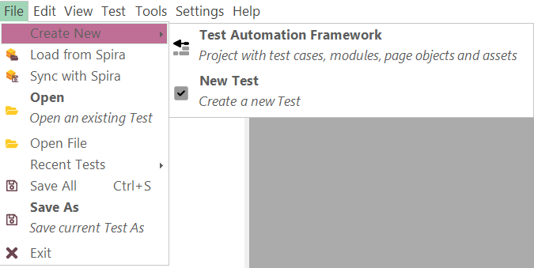

# Main Menu and Toolbars

## File

*Default*:

{width="540px"}

*Framework*:

{width="646px"}

The **File** menu provides quick access to all file management functions in Rapise. Many of these are also available on the [main toolbar](#main-toolbar).

*   **Create New**
    *   **New Test** - Creates a new standalone Rapise test that can be saved either to Spira or locally.
    *   **Test Automation Framework** - Starts a new [testing framework](./Frameworks/frameworks.md).
*   **Add To Framework** - Add items to a [testing framework](./Frameworks/frameworks.md)
    *   **Test Case** - Adds a new test case.
    *   **Module / Page Object** - Adds a new [module/page object](./Frameworks/pageobjects.md).
    *   **Spreadsheet** - Adds a new [shared spreadsheet](./Frameworks/frameworks.md#shared-files-and-repositories).
    *   **Shared Script** - Adds a new [shared JavaScript script](./Frameworks/frameworks.md#shared-files-and-repositories) for common functions and variables.
    *   **Import External Test Case** - Imports an external test case or a standalone test created earlier into the current testing framework.
    *   **Import External Module / Page Object** - Imports an external module/page object from another testing framework into this one.
*   **Open** - Opens an existing test (`.sstest`) that is already available locally.
*   **Open Test from Spira** - Opens a test from the [SpiraTest](spiratest_integration.md) test management repository and downloads it to the local repository.
*   **Save to Spira** - Saves the current test to the [Spira](spiratest_integration.md) test management system, updating the version in your [Spira](spiratest_integration.md) test management repository.
*   **Open File** - Opens a single file and displays it in the editor. The file is not added to the current test project.
*   **Recent Tests** - Opens one of the recently used test projects.
*   **Save All** (Shortcut: CTRL+S) - Saves the current test project and all open documents locally. To save to a different location, use the **Save As** option (available via `File > Save As`).
*   **Save As** - Creates a new, differently named copy of the test project and all files explicitly included in it.
*   **Exit** - Exits Rapise.

## Edit

The **Edit** menu provides tools for editing the currently open script file. Menu contents depend on the active editor currently open in the [content view](content_view.md).

*Default*:

*JavaScript*:

{width="198px"}

*RVL*:

*Manual*:

{width="306px"}

*   **Find**, **Find in Files** - Searches using the [Find and Replace Dialog](find_and_replace_dialog.md).

-----

*   **Ins Row** (Shortcut: Ctrl+I)
    *   RVL: Inserts an RVL row before the active one.
*   **Del Row** (Shortcut: Ctrl+D)
    *   RVL: Deletes the active row. If several rows are selected, all of them are deleted.
*   **Params** (Shortcut: Ctrl+P)
    *   RVL: Shows all parameters (including optional) for the currently edited action.

-----

*   **Add Link**
    *   Manual: Inserts a link to another manual step.
*   **Add Step** (Shortcut: CTRL+Ins)
    *   Manual: Appends a new manual step to the end.
*   **Remove Step**
    *   Manual: Deletes the selected step.
*   **Up**
    *   Manual: Moves the selected step up.
*   **Down**
    *   Manual: Moves the selected step down.

-----

*   **Save Manual Test to Spira**
    *   Manual: Uploads all modified steps to the [Spira](spiratest_integration.md) test case.
*   **Save Manual Test Locally**
    *   Manual: Saves manual test case steps as a local .rmt file.
*   **Reload Manual Test from Spira**
    *   Manual: Loads/reloads test steps from the [Spira](spiratest_integration.md) test case, overriding local changes.

-----

*   **Select All**
    *   JavaScript: Selects all text in the text editor.
*   **Copy** (Shortcut: CTRL+C)
    *   JavaScript: Copies any highlighted text to the clipboard.
    *   RVL: Copies selected rows or cells.
*   **Cut** (Shortcut: CTRL+X)
    *   JavaScript: Erases any highlighted text and copies it to the clipboard.
    *   RVL: Copies rows to the clipboard.
*   **Paste** (Shortcut: CTRL+V)
    *   JavaScript: Pastes content from the clipboard.
    *   RVL: Pastes cells from the clipboard.

-----

*   **Undo** (CTRL+Z) Reverses the last deletion or insertion.
*   **Redo** (CTRL+Y) Reverses the last undo action.

-----

*   **Format Document** Formats the current JavaScript or JSON document using [code formatting](./source_editor.md#code-formatting).

-----

*   **Toggle Breakpoint** (Shortcut: F9) Inserts or removes a breakpoint at the current cursor position.
*   **Show All Breakpoints** Displays all breakpoints in the [Warnings](./warning_view.md) window. You can click on them to navigate to their corresponding location.
*   **Remove All Breakpoints** Removes all breakpoints in the current test project.

*   **Save File**
    *   JavaScript: Saves the script file you are editing.

-----
*   **Select All Rows**
    *   RVL: Selects all rows in the currently visible sheet.
*   **Select Sheet**
    *   RVL: Switches to an RVL sheet.
*   **Add Sheet**
    *   RVL: Creates a new RVL sheet.
*   **Rename Sheet**
    *   RVL: Renames the current RVL sheet.
*   **Remove Sheet**
    *   RVL: Removes the current RVL sheet.
*   **Clear Sheet**
    *   RVL: Clears all rows in the current RVL sheet.
*   **Play This Sheet**
    *   RVL: Executes the current sheet.

## View

The **View** menu contents depend on the active editor currently open in the [content view](content_view.md).

*Default*:

*Manual*:

*   **Start Page** - Opens the Rapise [Start Page](start_page.md).
*   **Spira Dashboard** - Opens the [Spira Dashboard](spira_dashboard_2.md).
*   **RVL** - Opens the [RVL editor](rvl_editor.md).
*   **Main** - Opens the primary [test script file](understanding_the_script.md) (normally `Main.js`).
*   **User** - Opens the user functions [script file](understanding_the_script.md) containing any user-defined testing functions (called `User.js`).
*   **Show**

    

    *   **View > Show > Test Files** - Shows and highlights the [Test Files](test_files_dialog.md) view.
    *   **View > Show > Objects** - Shows and highlights the [Objects repository](object_tree.md) tree.
    *   **View > Show > Output** - Shows and highlights the [output view](output_view.md).
    *   **View > Show > Properties** - Shows and highlights the [Properties view](properties.md).

*   **Manual Steps** - Opens manual test steps for a given step (if any). If no manual steps are defined yet, it creates new ones.
*   **REST** - Finds and opens a [SOAP definition file](soap_definition_editor.md) in the [content view](content_view.md). If no `.soap` file is yet defined, nothing happens.
*   **SOAP** - Finds and opens a [REST definition file](rest_definition_editor.md) in the [content view](content_view.md). If no `.rest` file is yet defined, nothing happens.
*   **View Manual Test in Spira**
    *   Manual: Opens the current test in the [Spira](spiratest_integration.md) web interface. Remember to use `File > Save to Spira` if you made any local changes to manual steps.

## Test

The **Test** menu contents depend on the active editor currently open in the [content view](content_view.md).

*Default*

{width="172px"}

*Legacy/Sub-Tests*:

*Manual*:

*   **Play** - Executes the current test.
*   **Record** - Used for **recording and learning**, this item opens the [Recording Activity Dialog](recording_activity_dialog.md) when clicked.

    > Note: some additional options are available when using the **Record** button:

    *   **Record** - Clicking **Record** on its own starts Rapise recording using the currently selected libraries (this is the default action).
    *   **Shift+Record** - This brings up the library selector (shown above) and is equivalent to clicking the **[] libraries** button in the ribbon before starting recording.
    *   **Ctrl+Record** - This brings up the application selector (see below) and lets you change the application and library being recorded.

*   **Test Settings** - Displays [test settings](settings_dialog.md).
*   **Open Root ......** - Opens the root of the current test framework in this Rapise window. This option is only visible when you are in a sub-test of any nesting level.
*   **Open Parent ......** - Opens the parent test containing this sub-test in this Rapise window. This option is only visible when the parent is not yet a framework root (i.e., when you have a deeply nested test case).
*   **Spira Properties** - Opens the [Spira Properties dialog](spira_properties_dialog.md), which allows you to see the name of the SpiraTest project and test case that the current Rapise test is linked to.
*   **Playback Settings** - Opens the [Test Execution Parameters](test_to_play_selector.md#test-execution-parameters) dialog, which allows you to change local playback parameters of the current framework. Use this option if you need to change parameters before executing [RVL > Play](rvl_editor.md#context-menu) actions.
*   **Record Manual**
    *   Manual: Starts the [Select Application to Record](select_an_application_to_record_dialog.md) dialog box. This dialog box is the same one used for automated testing; however, when you click through the application under test, it records [manual test steps](manual_test_editor.md) instead of automated script code.

*   **Execute Manual**
    *   Manual: Executes the current manual test. You will be prompted to save the test case to Spira, and then the latest version from Spira will be downloaded into the Rapise [manual test execution wizard](manual_playback.md) so that you can begin manual testing.

*   **Screenshots**
    *   Manual: This option tells Rapise to capture the current screenshot when performing manual recording and include the screenshot with the recorded test step. It has two sub-options:
*   **Window**
    *   Manual: When checked, this records the entire window. Warning: this may consume large amounts of disk space. Otherwise, it records just the object underneath the current cursor.
*   **Cursor**
    *   Manual: When checked, this records the location of the mouse pointer/cursor inside the image.

## Tools

The **Tools** menu contents depend on the active editor currently open in the [content view](content_view.md).

*Default*:

{width="160px"}

*Manual*:

{width="160px"}

*   **Spy** - Dropdown to select the active [Spy](ses_spy_dialog.md). You use the Spy to examine the running application and find specific objects on which to perform an [operation](actions.md) or [verification](checkpoints.md).
*   **Debugger** - Toggles the [debugger](internal_debugger.md).
*   **Verbose Level** - Drop-down list that controls the [Verbosity Level](verbosity_levels.md).
*   **Libraries** - This button opens the [Select an Application Dialog](select_an_application_to_record_dialog.md), allowing you to add or change the [libraries](recording_library.md) used to record the current test.
*   **Npm Console** - Shows an `npm console` for the current testing [framework](../Intro/framework.md). This allows you to quickly install new packages or initialize using an existing `package.json`.
*   **Web Services** - Allows you to add a new [web service](web_service_testing.md) definition to your Rapise test. Clicking this displays the [Add Web Service](dialog_add_web_service.md) dialog box.
*   **Object Manager** - Opens the [Object Manager](object_manager.md) add-in, which is used to copy recorded objects between test scripts.
*   **Chrome for Testing** - Opens the [Chrome for Testing dialog](setting_up_selenium.md#chrome-for-testing-dialog).
*   **RPA Monitor** - Opens the [RPA Monitor](../Manuals/Rpa.md).
*   **Rapise Launcher** - Starts the [Rapise Launcher](spiratest_integration.md#using-rapiselauncher).

## Settings

Provides access to all global settings and options in Rapise. Settings relevant to only the current test are available via [Test > Test Settings..](settings_dialog.md).

*   **Global** - Brings up the [Global Settings dialog](options_dialog.md), which lets you change any system-wide settings for Rapise.
*   **SpiraTest** - Takes you to a dialog box that lets you change how Rapise is integrated with the [SpiraTest](spiratest_integration.md) test management system. It allows you to change the URL, username, and password used to connect.
*   **Web Spy** - Displays the [Web Spy Settings](web_settings.md) dialog box, which allows you to change settings related to using the Web Spy to inspect DOM objects in web pages.
*   **Selenium** - Displays the [Selenium settings](selenium_settings_dialog.md) dialog box, which is used to edit the different Selenium web browser profiles that can be used by Rapise.
*   **Mobile** - Displays the [Mobile Settings](mobile_settings_dialog.md) dialog box, which lets you configure the different mobile devices available for testing by Rapise.
*   **Java** - Displays the [Install Java Access Bridge](java_awt_swing_testing.md) dialog box. Installing the Java Access Bridge allows Rapise to connect to Java AWT/Swing applications so that they can be tested.

## Help

*   **About** - Provides information about the running instance of Rapise, including the version number.
*   **Activation** - Opens the Rapise license activation screen. This can be used to deactivate the current license so that it can be used on a different machine.
*   **Help** - Provides access to the interactive help system. You can also open the help system by pressing **F1** on the keyboard.
*   **Online Help** - Opens the online version of the help system (updated regularly).
*   **Remote Assistance** - Launches a GoToMeeting session with a given ID. Since Rapise 7.3, it launches a Zoom meeting.

Read more about [Remote Assistance](https://www.inflectra.com/Support/KnowledgeBase/KB529.aspx).

## Report

The **Report** menu is available anytime a report (`.trp`) file is visible in the [Content View](content_view.md).

*   **Plain** - Views test steps, assertions, and messages aligned in a table.
*   **Hierarchical** - Switches to a hierarchical display to more clearly see which assertions, messages, and data are associated with which test steps.
*   **Collapse** - Collapses the report to show only the top level. What is visible will depend on how the report is sorted.
*   **Expand** - Expands all report rows.
*   **Images** - Toggles between hiding and revealing images.
*   **Export to HTML** - Saves the report as an [HTML document](automated_reporting.md#export_as_html_dialog).
*   **Export to Excel** - Saves the report as an Excel file.
*   **Export to PDF** - Saves the report as an Acrobat PDF file.
*   **Export to XPS** - Saves the report as an [XML Paper Specification](https://en.wikipedia.org/wiki/Open_XML_Paper_Specification) file.
*   **Choose Columns** - Hides or reveals report columns.
*   **Merge Cells** - Merges identical consecutive cells.
*   This drop-down list lets you choose between previously saved layouts. The selected layout is loaded using the **Load Layout** item.
*   **Save Layout** - Presses to keep your layout changes after closing Rapise.
*   **Reset Layout** - Undoes any changes you've made.

See Also:

*   [Automated Reporting](automated_reporting.md)

## Debugger

The **Debugger** menu and [toolbar](#debugger-toolbar) are available while the [JavaScript debugger](internal_debugger.md) is active. To use the Debugger, first enable it by toggling the corresponding toolbar button:

Then [play](playback.md) your script.

*   **Continue** `++f5++` - Continues executing the script.
*   **Step In** `++f11++` - Steps into a function/procedure.
*   **Step Out** `++shift+f11++` - Continues until the current procedure is exited.
*   **Step Over** `++f10++` - Goes to the next line in the current procedure/function.
*   **Stop Debugger** `++shift+f5++` - Stops executing the script and exits the debugger.

## Main Toolbar

The **Main** toolbar is the primary toolbar providing tools to help with creating and executing tests. It is always visible:

## RVL Toolbar

The **RVL** toolbar is shown for the [RVL editor](rvl_editor.md):

## Manual Toolbar

The **Manual** toolbar is shown for the [manual test editor](manual_test_editor.md):

*   **Select Current Release** Dropdown list that displays the list of releases in the current Spira project. You can then choose the appropriate release against which the current test is being executed.

## Report Viewer Toolbar

The **Report** toolbar is shown for the [report viewer](report_viewer.md):

## Debugger Toolbar

The **Debugger** toolbar is shown while a JavaScript debug session is active. It is a set of shortcuts for the [Debugger](#debugger) menu:

