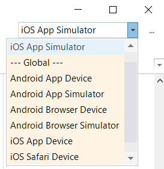

# Mobile Settings Dialog

## Mobile Profiles

Use Mobile Settings Dialog to configure `Mobile Profiles`. A mobile profile specifies how to connect to a simulator or device via [Appium](http://appium.io/). You may configure as many profiles as you need to run your tests on different devices.

Mobile Settings Dialog box displays the list of mobile profiles that have been configured for use by Rapise and lets you create a new profile, modify a profile or make a new profile based on an existing one.


## How to Open

You can open this dialog box from two places:

- From the main Rapise menu `Settings > Mobile`.
- From the [Mobile Spy](object_spy_mobile.md) tool when you click on the `Edit Profiles` toolbar button.

## Menu Options

This dialog box has the following menu options:

- **Select Profile** - This dropdown list lets you select a different mobile profile to be displayed in the dialog.
- **Save** - This button will save the changes to the current mobile profile.
- **Test URL** - This button will test the Connection (URL) from Rapise to [Appium](http://appium.io/) (which is used to manage the devices) and the connection from Appium to the physical (or simulated) device.
- **Duplicate** - This button will create a new mobile profile based on the currently viewed one.
- **Create** - This button will create a new empty mobile profile that you can edit.
- **Rename** - This button will change the name of the current mobile profile being edited.
- **Delete** - This button will delete the currently displayed mobile profile. There is no undo, so be careful!

## Connection

This section lets you enter the URL used to connect to the Appium server which hosts the mobile devices being tested. It is typically of the form:

```
http://server:4723/wd/hub
```

Where the port number used by Appium is 4723 by default and the /ed/hub suffix is added.

## Details

This section has various settings, some of which are used by all mobile devices, some only by simulated devices, some only by physical devices and some are specific to the type of device (iOS vs. Android).

For details check out [Appium Desired Capabilities](http://appium.io/docs/en/writing-running-appium/caps/) page.

## Kobiton / SauceLabs Settings

In addition, there are some settings, unique to running Appium mobile device tests through either the **SauceLabs** or **Kobiton** cloud
platforms:


- **Kobiton / Sauce Labs**
    - **accessKey** - This needs to be populated with your Kobiton/SauceLabs cloud access key.
    - **captureScreenshots** - This can be set to determine if you want to capture screenshots or not.
    - **deviceGroup** - The default value is group device belonged to. Group device value could be either: ORGANIZATION or KOBITON. System will filter device in any existing group if you set deviceGroup is empty.
    - **sessionDescription** - The description of the session (e.g. "This is an example for iOS web").
    - **sessionName** - The name of the session being performed (e.g. "Automation test session on second device").
    - **username** - This needs to be populated with your Kobiton/SauceLabs username.

## Browser Stack Settings

In addition, there are some settings, unique to running Appium mobile device tests through the BrowserStack cloud platform:


- **BrowserStack**
    - **browserstack.appium\_version** - Use this capability to set the Appium version in your test scripts.
    - **browserstack.key** - This needs to be populated with your Browserstack cloud access key.
    - **browserstack.user** - This needs to be populated with your Browserstack username.
    - **device** - Specifies a particular mobile device for the test environment.
    - **os\_version** - Use this capability to specify the OS version of the device.
    - **realMobile** - Use this flag to test on a physical mobile device.

## Local Mobile Profiles

Rapise version 6.3+ enables creation of profiles local to a test. It allows storing profiles together with tests (inside SpiraTest or Git repository) and eliminates the need to configure profiles manually on each execution host.

To create a local profile just press Duplicate for one of global profiles and set Local checkbox before clicking OK button. Global and Local profile may have same name, in this case Local profile is used for execution.


If a test contains local mobile profiles they can be seen in the dropdowns.




Local profiles are stored inside `<Test Root>\Profiles\MobileProfiles` folder.
