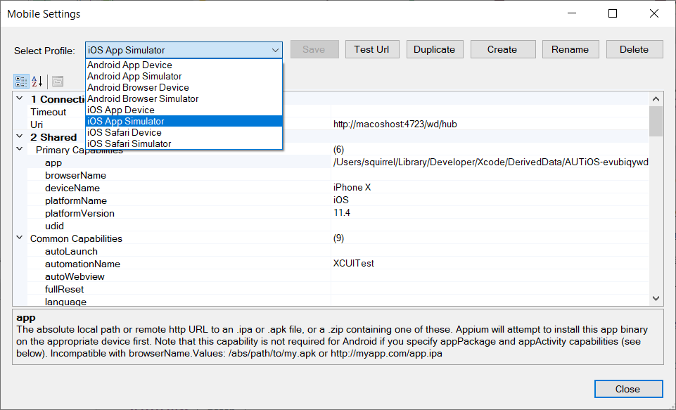

# Mobile Settings Dialog

## Mobile Profiles

Use the Mobile Settings Dialog to configure `Mobile Profiles`. A mobile profile specifies how to connect to a simulator or device via [Appium](http://appium.io/). You may configure as many profiles as you need to run your tests on different devices.

The Mobile Settings Dialog displays the list of mobile profiles configured for use by Rapise, allowing you to create new profiles, modify existing ones, or duplicate them.



Global profiles are stored in the `c:\ProgramData\Inflectra\Rapise\MobileProfiles` folder.

## How to Open

You can open this dialog from the following locations:

- From the [main Rapise menu](menu_and_toolbars.md#settings) `Settings > Mobile`.
- From the [Mobile Spy](object_spy_mobile.md) tool when you click the `Edit Profiles` toolbar button.
- Using the ellipsis button in the top-right corner of the Rapise window:
    
    {width="217px"}

## Menu Options

This dialog has the following menu options:

- **Select Profile** - This dropdown list allows you to select a different mobile profile for display in the dialog.
- **Save** - This button saves changes to the current mobile profile.
- **Test URL** - This button tests the connection (URL) from Rapise to [Appium](http://appium.io/) (which manages the devices).
- **Duplicate** - This button creates a new mobile profile based on the currently viewed one.
- **Create** - This button creates a new, empty mobile profile that you can edit.
- **Rename** - This button changes the name of the current mobile profile.
- **Delete** - This button deletes the currently displayed mobile profile. There is no undo, so use caution!

## Local Mobile Profiles

Rapise version 6.3+ allows creating profiles local to a test. It enables profiles to be stored together with tests (inside SpiraTest or a Git repository), eliminating the need to configure profiles manually on each execution host.

To create a local profile, simply press `Duplicate` for one of the global profiles and select the `Local` checkbox before clicking the `OK` button. Global and local profiles may have the same name; in this case, the local profile is used for execution.


If a test contains local mobile profiles, they can be seen in the dropdowns.

{width="218px"}

{width="322px"}

Local profiles are stored in the `<Test Root>\Profiles\MobileProfiles` folder.

## Profile Options

### Connection

This section allows you to enter the URL used to connect to the Appium server that hosts the mobile devices being tested. It is typically of the form:

```
http://server:4723/wd/hub
```

By default, the port number used by Appium is 4723, and the `/wd/hub` suffix is added.

### Shared

This section contains common capabilities.

### Platform Specific

In this section, set platform-specific options (for iOS and Android).

### Device Cloud

In addition, some settings are unique to running Appium mobile device tests using different device clouds.

#### BrowserStack

- **browserstack.appium_version** - Use this capability to set the Appium version in your test scripts.
- **browserstack.key** - This needs to be populated with your Browserstack cloud access key.
- **browserstack.user** - This needs to be populated with your Browserstack username.
- **device** - Specifies a particular mobile device for the test environment.
- **os_version** - Use this capability to specify the OS version of the device.
- **realMobile** - Use this flag to test on a physical mobile device.

#### Kobiton

- **accessKey** - This needs to be populated with your Kobiton cloud access key.
- **captureScreenshots** - This can be set to determine whether to capture screenshots.
- **deviceGroup** - The default value is the group the device belongs to. The device group value can be either: `ORGANIZATION` or `KOBITON`. The system will filter devices in any existing group if `deviceGroup` is left empty.
- **sessionDescription** - The description of the session (e.g. "This is an example for iOS web").
- **sessionName** - The name of the session being performed (e.g. "Automation test session on second device").
- **username** - This needs to be populated with your Kobiton username.

#### SeeTest

- **appBuildVersion** - Used only when installing a cloud application. Specifies the application build version for installation.
- **applicationClearData** - Clears the application data. If `noReset`, `fullReset`, or both are set to `true`, then `applicationClearData` will have no effect. 
- **appReleaseVersion** - Used only when installing a cloud application. Specifies the application release version for installation.
- **deviceQuery** - It is a special type of capability that describes one or more capabilities as a single query-like input.
- **dontGoHomeOnQuit** - The device will remain in its last state even after the test ends.
- **installOnlyForUpdate** - Install the application only if the desired version is different from the application version on the device (or if the app does not exist on the device). Otherwise, keep the application on the device.
- **instrumentApp** - Instrument the application.
- **testName** - Name of the test.

## Parameterizing a Profile

Since Rapise 8.3, it is possible to use [framework parameters](Frameworks/parameters.md) in mobile profiles. The syntax is:

```
{Parameter Name}
```

For example, the `app` capability (e.g., a path to an APK file) can be defined by a framework parameter and then used as:

```
{ApkPath}
```

Another example is setting `platformVersion`:

```
{{PlatformVersion}}
```


## See Also

- For details, check out [Appium Desired Capabilities](http://appium.io/docs/en/writing-running-appium/caps/) page.