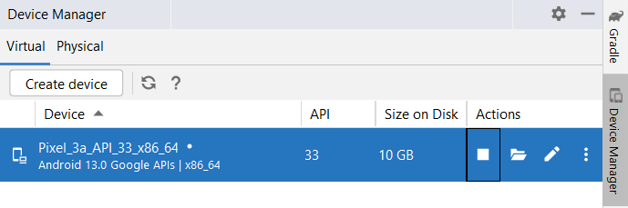
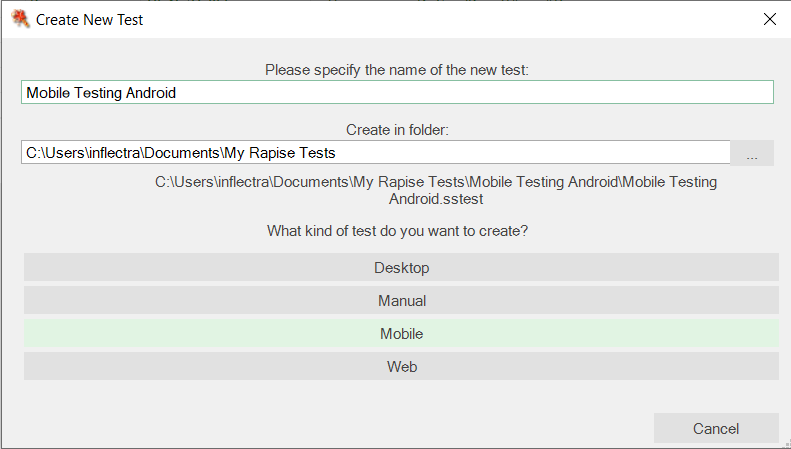
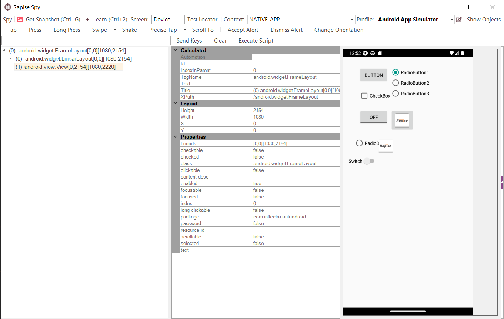
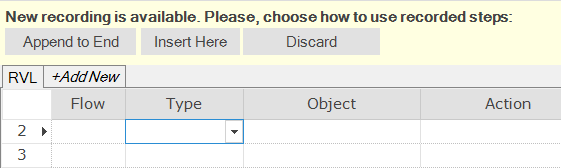

# Mobile Testing using Android

## Purpose

Rapise allows you to record and play back automated tests on native applications across a variety of mobile devices, including [Apple iOS](mobile_testing_ios.md) or [Android](mobile_testing_android.md). Rapise gives you the flexibility to test your applications on either real or simulated devices.

This tutorial provides a **simple example** of using Rapise to record and play back a basic test on a sample **Android application** running on the **Android Emulator** on your local PC. It does not require any physical mobile devices and only uses the PC where you have already installed Rapise. *(Other documentation describes the full range of mobile testing options)*.

## Setting up Environment

First, you need to [install Appium and Android Studio](../Manuals/Preparing_for_Android_Testing.md).

Launch the **Android Virtual Device Manager** from the menu:

{width="227px"}
{width="551px"}

Use the `Create Virtual Device...` button to create a virtual device. Learn more about [how to create and manage virtual devices](https://developer.android.com/studio/run/managing-avds).

You can then start the device and connect to it using Rapise.

## Configure the Mobile Profile

To begin mobile testing, [create a new test](create_a_new_test.md) using the `File > Create New > New Test` option in Rapise. Make sure you choose the **Mobile** methodology option:

{width="633px"}

Once you have entered the name for the new test, you will be asked to choose the mobile profile. Rapise ships with several default profiles; for now, select the one that is closest to the device you want to test (we recommend the generic **Android App Simulator** profile):

{width="470px"}

When you click the `OK` button, Rapise will prompt you to choose the Scripting Language:

{width="482px"}

Choose the **Rapise Visual Language (RVL).** Rapise will then create a new mobile test with the **Android App Simulator** profile selected.

{width="890px"}

Now, you need to modify the profile so that it correctly matches the type of device you are testing and points to the **Appium** server you are using to host the mobile devices. Click the `...` button in the top right corner of the Rapise window

{width="270px"}

to open the [Mobile Settings](mobile_settings_dialog.md) dialog box:

In the mobile profile screen, make sure you change the following settings:

- `app` - this needs to be the path to the application being tested on the device. You can download one from [AUTAndroid Repository](https://github.com/Inflectra/AUTAndroid).
- `deviceName` - for emulator testing, it must be `Android Emulator`.
- `platformName` - this must be set to `Android`.
- `platformVersion` - this must be set to the same version of Android that the virtual device is running.
- `automationName` - must be `UIAutomator2` for Android testing.

Once you have entered the information and saved the profile, make sure that Appium is running on the PC, and then click the `Test Url` button to verify the connection with Appium:

{width="245px"}

## Using the Mobile Spy

The Mobile Spy allows you to view an application running on the mobile device, take a snapshot of its screen, and then interactively inspect the objects within the application being tested. This is a useful first step to ensure that Rapise recognizes the application and has access to the objects in the user interface.

If the Mobile Spy button  is not visible on the toolbar, choose Mobile Spy from the main menu: `Tools > Spy > Mobile`. Click the Mobile Spy button. The Mobile Spy will then be displayed. Now, click the `Get Snapshot` button to display the application specified in the [mobile profile](mobile_settings_dialog.md) on the screen:

The example above displays the sample Android application available in the [AUTAndroid Repository](https://github.com/Inflectra/AUTAndroid).

If you click on one of the objects in the user interface, it will be highlighted in red, and the tree hierarchy on the left will expand to show the properties of that object:

To view the contents of the Spy as a text file, click the `Spy > Page Source` menu option. You will then see the contents of the Spy properties window as a text file.

To perform an action on the application (e.g., click on the selected item), use the toolbar buttons.

Now, click `Tap`. Rapise will send a tap event to the application, switching it to the next page:

Assuming you can see your application in the Spy and that the objects can be inspected (similar to what is shown above), you can now begin testing your mobile application. Click the `Spy > Disconnect` menu option to end your Spy session and close the Rapise Spy dialog. You will now be returned to your test script.

## Recording and Playing a Test

With the new Rapise mobile test script open, click the `Record` button on the toolbar. This will display the [recording activity dialog](recording_activity_dialog.md):

{width="572px"}

Now, click the `Spy` button, and in the Rapise Spy, click the `Get Snapshot` button on the toolbar:

We now want to record a click on one of the menu options. Simply click the `Login` button on the screenshot you see in Mobile Spy:

Now, click the `Tap` button to move the sample app to the next screen. Rapise will automatically reload the page in the Mobile Spy to get the updated screen:

Now, highlight the user name field, enter text into the edit field on the toolbar, and press the `Send Keys` button. Do the same for the password field and record a tap action on the Login and Home (back arrow) buttons. You will see the events in the recording activity dialog:

{width="572px"}

Now, click the `Finish` button, and you will be taken back to the test script. Click the `Append to End` button.

{width="449px"}

You will find Android objects listed and actions displayed on the RVL sheet:

To play back the test, simply click `Play` in the Rapise toolbar, and the test will play back in the **Android Emulator**. This is the report of the test execution.

## Sample Application and Tests

You can find the Android sample tests and sample application in the [AUTAndroid Repository](https://github.com/Inflectra/AUTAndroid).

## See Also

-   [Mobile Testing](mobile_testing2.md), for an overview of mobile testing and its sub-sections.
-   [Mobile Settings Dialog](mobile_settings_dialog.md) - for information on setting up the different **mobile profiles** for the mobile devices you will be testing.
-   [Mobile Object Spy](object_spy_mobile.md) - for information on how Rapise connects to the device and allows you to view the objects in the tested application.
-   [KB382](https://www.inflectra.com/Support/KnowledgeBase/KB382.aspx) Android Testing Hints
-   [KB280](https://www.inflectra.com/Support/KnowledgeBase/KB280.aspx) How to specify Selenium or Appium capabilities which are not available through Rapise UI?
-   [KB278](https://www.inflectra.com/Support/KnowledgeBase/KB278.aspx) How to run a cross-browser test on a mobile device?