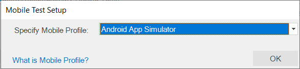
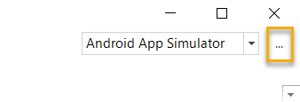
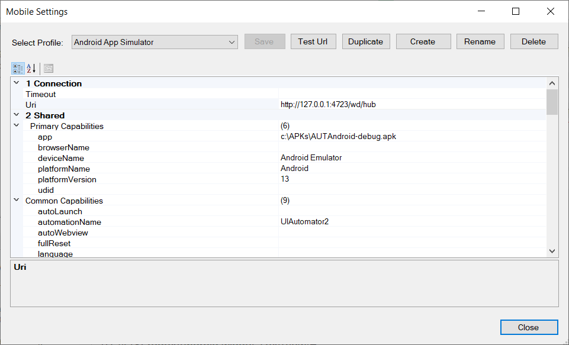
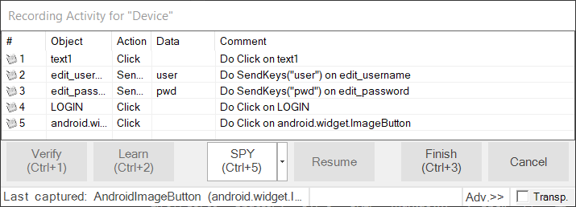

# Mobile Testing using Android

## Purpose

Rapise lets you record and play automated tests against native applications on a variety of mobile devices using either [Apple iOS](mobile_testing_ios.md) or [Android](mobile_testing_android.md). Rapise gives you the flexibility to test your applications on either
real or simulated devices.

This tutorial is a **simple example** of using Rapise to record and playback a simple test against a sample **Android application** running on the **Android Emulator** on your local PC. It does not require any physical mobile devices and only uses the PC that you have already
installed Rapise on. *(There is [other documentation](mobile_testing2.md) that describes the full range of mobile testing options)*.

## Setting up Environment

The first thing you need to do is [install Appium and Android Studio](/Manuals/Preparing_for_Android_Testing/).

Launch **Android Virtual Device (AVD) Manager** from the menu:

Use the `Create Virtual Device...` button to create a Virtual Device. Learn more about [how to create and manage virtual devices](https://developer.android.com/studio/run/managing-avds).

You can then start the device and then connect to it using Rapise.

## Configure the Mobile Profile

To begin the actual mobile testing, [create a new test](create_a_new_test.md), using the `File > New Test` option in Rapise. Make sure you choose the mobile methodology option **Mobile: Mobile Support**:

Once you have entered the name for the new test you will be asked to choose the mobile profile. Rapise ships with several default profiles, for now select the one that is closer to the device you want to test (we recommend the **Android App Simulator** generic profile):

When you click the `OK` button, Rapise will ask you to choose the Scripting Language:

Please choose the **Rapise Visual Language (RVL).** Rapise will then create a new mobile test with the **Android App Simulator** profile selected.

Now you need to modify the profile so that it correctly matches the type of device you are testing and also so that it correctly points to the **Appium** server that you are using to host the mobile devices. Click `...` button in the top right corner of Rapise window

to bring up the [Mobile Settings](mobile_settings_dialog.md) dialog box:

In the mobile profile screen, make sure you change the following:

- `app` - this needs to the path to the Application being tested on the device. You can download one from [AUTAndroid Repository](https://github.com/Inflectra/AUTAndroid).
- `deviceName` - for emulator testing it must be `Android Emulator`.
- `platformName` - this needs to be set to `Android`.
- `platformVersion` - this needs to be set to the same version of Android that the virtual device is running.

Once you have entered in the information and saved the profile, make sure that Appium is running on the PC and then click the `Test Url` button to verify the connection with Appium:

## Using the Mobile Spy

The Mobile Spy will let you view an application running on the mobile device, take a snapshot of its screen and then interactively inspect the objects in the application being tested. This is a useful first step to make sure that Rapise recognizes the application and has access to the objects in the user interface.

If you do not see Mobile Spy button  on the toolbar then choose Mobile Spy from the main menu: `Tools > Spy > Mobile`. Click Mobile Spy button,  Mobile Spy will be displayed in **Discovery Mode**. Now click the `Get Snapshot` button to display the application specified in the [mobile profile](mobile_settings_dialog.md) on the screen:

In the example above, we are displaying the sample Android application that is available in [AUTAndroid Repository](https://github.com/Inflectra/AUTAndroid).

If you click on one of objects in the user interface, it will be highlighted in Red and the tree hierarchy on the left will expand to show the properties of that object:

If you want to view the contents of the Spy as a text file, just click `Spy > Page Source` menu and you will see the contents of the Spy properties window as a text file.

If you want to perform an action on the application (e.g. click on the selected item) use toolbar buttons.

Now click on `Tap` and Rapise will send a tap event to the application, switching the application to the next page:

Assuming that you can see your application in the Spy and that the objects can be inspected (similar to that shown above) you can now begin the process of testing your mobile application. Click on `Spy > Disconnect` menu
to end your Spy session and close the Rapise Spy dialog. You will now be returned back to your test script.

## Recording and Playing a Test

With the new Rapise mobile test script open, click on the `Record` button on the toolbar and that will display the [recording activity dialog](recording_activity_dialog.md):

Now click on the `Spy` button and the Rapise Spy will be displayed in **Recording Mode**:

We now want to record a click on one of the menu options, simply click on the `Login` button on the screenshot you see in Mobile Spy:

Now click the `Tap` button to move the sample app to the next screen; Rapise will  automatically reload the page in the Mobile Spy to get the updated screen:

Now highlight user name field, put text into the edit field on the toolbar and press `Send Keys` button. Do the same for password field and record tap action on the Login and Home (back arrow) buttons. You will see the events in the recording activity dialog:

Now click on the `Finish` button and you will be taken back to the test script with the Android objects listed and actions displayed on the RVL sheet:

Now to playback the test simply click `Play` in the Rapise toolbar and the test will play back in the **Android Emulator**. This is the report of the test being executed.

## Sample Application and Tests

You can find the Android sample tests and sample Application in [AUTAndroid Repository](https://github.com/Inflectra/AUTAndroid).

## See Also

- [Mobile Testing](mobile_testing2.md), for an overview of mobile testing with sub-sections on testing.
- [Mobile Settings Dialog](mobile_settings_dialog.md) - for information on setting up the different **mobile profiles** for the mobile devices you will be testing.
- [Mobile Object Spy](object_spy_mobile.md) - for information on how Rapise connects to the device and lets you view the objects in the tested application.
