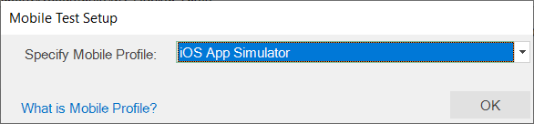
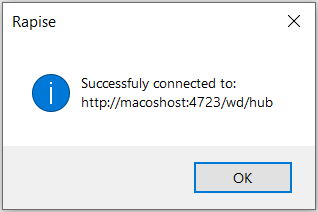
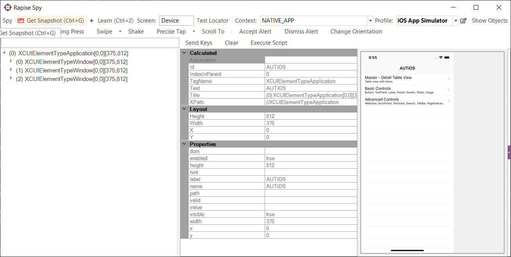
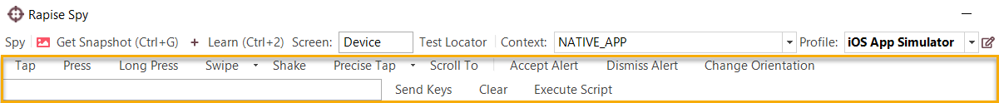
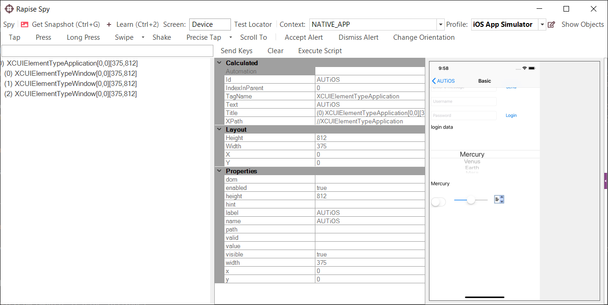
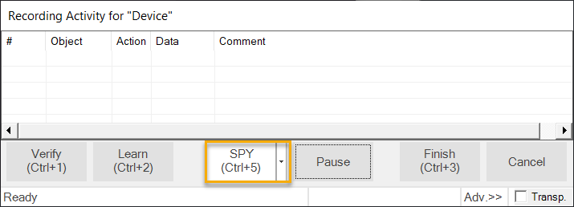

# Mobile Testing using iOS

## Purpose

Rapise lets you record and play automated tests on real iOS devices (iPad and iPhone) as well as test applications using the iOS simulator
that ships with Xcode. No jailbreaking needed! With Rapise you can record on one device and playback on multiple.

## Prerequisites

This section assumes that you have already installed and configured all of the necessary components. For details on this, please refer to the [Preparing Environment for iOS Mobile Testing](../Manuals/Preparing_for_iOS_Testing.md) section.

## Configure the Mobile Profile

To begin the actual mobile testing, [create a new test](create_a_new_test.md), using the `File > Create New > New Test` option in Rapise. Make sure you choose the mobile methodology option **Mobile**:

{width="633px"}

Once you have entered the name for the new test (with the mobile methodology selected) you will be asked to choose the mobile profile.
Rapise ships with several default profiles, for now select the one that is closer to the device you want to test (we recommend the **iOS App Simulator** generic profile):

{width="469px"}

When you click the `OK` button, Rapise will ask you to choose the Scripting Language:

{width="482px"}

Please choose the **Rapise Visual Language (RVL).** Rapise will then create a new mobile test with the **iOS App Simulator** profile selected.

{width="884px"}

Now you need to modify the profile so that it correctly matches the type of device you are testing and also so that it correctly points to the **Appium** server that you are using to host the mobile devices. Click `...` button in the top right corner of Rapise window

The example screeenshot above is for an iPhone X simulator running iOS 11.4. For any iOS device (real or simulated) you will need to
provide the following:

- **Uri** - this is the URL to your Appium server. We shall discuss this shortly.
- **app** - this needs to be the path (on the Mac running Appium) to the Application being tested on the device (e.g. `/Users/user.name/Library/Developer/Xcode/DerivedData/AUTiOS-gvdyymxgyzrfgqdfvfylapawjoyd/Build/Products/Debug-iphonesimulator/AUTiOS.app`)
- **deviceName** - this needs to match the name of the device being connected.
- **platformName** - this needs to be set to **iOS**.
- **platformVersion** - this needs to be set to the correct version of iOS that the device is running.

In addition, for physical devices only, you need to specify:

- **udid** - the unique device identifier of the connected physical device (leave blank for simulated devices).

Once you have entered in the information and saved the profile, make sure that Appium is running on the Mac and then click the `Test Url` button to verify the connection with Appium:

{width="254px"}

Now you can start testing your mobile iOS application.

## Using the Mobile Spy

The Mobile Spy will let you view an application running on the mobile device, take a snapshot of its screen and then interactively inspect the objects in the application being tested. This is a useful first step to make sure that Rapise recognizes the application and has access to the objects in the user interface.

If you do not see Mobile Spy button  on the toolbar then choose Mobile Spy from the main menu: `Tools > Spy > Mobile`. Click Mobile Spy button. Now click the `Get Snapshot` button to display the application specified in the [mobile profile](mobile_settings_dialog.md) on the screen:

In the example above, we are displaying the sample iOS application that is available in [AUTiOS Repository](https://github.com/Inflectra/AUTiOS).

If you click on one objects in the user interface, it will be highlighted in Red and the tree hierarchy on the left will expand to
show the properties of that object:

If you want to view the contents of the Spy as a text file, just click `Spy > Page Source` menu and you will see the contents of the Spy properties window as a text file.

If you want to perform an action on the application (e.g. click on the selected item) use toolbar buttons.

Now click on `Tap` and Rapise will send a tap event to the application, switching the application to the next page:

Assuming that you can see your application in the Spy and that the objects can be inspected (similar to that shown above) you can now begin the process of testing your mobile application. Click on `Spy > Disconnect` menu
to end your Spy session and close the Rapise Spy dialog. You will now be returned back to your test script.

## Recording and Playing a Test

With the new Rapise mobile test script open, click on the `Record` button on the toolbar and that will display the [recording activity dialog](recording_activity_dialog.md):

{width="572px"}

Now click on the `Spy` button and in the Rapise Spy click `Get Snapshot` button on the toolbar:

We now want to record a click on one of the menu options, simply click on the `Basic Controls` list item on the screenshot you see in Mobile Spy:

Now click the `Tap` button to move the sample app to the next screen; Rapise will  automatically reload the page in the Mobile Spy to get the updated screen. Now highlight user name field, put text into the edit field on the toolbar and press `Send Keys` button.

Do the same for password field and record `tap` action on the `Login` and `Home (back arrow)` buttons. You will see the events in the recording activity dialog:

{width="572px"}

Now click on the `Finish` button and you will be taken back to the test script. Click on `Append to End` button.

{width="449px"}

Find iOS objects listed and actions displayed on the RVL sheet:

Now to playback the test simply click `Play` in the Rapise toolbar and the test will play back in the **iOS Simulator**. This is the report of the test being executed.

## Sample Application and Tests

You can find the Android sample tests and sample Application in [AUTiOS Repository](https://github.com/Inflectra/AUTiOS).

## See Also

- [Mobile Testing](mobile_testing2.md), for an overview of mobile testing with sub-sections on testing.
- [Mobile Settings Dialog](mobile_settings_dialog.md) - for information on setting up the different **mobile profiles** for the mobile devices you will be testing.
- [Mobile Object Spy](object_spy_mobile.md) - for information on how Rapise connects to the device and lets you view the objects in the tested application.
- [KB381](https://www.inflectra.com/Support/KnowledgeBase/KB381.aspx) iOS Testing Hints
- [KB280](https://www.inflectra.com/Support/KnowledgeBase/KB280.aspx) How to specify Selenium or Appium capabilities which are not available through Rapise UI?
- [KB278](https://www.inflectra.com/Support/KnowledgeBase/KB278.aspx) How to run a cross-browser test on a mobile device?
- [KB418](https://www.inflectra.com/Support/KnowledgeBase/KB418.aspx) Is it possible to automate an iOS Web App using Rapise?