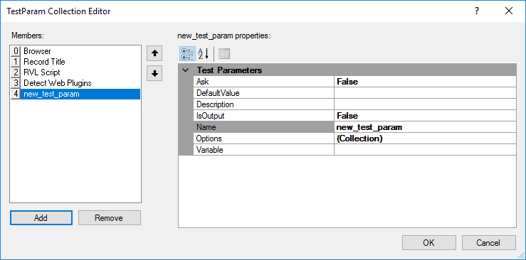

# TestParam Collection Editor Dialog

## Purpose

Specifies custom strings and their values.

## How to Open

To open: Select the **TestParams** option in the [Settings Dialog](settings_dialog.md).

## Widgets

- **Add**: Adds a custom string. Clicking **Add** displays the following:

- **Remove**: Removes the selected custom string.
- **OK**: Saves changes and closes the dialog.
- **Cancel**: Closes the dialog without saving changes.