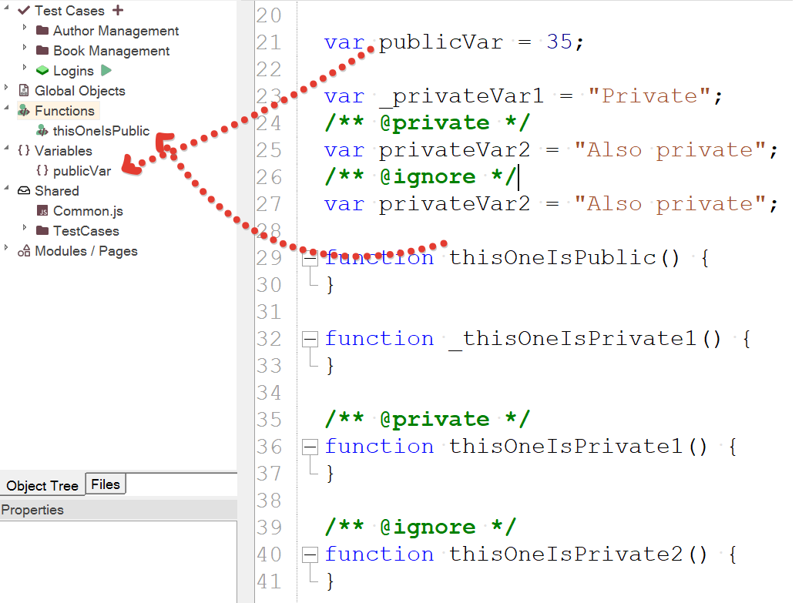

# Naming Conventions

## Purpose

The Rapise engine and API follow simple naming conventions.

## Usage

You will find descriptions of the naming conventions below. Note: Italicized text represents placeholders.

- SeS*&lt;...&gt;* - public functions for users
- Do*&lt;Action&gt;* - action implementations
- \_*&lt;somevar&gt;* and \_*&lt;somename&gt;* - private functions and objects
- g\_*&lt;varname&gt;* - system global variable.

## Private Variables and Functions in the Object Tree

Any custom function or variable that you define in `User.js`, `Common.js`, or any other `.js` file will be displayed in the corresponding node of the object tree.

However, there are two exceptions that help you hide internal functions or variables from the tree:

1. If you prefix a function name with an underscore, such as _myFunc, these functions will be automatically filtered and not displayed in the tree.

2. You can use `/** @private */` and `/** @ignore */` comments to indicate that a function or variable should be treated as private or ignored, respectively.



## Examples

Here are some examples to clarify these conventions:

```javascript
SeS("object") // gets the object named "object"
DoClick()     // public action function to click on something
_mydata       // private variable called mydata
g_publicdata  // global variable called publicdata
```