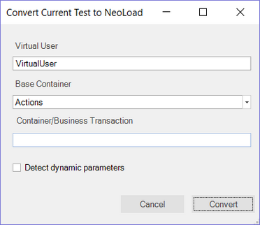

# NeoLoad Converter Dialog

!!! important
    NeoLoad integration has been removed in Rapise 7.0.

## Purpose

This dialog enables the conversion of a functional test script from Rapise into a protocol-based performance script executable by the [NeoLoad](neoload_integration.md) performance testing tool from Neotys.

## How to Open

To open this dialog, navigate to `Tools > Convert to Neoload`.

## Virtual User

In this field, specify the name of the virtual user to be created in NeoLoad:

-   The default value is "VirtualUser".
-   If the name is already in use, it is automatically renamed by appending the suffix “_X”, where X is an incrementing integer.
-   If the name contains invalid characters, they are escaped as an underscore (_).

## Base Container

This specifies the base container where recording should start (Init / Actions / End).

-   The default value is Actions.

## Container/Business Transaction

This specifies the current recording container in NeoLoad. It is limited to a single level; it does not support specifying a tree of containers.

-   By default, no container is used.
-   If the name is already in use, it is made unique by appending `_1`, `_2`, and so on.
-   If the name is left empty, no container will be used.

## Detect Dynamic Parameters

When this box is checked, Rapise instructs NeoLoad to scan the protocol traffic for known dynamic parameters (e.g., Session IDs, ASP.NET ViewState) that change with each HTTP request. These parameters must be parameterized by NeoLoad to ensure the performance scripts are robust and well-defined, avoiding hardcoded Session IDs.

## Actions

-   **Convert** initiates the Rapise &gt; NeoLoad test conversion process.
-   **Cancel** cancels the conversion and returns you to Rapise.