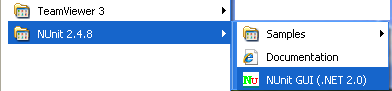
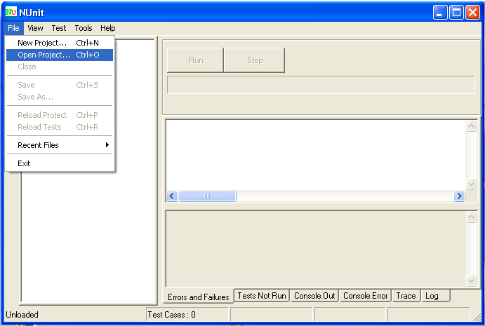
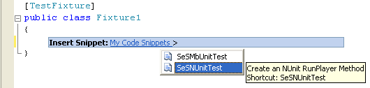

# NUnit

## About NUnit Integration

SeSNUnit is a sample of using NUnit. We provide special attribute to help executing Rapise GUI tests from within NUnit tests.

Standard NUnit test looks like this:

```C#
using System;
using NUnit.Framework;

[TestFixture]
public class MyTests
{
    [Test] /* – THIS IS AN ATTRIBUTE FOR STANDARD NUnit Test */
    public void MyTest1()
    {
        Assert.AreEqual(1, 2, "Check equality");
    }
}
```

Each test case is a function with a special attribute [**Test**]. NUnit uses it to find test cases, then collects cases in sets and so on.

Rapise integration makes execution of Rapise tests as simple as execution of normal NUnit tests:

```C#
using System;
using NUnit.Framework;
using SeSNUnit; // We include Rapise helper class

[TestFixture]
public class PlayerTesting
{
    // Next line means: this is an NUnit test that executes Cross Browser.sstest with Rapise
    [SeSNUnitTest(@"T:\Samples\Cross Browser\CrossBrowser.sstest")]
    public void TestIEandFirefox()
    {
        int exitCode = SeSNUnitHelper.TestExecute();
        Assert.AreEqual(0, exitCode);
    }
}
```

Now we use another attribute to mark the test:

```C#
[SeSNUnitTest(@"<path to .sstest>")]
```

We just mark this test as a wrapper for concrete Rapise test instance.

## Installing NUnit

To run this sample you need NUnit. You can download NUnit from this site [http://www.nunit.org/index.php?p=download](http://www.nunit.org/index.php?p=download).

Download and install NUnit package (for example, NUnit-2.4.8-net-2.0.msi).

It is installation package file, so only thing that you need to do after download is to double click on that file.

Run NUnit from the start menu:



Select “OpenProject…” from “File” menu:



In opened window find and select

    C:\Program Files (x86)\Inflectra\Rapise\Extensions\UnitTesting\NUnit\SeSNUnit\SeSSamplesNUnit\bin\Release\SeSSamplesNUnit.dll

Press “Run” to start the test


After the test ended NUnit GUI must look like:


## Tree Display

There is a test tree in the left part of a window, it contains tests of current NUnit project.

From this tree you can easily determine the test status. Successful tests are colored green, with a check mark. If any tests had failed, they would be marked red, with an X symbol.

## Progress Bar

The progress bar shows the progress of the test. It is colored according to the "worst" result obtained: red if there were any failures, yellow if some tests were ignored and green for success.

## Result Tabs

The tabs in the right-hand part of the display show the results of running a test. The **Errors and Failures** tab displays the error
message and stack trace for both unexpected exceptions and assertion failures. The **Tests Not Run** tab provides a list of all tests that
were selected for running but were not run, together with the reason. The **Console.Out**, **Console.Error** and **Trace Output** tabs display text output from the tests.

## Visual Studio Templates

Templates are available to help you creating tests in Visual Studio. To install them use run installer file: 

    C:\Program Files (x86)\Inflectra\Rapise\Extensions\UnitTesting\NUnit\SeSNUnit.vsi

and follow the installation process


This will add code snippets and project templates described below.

## Creating SeSNUnit test

Maybe you will want to write your own SeSNUnit test.  We have special template which will help you to do that. In this part we’ll explain how to use it.

The only thing you need to do is just to create **SeSNUnitTests** type project. For that open VS2005, on **Start Page** click on `Project...` (in the right side of `Create:`) and in opened window from `My Templates` part select `SeSNUnitTests`. If you want you can change name of dll. By default it is `SeSNUnitTests1`:


In the created project Open `Fixture1.cs` file.  All necessary references are already added:

```C#
using System;
using System.Collections.Generic;
using System.Text;
using System.Diagnostics;
using NUnit.Framework;
using SeSNUnit;
```

File also contains `Fixture1class` with `[TestFixture]` attribute:

```C#
[TestFixture]
public class Fixture1
{
    ...
}
```

This is the attribute that marks a class that contains tests and, optionally, setup or teardown methods.

There are a few restrictions on a class that is used as a test fixture.

- It must be a publicly exported type.
- It must not be abstract.
- It must have a default constructor
- It must have no more than one of each of the following method types: `SetUp`, `TearDown`, `TestFixtureSetUp` and `TestFixtureTearDown`.

If any of these restrictions are violated the class will be shown as a non-runnable test fixture and will turn yellow in the NUnit GUI if you attempt to run it.

In addition it is advisable that the constructor not have any side effects since NUnit may construct the object multiple times in the
course of a session.

In class we have `SetUp()` and `TearDown()` methods, and one more test method:

```C#
[SetUp()]
public void SetUp()
{
    //TODO - Setup your test objects here
}

[TearDown()]
public void TearDown()
{
    //TODO - Tidy up your test objects here
}

[SeSNUnitTest(/*Insert path to .sstest file which must be run.*/)]
public void TestSeS()
{
    int exitCode = SeSNUnitHelper.TestExecute();
    Assert.AreEqual(0, exitCode);
}
```

Now you also have a snippet, by which you can easily add `TestSeS` method with `[SeSNUnitTest(@"<path to .sstest>")]` attribute. Right
click in class body and from opened context menu select `Insert Snippet…`:


From it select **My Code Snippets** (if your snippets are in **My Code Snippets** folder, otherwise select proper folder), and then **SeSNUnitTest**:



This code will be added:

```C#
[SeSNUnitTest(/*Insert path to .sstest file which must be run.*/)]
public void TestSeS()
{
    int exitCode = SeSNUnitHelper.TestExecute();
    Assert.AreEqual(0, exitCode);
}
```

You just need to add path of `.sstest`  file to `SeSNUnitTest` attribute. If you add code via snippet in standard SeSNUnit Test project you will have two `TestSeS` methods, so don’t forget to change the name of one of them.
