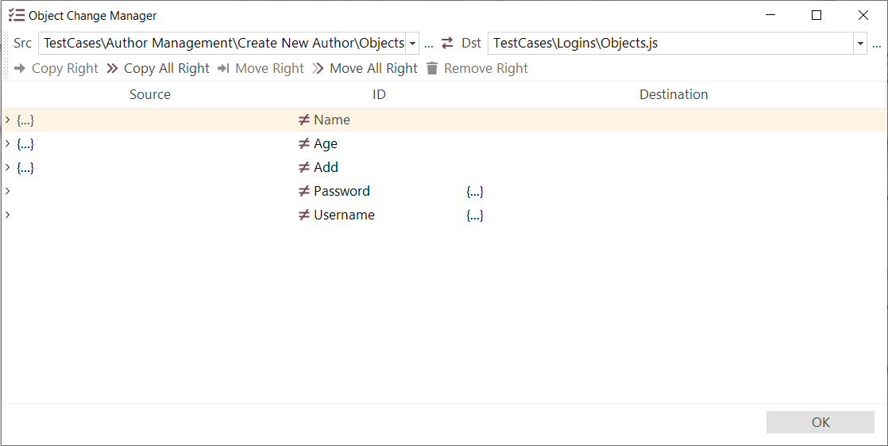
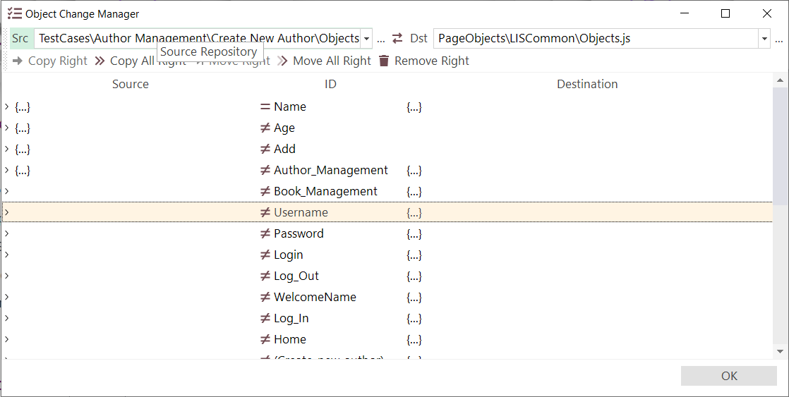

# Object Manager

## Purpose

The **Object Manager** allows you to merge the **object trees** of two different Rapise tests. This can be useful when you have a new test that needs objects from an existing test.

## How to Open

Use menu `Tools > Object Manager`.

In [testing framework](Frameworks/frameworks.md) mode, you can open the **Object Manager** from the context menu of the corresponding object repository:

{width="293px"}

## Choosing Files to Merge

In the example above, we've opened a test case containing some objects. Next, you'll need to open another test that also contains objects. To do this, click the dropdown button to the right of the **Dst** (destination) text box to open a Rapise test object file (`Objects.js`):

Once you've selected the file, the **Object Manager** dialog displays the list of objects to be merged (see the next section).

If you click the dropdown button on the left-hand side of the dialog box, marked **Src** (Source), you can select a different Rapise test object file (`Objects.js`) that you want to copy objects from.

If you want to make the current test the **Destination** rather than the **Source** (i.e., you want to add objects to the current test instead of exporting them from it), simply click the **Switch Sides** `<-->` icon. The current test will then be moved to the destination:

{width="505"}

## Viewing Objects

Once you've selected both the source and destination object files, the system displays a dialog showing all objects defined in both tests. You can then choose which objects to add to or delete from the destination test:

For each object in the **Object Manager**, you will see an `>` expand icon on the left-hand side. Clicking this icon expands the object to display its properties. If the same object exists in both the source and destination, its properties will be displayed on the left and right sides, respectively. If it only exists in either the source or destination, properties will only appear on the appropriate side:

Each object in the source object list is displayed with one of two icons:

*   **Equals (=)**: This indicates that the same object exists in both the **source** and **destination** test object files, and all their properties are identical.
*   **Not-Equals (≠)**: This indicates that the object either exists only in the **source** or **destination** file, or that there are object properties with different values.

You can tell which file(s) an object is defined in (source, destination, or both) by looking for the `...` icon. If you see this icon only on the left-hand side, the object exists only in the source file. If you see it on the right-hand side, it exists only in the destination.

If you see it on both sides, it exists in both the source and destination:

## Copying Objects

To add an object from the **source** to the **destination** test (for example, the 'Name' object in this example), select the relevant row:

Then, click the **Copy Right** icon in the toolbar or use the shortcut (++ctrl+f5++). This will copy the object from the source to the destination:

You can tell the object has been copied because the **Not-Equals (≠)** sign changes to the **Equals (=)** sign.

There is also an option to copy all objects to the destination; simply use the **Copy All Right** button on the toolbar.

## Deleting Objects

Conversely, to remove an object (e.g., **Username**) from the destination, simply select the row:

Then, click the **Remove Right** button or use the shortcut (++ctrl+d++):

The object will now be removed from the **destination** object tree.

> **Warning:** All changes you make to the objects file are committed immediately. Therefore, only delete objects from the destination test that you no longer want to be part of it.

## Moving Objects

Rapise 8.4 introduces the ability to move objects. Two new buttons have been added to the toolbar: **Move Right** and **Move All Right**. A good use case for these buttons is when you've recorded something into a test case but want to move the functionality and objects to a Page Object or Module.