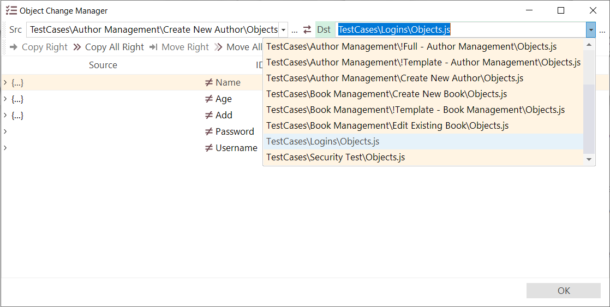

# Object Manager

## Purpose

The **Object Manager** allows you to merge the **object trees** of two different Rapise tests. This can be useful when you have a new test that needs some of the objects from a test that you have already written.

## How to Open

Use menu `Tools > Object Manager`.

In [testing framework](Frameworks/frameworks.md) mode you may open an **Object Manager** from the context menu of the corresponding object repository:

## Choosing Files to Merge

In the example above we have opened up a test case that has some objects. Now we need to open up another test that also has some objects. To do this, click on the dropdown button to the right of the **Dst** (destination) text box to open up a Rapise test object file (`Objects.js`):

Once you have selected the file, the **Object Manager** dialog will display the list of objects to be merged (see next section).

If you click on the dropdown button in left hand side of the dialog box, marked **Src** (Source), you will be able to select a different Rapise test object file (`Objects.js`) that you want to copy the objects **from**.

If you want to make the current test the **Destination** rather than the **Source** (i.e. you want to add objects to the current test rather than exporting from the current test), simply click the **switch sides** `<-->` icon and the current test will be moved to the destination:

## Viewing the Objects to Merge

Once you have selected both the source and destination object files, the system will display the dialog that lets you see all the objects defined the source and destination tests. You can now choose which objects to add/delete to/from the destination test:

For each object in the **object manager** you will see an `>` expand icon in the **left-hand** side. When you click on this icon it will expand the object to display its properties. If the same object is in both the source and destination, you will see the properties of both versions on the left and right hand sides respectively. If it only exists in the source or destination, then it will only show the properties on the appropriate side:

Each object in the source object list will be displayed with one of two icons:

- **equals (=)** - this means that the same object exists in both the **source** and **destination** test object files.
- **not-equals (≠)** - this means that the object only exists in the **source** file and not in the **destination** or vice-versa

You can see which file(s) an objects is defined in (source, destination or both) by looking for the `...` icon. If you see this on the left hand side only, this object only exists in the source file, if you see it in the right-hand side, it only exists in the destination.

If you see it on both sides then it exists in both the source and destination:

## Merging the Objects

To add an object from the **source > destination** test (for example the 'Name' object in this example) select the row in question:

Then click on the **'Copy Object to the Right (F5)'** icon in the toolbar. This will copy the object from the source to the destination:

You can tell that the object has been copied because the **not-equals (≠)** sign changes to the **equals option (=)**.

Conversely, to remove an object (e.g. **Username**) from the destination, simply select the row:

Then click on the '**Remove from Destination (++ctrl+d++)'**:

The object will now have been removed from the **destination** object tree.

> **Warning:** All of the changes you make to the objects file are committed immediately, so only delete objects in the destination test that you no longer want to be part of the test.
