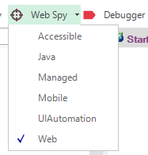

# Object Spy

## Purpose

The **Object Spy** allows you to inspect an object's properties and state.

Many controls on [User Interfaces](glossary.md) are compound objects, or there may be many instances of similar objects. To ensure you select precisely the correct object—or the correct object from a collection of similar objects—its properties can be used to further identify the specific instance.

## Usage

## Select Spy

To spy on an object, choose the type of **Object Spy** you want to use. You can do this by using the menu `Tools > Spy > ...` or by clicking the down-arrow next to the Spy icon in the [toolbar](menu_and_toolbars.md):

There are **6** types of Spy available:

1. [**Accessible**](object_spy_accessible.md) - Used to inspect applications that expose their properties using Microsoft Active Accessibility (MSAA) technology. Typically used by applications written in MFC, ATL, Qt, C++, and Visual Basic.
2. [**Java**](object_spy_java.md) - Used to inspect applications written using the Java AWT and Swing UI frameworks.
3. [**Managed**](object_spy_managed.md) - Used to inspect applications written in .NET 1.1, .NET 2.0, .NET 4.0 using Microsoft Windows Forms.
4. [**Mobile**](object_spy_mobile.md) - Used to inspect mobile applications running on iOS or Android devices, as well as on iOS or Android simulators.
5. [**UIAutomation**](object_spy_uiautomation.md) - Used to inspect applications that expose their properties using Microsoft's newer UIAutomation technology. Typically used by applications written in WPF, Silverlight, and Java SWT.
6. [**Web**](web_spy.md) - Used to inspect web applications running in browsers: Internet Explorer, Chrome, Firefox, or any browser accessible via Selenium.

For more details on each Spy type, refer to the specific topics above.

## Object Tracking

You can open the **Spy Dialog** directly using the **Spy** button in the main Rapise [toolbar](menu_and_toolbars.md), or by pressing the **Spy** button in the [Recording Activity](recording_activity_dialog.md) dialog during recording or learning.

1. Click the **Start Tracking** button (or press ++Ctrl+G++ (or ++Ctrl+T++ in Web Spy)).
2. As your mouse moves over different objects, the contents of the Object Spy dialog will change as it collects information about the object.
3. Hover over the object you wish to spy on and press ++Ctrl+G++. The reduced-size tracking dialog will expand into the larger [Object Spy Dialog](ses_spy_dialog.md), presenting all available information for the object.

## See Also

- Refer to the [Object Spy Dialog](ses_spy_dialog.md) for more details.