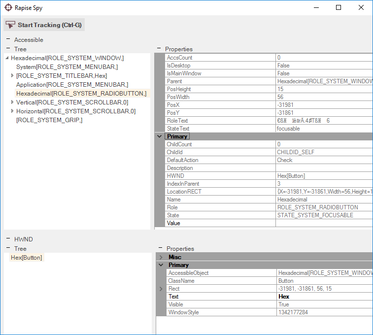
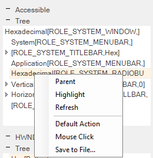

# Accessible (MSAA) Spy

## Purpose

The **Accessible Spy** is used to inspect applications that contain Microsoft Active Accessible (MSAA) objects.

## Features

The Accessible Spy has the following features:

- The **Tree** pane lets you view the hierarchy of MSAA objects available in the application
- The **Properties** pane lets you view the exposed properties of the highlighted MSAA object
- The **Learn Object** option is displayed when you use the Spy during recording and lets you pick specific [objects to learn](learn_object.md).

## Commands

In addition to viewing the object hierarchy and object properties, you can perform the following tasks:

- **Parent** - This selects the parent object of the one displayed
- **Highlight** - This will attempt to Flash (highlight with a red rectangle) the object selected in the Spy.
- **Refresh** - this simply refreshes the Spy view to reflect any changes that might have occurred in the application.
- **Default Action** - this will perform the default action on the selected object in the Spy
- **Mouse Click** -  this will perform a simple mouse click on the selected object in the Spy
- **Save to File** - this will save the properties of the currently selected object to a text file.

## See Also

- [Object Spy](object_spy.md)
- [Microsoft Active Accessibility](http://msdn.microsoft.com/en-us/magazine/cc301312.aspx)
- [HWND](http://msdn.microsoft.com/en-us/library/aa979055.aspx)
