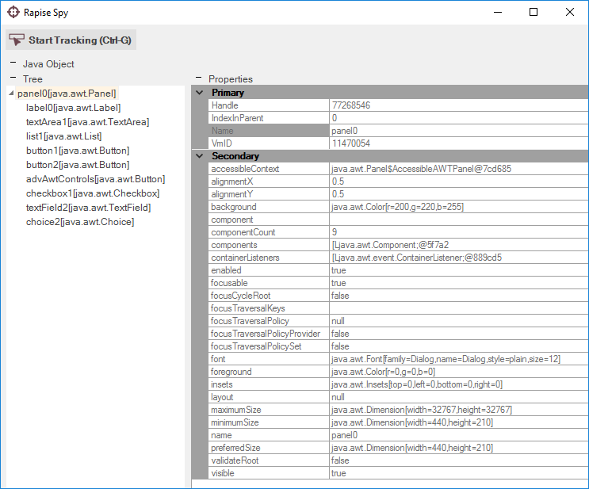

# Java Spy

## Purpose

The **Java Spy** is used to inspect applications that contain **Java (Swing / AWT)** objects.

## Features

The Java Spy has the following features:

- The **Tree** pane displays the hierarchy of Java objects available in the application.
- The **Properties** pane displays the exposed properties of the highlighted Java object.
- The **Learn Object** option is displayed when you use the Spy during recording, allowing you to pick specific [objects to learn](learn_object.md).

## Commands

In addition to viewing the object hierarchy and object properties, you can perform the following tasks:

- **Parent**: Selects the parent object of the currently displayed object.
- **Highlight**: Attempts to flash (highlight with a red rectangle) the object selected in the Spy.
- **Refresh**: Refreshes the Spy view to reflect any changes that may have occurred in the application.
- **Save to File**: Saves the properties of the currently selected object to a text file.
- **Save Type Information**: Saves Java object class information to a text file.

## See Also

- [Object Spy](object_spy.md)