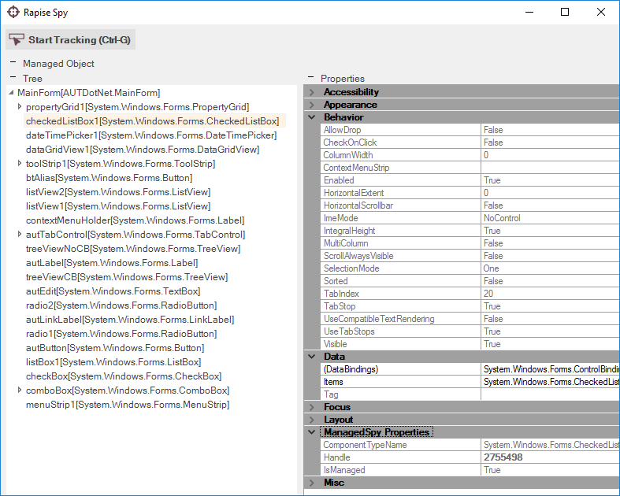
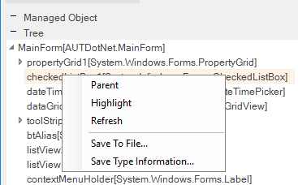

# Managed (.NET) Spy

## Purpose

The **Managed Spy** is used to inspect Microsoft .NET applications that contain .NET Framework objects (e.g., those using Windows Forms).

## Features

The Managed Spy has the following features:

- The **Tree** pane lets you view the hierarchy of .NET objects available in the application.
- The **Properties** pane lets you view the exposed properties of the highlighted .NET object.
- The **Learn Object** option is displayed when you use the Spy during recording and lets you pick specific [objects to learn](learn_object.md).

## Commands

In addition to viewing the object hierarchy and object properties, you can perform the following tasks:

- **Parent** - Selects the parent object of the currently displayed object.
- **Highlight** - Attempts to flash (highlight with a red rectangle) the object selected in the Spy.
- **Refresh** - Refreshes the Spy view to reflect any changes that may have occurred in the application.
- **Save to File** - Saves the properties of the currently selected object to a text file.
- **Save Type Information** - Saves object class type information to a text file.

## See Also

- [Object Spy](object_spy.md)