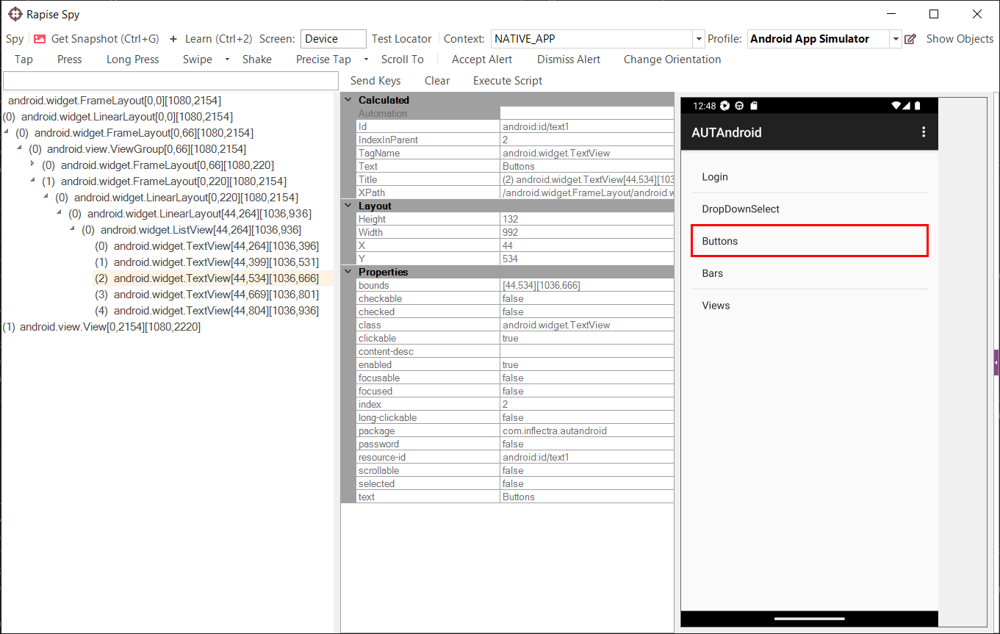
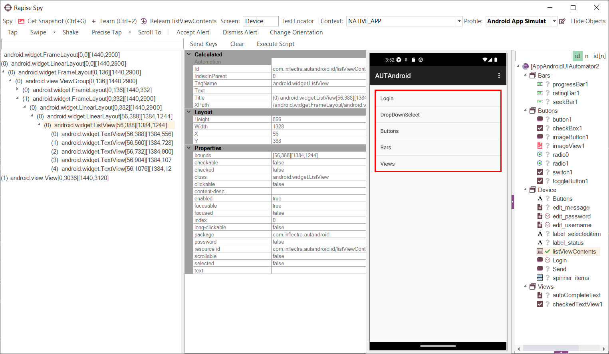
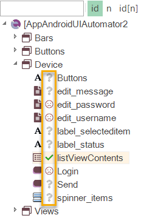

# Mobile Spy

## Purpose

The **Mobile Spy** is used to inspect applications running on connected mobile devices (e.g., Apple iOS and Android devices).

The **Mobile Spy** dialog displays a snapshot of the screen on the connected mobile device, as well as the properties of the currently selected object. You can select the object either by clicking on the screen snapshot or the control hierarchy displayed to the left. The properties displayed will depend on the type of mobile device being tested (iOS vs. Android).

## Tree Pane

The spied-upon object and its children are displayed here. When you click on an object, it will also be highlighted in the **snapshot** pane to the right.

## Properties Pane

Object fields and field values are displayed here.

## Snapshot Pane

This displays a snapshot of the screen on the mobile device under test. The objects in the snapshot are clickable, allowing you to visually select objects from the hierarchy.

## Toolbar First Row

- **Get Snapshot (++ctrl+g++)** - This connects to the mobile device, retrieves the latest snapshot, and displays it in the right-hand window.
- **Spy > Disconnect** - This option disconnects the Spy from the mobile device and ends the connection.
- **Learn Object** - This option is only displayed in Recording mode and allows you to add the currently selected object to the [Object Tree](object_tree.md) for the current test. It can then be used as a scriptable object in the test.
- **Spy > Page Source** - This allows you to view the mobile device's source in a text editor, such as Notepad. It displays the objects from the tree view as an XML document.
- **Spy > Go to URL** - This instructs the mobile device to navigate its built-in web browser to a specific URL.
- **Test Locator** - This displays the [Mobile Test Locator](mobile_test_locator_dialog.md) dialog box, allowing you to try different locators to resolve specific objects in the object hierarchy. It includes options such as XPath and IDs.
- **Profile** - This allows you to change the profile of the mobile device you are testing while the Spy dialog is open.
- **Edit Profiles** - This opens the [Mobile Settings](mobile_settings_dialog.md) dialog box. You cannot be connected to the device to do this.
- **Context** - This displays either 'Maintenance Mode' or 'Recording Mode'.

## Toolbar Second Row

The **Mobile Spy** also includes toolbar controls that allow you to send events to the mobile device from Rapise, simulating actions as if you were performing them directly on the device:

This dialog allows you to perform the following events on the device:

- **Tap** - This simulates tapping the currently selected object on the device.
- **Press** - This simulates a long tap (1 second) on the currently selected object.
- **Long Press** - Performs a long press on the currently selected object.
- **Swipe** - You specify the start and end points of the swipe operation. This is useful for simulating a realistic swipe on the device in a specific direction at a specific location (e.g., on a progress selector).

 

- **Shake** - For devices that support it (e.g., iOS), this simulates physically shaking the device.
- **Precise Tap** - You specify the exact location on the screen within the bounds of the current object where a tap will be simulated.

- **Scroll To** - Simulates scrolling to the selected object within the device object tree (which may not be visible).
- **Text / Send Keys** - To use this, enter text in the text box and click 'Send Keys'. This sends text to the currently selected object as if you were using the virtual keyboard on the device.
- **Clear** - Select a text box and use 'Clear' to erase the text displayed within it.
- **Accept Alert** - If a pop-up alert appears on the device, this simulates accepting it.
- **Dismiss Alert** - If a pop-up alert appears on the device, this simulates dismissing it.
- **Change Orientation** - For devices that support it, this simulates changing the device's orientation from landscape to portrait (or vice-versa).
- **Execute Script** - *This is not currently supported and is intended for future functionality*.

## Maintenance Mode

Since Rapise **version 6.2**, it is easier to check and update object locators. When you launch the spy, it will show the object tree in the right-side panel. You can toggle the visibility of the object tree using the `Show/Hide Objects` button in the top-right corner of the spy.

To check an object locator, simply select the object in the object tree. The result of the locator test is indicated by an icon.

{width="186px"}

If an object is found, it will be highlighted on the screenshot and selected in the tree of application objects (left pane).

To fix a locator for an object that is not found, do the following:

1.  Select the object in the object tree (right pane)
2.  Select the element on the screenshot or in the application tree (left pane)
3.  Press the Relearn button on the toolbar.

## See Also

- [Object Spy](object_spy.md)