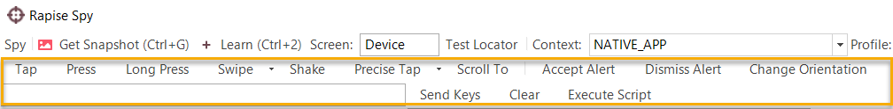

# Mobile Spy

## Purpose

The **Mobile Spy** is used to inspect applications running on connected Mobile Devices (e.g. Apple iOS and Android devices).

The **Mobile Spy** dialog shows a snapshot of the screen displayed on the connected Mobile device as well as the properties of the currently selected object. You can selected the object either by clicking on the screen snapshot or the control hierarchy displayed to the left. The properties displayed will depend on the type of mobile device being tested (iOS vs. Android).

## Tree Pane

The spied upon object and its children are displayed here. When you click on an object it will also be highlighted in the **snapshot**
pane to the right.

## Properties Pane

Object fields and field values are displayed here.

## Snapshot Pane

This displays a snapshot of what is displayed on the mobile device  being tested. The objects in the snapshot are clickable, which allows
you to visually select objects from the hierarchy.

## Toolbar First Row

- **Get Snapshot (++ctrl+g++)** - This will connect to the mobile device and get the latest snapshot from the mobile device and display in the right-hand window.
- **Spy > Disconnect** - This option disconnects the Spy from the mobile device and ends the connection.
- **Learn Object** - This option is only displayed in Recording mode and lets you take the currently selected object and add it to the [Object Tree](object_tree.md) for the current test. It can then be used as a scriptable object in the test.
- **Spy > Page Source** - This lets you view the source of the mobile device in a text editor such as Notepad. It will show the objects in the treeview represented as an XML document.
- **Spy > Go to Url** - This will instruct the mobile device to navigate its built in web browser to a specific URL.
- **Test Locator** - This will display the [Mobile Test Locator](mobile_test_locator_dialog.md) dialog box that lets you try different locators to resolve specific objects in the object hierarchy. It will include options such as using XPath and IDs.
- **Profile** - This lets you change the profile of the mobile device you are testing while the Spy dialog is open.
- **Edit Profiles** - This will open up the [Mobile Settings](mobile_settings_dialog.md) dialog box. You cannot be connected to do this.
- **Context** - This will display either 'Maintenance Mode' or 'Recording Mode'.

## Toolbar Second Row

The **Mobile Spy** also includes toolbar controls that let you send events to mobile device from Rapise, as if you were actually performing them on the device:

This dialog lets you perform the following events on the device:

- **Tap** - this will simulate tapping the currently selected object on the device.
- **Swipe** - you specify the start and end points of the swipe operation. This is useful for simulating a real swipe on the device in a specific direction at a specific location (e.g. on a progress selector).

 

- **Shake** - for devices that support it (e.g. iOS) this simulates shaking the device physically.
- **Precise Tap** - you specific the specific location on the screen within the bounds of the current object that you will be simulating a tap. 

- **Scroll To** - simulates scrolling to the selected object in the device object tree (which may not be visible).
- **Text / Send Keys** - to use this, enter in text in the text box and click 'Send Keys', this sends text to the currently selected  object as if you were using the virtual keyboard on the device.
- **Accept Alert** - if you have a popup alert on the device, this simulates accepting it.
- **Dismiss Alert** - if you have a popup alert on the device, this simulates dismissing it.
- **Change Orientation** - for devices that support it, this simulates changing the orientation of the device from landscape to portrait (or vice-versa).
- **Execute Script** - *this is not currently supported and is for future functionality*.

## Maintenance Mode

Since Rapise **version 6.2** it is easier to check and update object locators. If you launch the spy from the toolbar (it will be launched in Maintenance Mode) it will show the object tree in the right side panel.

To check an object locator simply select the object in the object tree. The result of locator test is indicated by an icon.

If an object is found it will be highlighted on the screenshot and selected in the tree of application objects (left pane).

To fix a locator for object that is not found do the following:

1. Select the object in the object tree (right pane)
2. Select the element on the screenshot or in the application tree (left pane)
3. Press relearn button on the toolbar.

## See Also

- [Object Spy](object_spy.md)