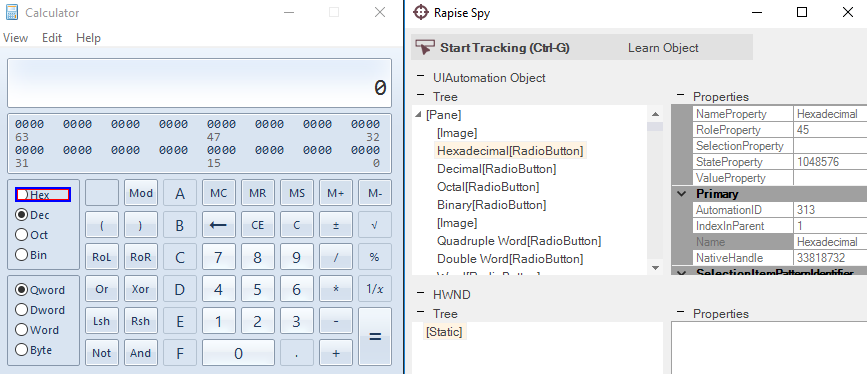

# UIAutomation Spy

## Purpose

The **UIAutomation Spy** is used to inspect applications that contain Microsoft UIAutomation objects (e.g., Windows Presentation Foundation, Silverlight, or Java's Standard Widget Toolkit running on Windows).

## How to Open

In the main menu, select `Tools > Spy > UIAutomation`. Then, on the toolbar, click the `UIAutomation Spy` button.

## Features

The UIAutomation Spy has the following features:

- The **Tree** pane allows you to view the hierarchy of UIAutomation objects available in the application.
- The **Properties** pane allows you to view the exposed properties of the highlighted UIAutomation object.
- The **Learn Object** option is displayed when the Spy is used during recording, allowing you to pick specific [objects to learn](learn_object.md).

## Commands

In addition to viewing the object hierarchy and object properties, you can perform the following tasks:

- **Parent** - Selects the parent object of the currently displayed one.
- **Highlight** - Attempts to flash (highlight with a red rectangle) the object selected in the Spy.
- **Refresh** - Refreshes the Spy view to reflect any changes that have occurred in the application.
- **Save to File** - Saves the properties of the currently selected object to a text file.
- **Save Type Information** - Saves information about UIAutomation object properties and patterns to a text file.

## See Also

- [Object Spy](object_spy.md)
- [Microsoft UIAutomation](http://support.microsoft.com/kb/971513/)