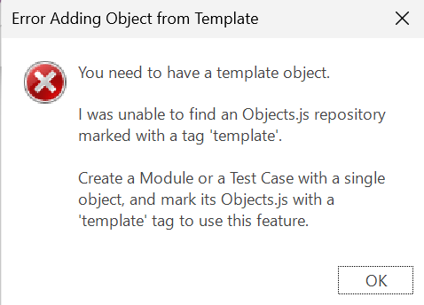
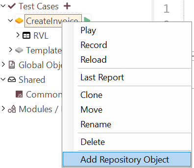

# Object Templates

## Purpose

The **Object Templates** feature allows you to model test cases using placeholder repository objects before you’ve learned them from the application. This is useful when designing [Modules / Page Objects](./Frameworks/pageobjects.md) ahead of actual implementation.

Object Templates are only available when working in [Testing Framework](./Frameworks/frameworks.md) mode.

## How to Use

Right-click on a **Test Case**, **Page Object / Module**, or **Object Repository Window** in the Object Tree. You will see the **Add Repository Object**.

This command inserts a repository object that is copied from a predefined **template** object.

### One-Time Setup: Creating a Template

Before you can use object templates, you must create at least one template object.

If no template is defined, you will see an error like this:

=== "Screenshot"
    
=== "Transcript"
    **Error Adding Object from Template**

    You need to have a template object.

    I was unable to find an Objects.js repository marked with a tag `template`.

    Create a Module or a Test Case with a single object, and mark its Objects.js with a `template` tag to use this feature.

Follow these steps to define a template:

1. **Create a Test Case**

   Create a new [test case](./Frameworks/frameworks.md#test-cases), for example named `Template`.

   
   

2. **Assign Tags**

   Right-click the test case while holding ++shift++, then select **Tags**.

   

   Add the following tags:

   - `template` – marks the test case and its repository as a template.
   - `skip` – optional; prevents the test from being executed or displayed in [Spira Dashboard](spira_dashboard_2.md).

   

3. **Learn an Object**

   Start the recorder and learn a UI object:

   
   

   After recording, press **Finish**.

4. **Rename Objects (Optional)**

   - Rename the learned object to something meaningful, like `Button`.

     
     

   - You may also rename the containing window.

     

5. **Tag the Repository**

   - Switch to **Test Files** view.

     

   - Select the `Objects.js` file next to the `Main` file.

   - In the **Properties** panel, set the `Tags` field to `template`.

     
     

## Adding Repository Objects from Template

Once the template is defined, you can add repository objects from it into other test cases or page objects.

### Adding to a Test Case or Module

Right-click on a test case or module in the Object Tree and choose:

**Add Repository Object**

=== "Screenshot"
    
=== "Transcript"
    User right-clicks on TestCases/CreateInvoice and chooses **Add Repository Object**.

You will be prompted to provide a new object ID:

The new object appears in the Object Tree under the window from the template. You can rename it as needed.

### Adding to a Window

Right-click on a window node in the Object Tree and choose **Add Repository Object**:

The new object appears within the same window:

### Adding Next to Another Object

Right-click on an existing repository object and choose **Add Repository Object**:

The new object will be added to the same window.

> 💡 You can also [clone an object](./object_tree.md#context-menu-object) to achieve a similar result.

## Multiple Template Objects

You can define multiple objects within a single template repository. For example, you may define both a `Button` and `TextBox` object:

When you use **Add Repository Object**, a selection dialog will appear:

Select the object you want to insert and click **OK**.

## Summary

- **Object Templates** allow designing tests before real object learning.
- You must first create a test case or module and mark its `Objects.js` with the `template` tag.
- Use **Add Repository Object** from the Object Tree to insert template-based objects.
- Supports inserting into test cases, page objects, object windows, or alongside other objects.
- Multiple template objects can be defined, and users will be prompted to select one when adding.
- Tagging test cases with `skip` and `template` ensures clean integration with dashboards and test sets.
