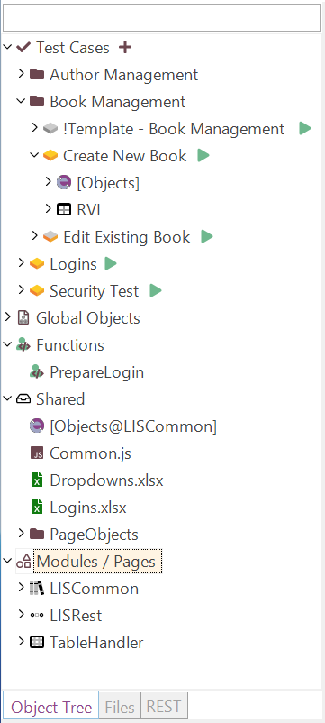

# Object Tree View

{width="241px"}

## Purpose

The purpose of the Object Tree View varies based on whether the current context is a standalone test or a [testing framework](./Frameworks/frameworks.md).

## How to Open

The Object Tree View is always visible by default, unless you have explicitly switched to a different view. To display the Object Tree View again, go to `View > Show > Objects`.

The **Objects** dialog is a component of the [Default Layout](restoring_the_default_layout.md).

## Filtering

The Object Tree has built-in filtering and display mode switches.

{width="241px"}

- *Filter* - A quick filter to narrow down the range displayed in the object tree. It updates the tree as you type. To cancel the filtering, simply remove everything from this input box, press the `X` icon, or press ++esc++ on your keyboard.

## Testing Framework Mode

When a [Testing Framework](./Frameworks/frameworks.md) is open, the Tree View includes additional nodes.

### Test Cases Node

This node represents framework [test cases](./Frameworks/frameworks.md#test-cases).

#### Test Cases Root Context Menu

{width="266px"}

- **Create Test Case** - Adds a new [test case](./Frameworks/frameworks.md#test-cases) to the root.
- **Import Test Case** - [Imports a Test Case](./Frameworks/frameworks.md#importing-test-cases) to the root.
- **Play All** - Runs all root test cases except those marked with `template` or `skip` tags.
- **Play All (Recursive)** - Runs all test cases except those marked with `template` or `skip` tags.
- **Reveal in Explorer** - Opens the `TestCases` folder in your file explorer.
- **Expand All** - Expands all nodes below.
- **Collapse All** - Collapses all nodes below.
- **Reload** - Reloads all test cases (this may be needed if tests were synchronized with a remote repository).

#### Test Cases Group Context Menu

{width="259px"}

- **Create Test Case** - Adds a new [test case](./Frameworks/frameworks.md#test-cases) to this group.
- **Import Test Case** - [Imports a Test Case](./Frameworks/frameworks.md#importing-test-cases) to this group.
- **Play All** - Runs all test cases from this folder, except those marked with `template` or `skip` tags.
- **Play All (Recursive)** - Runs all test cases in this folder and its subfolders, except those marked with `template` or `skip` tags.
- **Reveal in Explorer** - Opens the `TestCases` folder in your file explorer.

#### Test Case Context Menu

{width="278px"}

- **Play** - Executes this test case.
- **Record** - Starts the recorder for this test case.
- **Reload** - Re-reads information about this test case.
- **Last Report** - Opens the last execution report for this test case (if available).
- **Clone** - Clones the test case.
- **Move** - Moves this test case into a new or existing folder (re-groups it).
- **Rename** - Changes the alias name (the folder name will remain the same).
- **Delete** - Removes the test case.

#### Test Case Tags

When you right-click with the ++shift++ key pressed, the context menu will include options to manage the following tags:

{width="247px"}

- **draft**: Toggles the `draft` state of the test case, which is useful for marking it as incomplete.
- **template**: Marks the test case as a template. Template test cases are not displayed in the [Spira Dashboard](spira_dashboard_2.md), as it is assumed they will be used to create test cases using the **Clone** functionality.
- **skip**: Ignores this test case when using **Play All** or **Play All (Recursive)**.

The `draft` and `template` states affect the context menu's display:

Default:

{width="192px"}

Draft:

{width="192px"}

Template:

{width="192px"}

#### Test Case Object Repository Context Menu

{width="251px"}

- **Collapse All** - Collapses all object windows.
- **Expand All** - Expands all object windows.
- **Reload** - Re-reads information from this Object Repository.
- **Object Manager** - Opens the [Object Manager](object_manager.md).

#### Test Case RVL Sheet Context Menu

{width="225px"}

- **Play this Sheet** - Executes the given RVL Sheet.

### User Functions and Variables

Rapise scans available shared JavaScript files and extracts information about global, user-defined [functions and variables](global_variables.md) into these nodes.

#### User Functions/Variables Context Menu

{width="171px"}

{width="171px"}

- **Reload** - Re-reads information about known functions and variables.

### Shared Node

This node displays shared assets, including common JavaScript files (`*.js`), Object Repositories (`Objects.js`), spreadsheets (`*.xlsx`, `*.xls`, `*.csv`), web service definitions (`*.rest`, `*.soap`), and other file types (`*.json`, `*.txt`, etc.).

#### Shared Node Context Menu

{width="266px"}

- **New JavaScript File...** - Creates and adds a `.js` file.
- **New Spreadsheet...** - Creates and adds a `.xlsx` file.
- **New Text File...** - Creates and adds a `.txt` file.
- **New JSON File...** - Creates and adds a `.json` file.
- **New File...** - Creates and adds another type of file.
- **New Dropdowns.xlsx** - Creates [Dropdowns.xlsx](./Frameworks/frameworks.md#dropdownsxlsx). This item is only visible if `Dropdowns.xlsx` does not yet exist.
- **Reveal In Explorer** - Opens the `Shared` folder in your file explorer.
- **Import File** - Imports a file (usually a spreadsheet or text file).
- **Reload** - Updates the shared files view.

#### Shared File Context Menu

{width="244px"}

- **Rename** - Changes the name of a file.
- **Make a Copy** - Creates a duplicate shared file with identical contents.
- **Remove from Disk** - Deletes the file from the test as well as from the disk.
- **Reveal in Explorer** - Opens the file explorer and highlights this particular file.

### Modules / Pages Node

This node contains [Modules / Page Objects](./Frameworks/pageobjects.md) defined within this testing framework.

#### Modules / Pages Context Menu

{width="257px"}

- **Create Module / Page Object** - Adds a new [Module / Page Object](./Frameworks/pageobjects.md).
- **Import Module / Page Object** - Imports an existing [Module / Page Object](./Frameworks/pageobjects.md) from another testing framework.

#### Page Object Context Menu

{width="206px"}

- **Reload** - Refreshes information about this module.
- **Add Repository Object** – Creates a new Object Repository and adds an object to it. This option is only available if no Object Repository currently exists and a [template repository](./object_templates.md) has been defined.
- **Delete** - Removes this module.

#### Module / Page Action Context Menu

{width="254px"}

- **Invoke <Some Action>** - Plays this action alone.

### Context Menu (window)

Right-click the **Window** node to see:

{width="192px"}

- **Remove** - Removes the window and all contained objects.
- **Add Repository Object** - Adds an object from a template to this window. This menu item is only available when a [template repository](./object_templates.md) is defined for the current testing framework.

### Context Menu (object)

Right-click an object in the **Object Tree** dialog to see:

{width="222px"}

- **Flash** - Opens the application/URL where the object is located. A frame will blink around the object to show its position on the page.
- **Re-Learn** - Opens the [Recorder](recording.md), allowing you to re-learn the object. This is useful if the AUT has changed and the object definition no longer correctly locates the object.
- **Rename** - Opens the Rename dialog for the object.
- **Clone** - Makes a copy of the object definition and adds the cloned version to the tree. You can then make changes to the cloned copy.
- **Add Parameter** - Opens a dialog box that allows you to add a custom parameter to the learned object definition (stored in the `Objects.js` file).
- **Delete** - Simply removes the selected object from the tree.
- **Add Repository Object** - Adds an object from a template to this object's window. This menu item is only available when a [template repository](./object_templates.md) is defined for the current testing framework.

### Context Menu (Object Repository)

Right-click the **Object Tree** node to see:

{width="271px"}

- **Reload** - Checks for new objects to display.
- **Object Manager** - Runs an [Object Manager](object_manager.md).
- **Add Repository Object** - Adds an object from a template to this repository. This menu item is only available when a [template repository](./object_templates.md) is defined for the current testing framework.