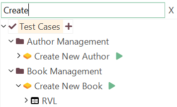
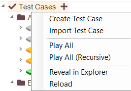
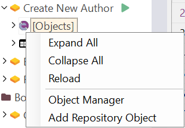
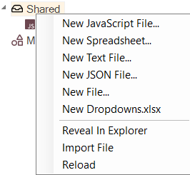
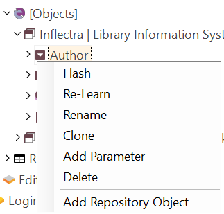

# Object Tree View

{width="241px"}

## Purpose

The purpose of the Object Tree View varies depending on whether the current context is a standalone test or a [testing framework](./Frameworks/frameworks.md).

## How to Open

The Object Tree View is always visible by default, unless you have explicitly switched to a different view. If you want to display the Object Tree View again, go to `View > Show > Objects`.

The **Objects** dialog is a component of the [Default Layout](restoring_the_default_layout.md).

## Filtering

Object Tree has build in filtering and display mode switches.

{width="241px"}

- *Filter* - quick filter to narrow down range displayed in the object tree. Updates the tree while you type. If you want to cancel the filtering then simply remove everything from this input box or press `X` icon or press ++esc++ on your keyboard.

## Testing Framework Mode

When a [Testing Framework](./Frameworks/frameworks.md) is currently open, the Tree View includes additional nodes.

### Test Cases Node

The node represents framework [test cases](./Frameworks/frameworks.md#test-cases).

#### Test Cases Root Context Menu

{width="266px"}

- **Create Test Case** - Add new [test case](./Frameworks/frameworks.md#test-cases) to the root.
- **Import Test Case** - [Import Test Case](./Frameworks/frameworks.md#importing-test-cases) to the root.
- **Play All** - Run all root test cases except those marked with `template` or `skip` tags.
- **Play All (Recursive)** - Run all test cases except those marked with `template` or `skip` tags.
- **Reveal in Explorer** - Open `TestCases` folder in file explorer.
- **Expand All** - Expand all nodes below.
- **Collapse All** - Collapse all nodes below.
- **Reload** - Reload all test cases (may be needed if test were synchronized with remote repository).

#### Test Cases Group Context Menu

{width="259px"}

- **Create Test Case** - Add new [test case](./Frameworks/frameworks.md#test-cases) to this group.
- **Import Test Case** - [Import Test Case](./Frameworks/frameworks.md#importing-test-cases) to this group.
- **Play All** - Run all test cases from this folder except those marked with `template` or `skip` tags.
- **Play All (Recursive)** - Run all test cases in this folder and its subfolders except those marked with `template` or `skip` tags.
- **Reveal in Explorer** - Open `TestCases` folder in file explorer.

#### Test Case Context Menu

{width="278px"}

- **Play** - Execute this test case.
- **Record** - Start recorder for this test case.
- **Reload** - Re-read information about this test case.
- **Last Report** - Open last execution report for this test case (if any).
- **Clone** - Make a Clone of the test case
- **Move** - Move this Test Case into new or existing Folder (Re-Group)
- **Rename** - Change Alias name (folder name will stay the same)
- **Delete** - Remove a test case

#### Test Case Tags

When you right-click with the ++shift++ key pressed, the context menu will have two additional options:

{width="247px"}

- **draft**: Toggles the `draft` state of the test case. This is useful for marking a test case as incomplete.
- **template**: Marks the test case as a template. Template test cases are not displayed in the [Spira Dashboard](spira_dashboard_2.md). It is assumed that templates will be used to create test cases using the **Clone** functionality.
- **skip**: Ignore this test case when using **Play All** or **Play All (Recursive)**

The `draft` and `template` states affect the display of the context menu:

Default:

{width="192px"}

Draft:

{width="192px"}

Template:

{width="192px"}

#### Test Case Object Repository Context Menu

{width="251px"}

- **Collapse All** - Collapse all object windows.
- **Expand All** - Expand all object windows.
- **Reload** - Re-read information from this Object Repository.
- **Object Manager** - Opens the [Object Manager](object_manager.md).

#### Test Case RVL Sheet Context Menu

{width="225px"}

- **Play this Sheet** - Execute given RVL Sheet.

### User Functions and Variables

Rapise scans available shared JavaScript files and extracts information about global user defined [functions and variables](global_variables.md) into these nodes.

#### User Functions/Variables Context Menu

{width="171px"}

{width="171px"}

- **Reload** - Re-read information about known Functions/Variables.

### Shared Node

The node displays shared assets, including common JavaScript files (`*.js`), Object Repositories (`Objects.js`), Spreadsheets (`*.xlsx`, `*.xls`, `*.csv`), WebService definitions  (`*.rest`, `*.soap`) and other file types (`*.json`, `*.txt`, etc.).

#### Shared Node Context Menu

{width="266px"}

- **New JavaScript File...** - create and add a `.js` file.
- **New Spreadsheet...** - create and add a `.xlsx` file.
- **New Text File...** - create and add a `.txt` file.
- **New JSON File...** - create and add a `.json` file.
- **New File...** - create and add other type of file.
- **New Dropdowns.xlsx** - create [Dropdowns.xlsx](./Frameworks/frameworks.md#dropdownsxlsx). This item is only visible if there is no `Dropdowns.xlsx` yet.
- **Reveal In Explorer** - open `Shared` folder in file explorer.
- **Import File** - Import a file (usually spreadsheet or text)
- **Reload** - Update a shared files view.

#### Shared File Context Menu

{width="244px"}

- **Rename** - change the name of a file.
- **Make a Copy** - create a duplicate shared file with identical contents.
- **Remove from Disk** - deletes the file from Test as well as from the disk.
- **Reveal in Explorer** - opens the file explorer and highlights this particular file.

### Modules / Page Objects Node

The node contains [Module / Page Objects](./Frameworks/pageobjects.md) defined in this testing framework.

#### Page Objects Context Menu

{width="257px"}

- **Create Module / Page Object** - add new [Module / Page Object](./Frameworks/pageobjects.md).
- **Import Module / Page Object** - import existing [Module / Page Object](./Frameworks/pageobjects.md) from another testing framework.

{width="206px"}

- **Reload** - refresh information about this module.
- **Delete** - remove this module.

{width="254px"}

- **Invoke &lt;Some Action&gt;** - play this action alone.

## Single Test Mode

### Context Menu (root node)

Right click the **Object Tree** node to see:

{width="271px"}

- **Reload** - checks for new objects to display.
- **Object Manager** - run an [Object Manager](object_manager.md).

### Context Menu (window)

Right click the **Window** node to see:

{width="192px"}

- **Remove** remove window and all contained objects.

### Context Menu (object)

Right click on an object in the **Object Tree** dialog to see:

{width="222px"}

- **Flash** opens the application/url where the object is located.  A frame will blink around the object to show you where it is on the page.
- **Re-Learn** will open up the [Recorder](recording.md), allowing you to re-learn the object. This is useful if the AUT has changed and the object definition will no longer correctly locate the object.
- **Rename** opens Rename dialog for the object.
- **Clone** makes a copy of the object definition and adds the cloned version into the tree. You can then make changes to the cloned copy.
- **Add Parameter** opens up a dialog box that lets you add a custom parameter to the learned object definition (stored in the `Objects.js` file).
- **Delete** simply removes the selected object from the tree.
