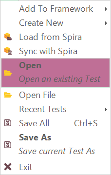
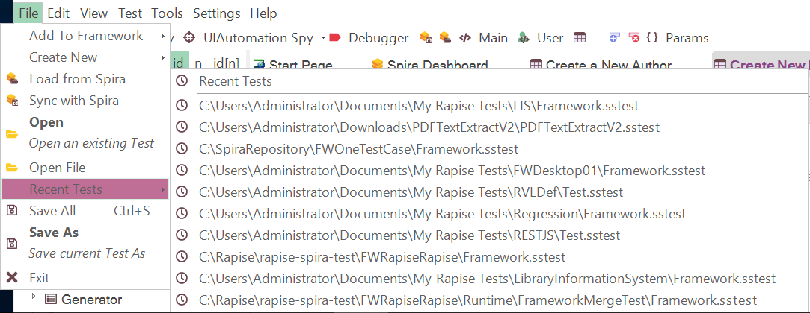

# Open a Test

You can open a test from the main menu.

The main menu includes an **Open** option and a list of **Recent Tests** from which you can choose:

You can also open a test stored in **SpiraTest** (our web-based test management system) instead of on the local filesystem. To do this, click the **Open Test from Spira** option. For more details on using Rapise with SpiraTest, refer to the [SpiraTest Integration](spiratest_integration.md) section.

## See Also

- [How-Tos](howtos.md)