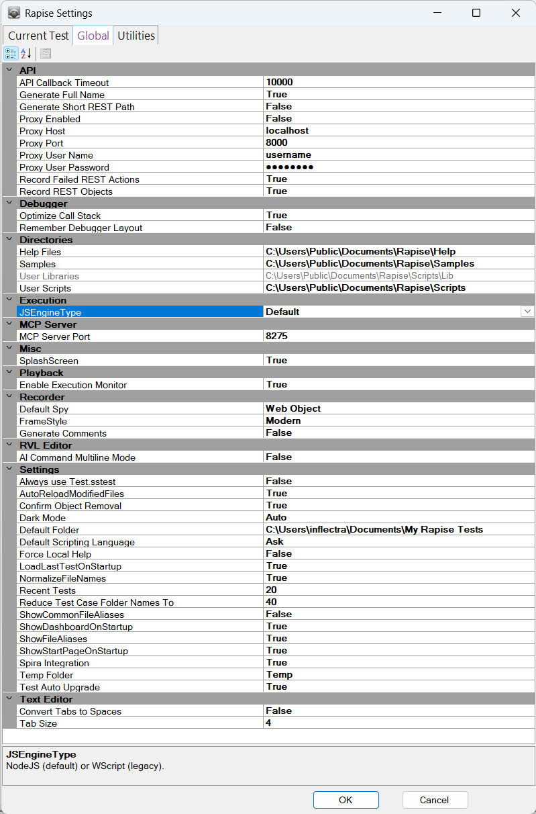

# Rapise Settings Dialog

## Purpose

Use the **Rapise Settings** dialog to change the global options. Your changes will apply to all tests.

## How to Open

User `Settings > Global` menu item.

## Global Settings

### Misc

* **SplashScreen**: A splash screen is the image that appears while a program initializes.  The Rapise splash screen looks like this:

Set **SplashScreen** to **False** to prevent the splash screen from appearing.

### API

* **API Callback Timeout**: Defaults to 10000. Number of milliseconds to wait when doing [Before-Request and After-Response REST Callbacks](rest_web_service.md#before-request-and-after-response-rest-callbacks). The timeout applies to each callback call individually.
* **Generate Full Name**: If 'Record REST Objects' is `true`, then
    * `true`: Generate long name for objects and variables, i.e. 'Libraryinformationsystem_Login'
    * `false`: Generate short name, i.e. 'Login'
* **Generate Short REST Path**: If 'Record REST Objects' is `false`, then
    * `true`: Generate short path, i.e. 'RESTDef.rest'
    * `false`: Generate full path, i.e. '%WORKDIR%/SubTest/RESTDef.rest'. May be needed when you have **.rest** definition files with the same name in your framework.
* **Record Failed REST Actions**: `true` means: If recorded REST action is failed, generate `.DoExecute(...,true)` that [ignores](../Libraries/RESTService.md#doexecute) the response code so generated test is passing.
* **Record REST Objects**: Generate Object for Each REST request.
    * `true`: An object added to the Object Repository for each request. Then it is initialized using `var <request_object_id> = SeS(<request_object_id>)`.
    * `false`: Don't add anything to the object tree. Each request is initialized as `var <request_object_id> = /**RESTRequest*/Session.GetRESTRequest('<definition>.rest', '<request_id>')`. This approach makes it easier to generate re-usable functions doing REST calls without need to load objects. See [Session.GetRESTRequest](../Libraries/Session.md#getrestrequest).

### Debugger

* **Optimize Call Stack**: If **True**, removes redundant information from the call stack view. See also [Call Stack View Optimization](variable_call_stack_view#call-stack-view-optimization).

* **Remember Debugger Layout**: If **True**, Rapise will remember the window layout for debug mode separately. For example, this may be useful if you want to work full screen while authoring the Test and half-screen to debug. This way the AUT and the Rapise debugger fit on the screen.

### Execution

* **JSEngineType**: Set preferred  [JavaScript Engine](jscript_language_reference) (one of **Default**, **Node**, **WScript**). Where **Default** means **Node**.

### Settings

* **Always use Test.sstest**: Defaults to **False**. If set to **True**, the test file name is set to `Test.sstest` rather than `<test folder name>.sstest`. This may be useful in rare cases when your testing framework has deep nested structure, you have very long file names and need to fit into 260 chars of Windows `MAX_PATH` limit.
* **AutoReloadModifiedFiles**: If set to **True**, any files you modify outside of Rapise are automatically reloaded in Rapise.
* **Confirm Object Removal**: Ask when deleting object form the [Object Tree](object_tree.md).
* **DefaultFolder** specifies  where new tests are kept before you explicitly save them.  The location is relative to the Rapise executable.
* **Default Scripting Language**: JavaScript, RVL or Ask. 
* **LoadLastTestOnStartup**: If set to **True**, Rapise will open the last test you worked on and saved.  If set to **False**, Rapise will create a new test named MyTest<#> where <#> is an integer.  A folder for MyTest<#> is created in the folder specified by the **DefaultFolder** option.
* **NormalizeFileName**: If set to **True**, files are referred to (in the `*.sstest` file) using a a path relative to the `*.sstest` file.  Otherwise, their absolute path is used.
* **RecentTests**: The maximum number of recent files displayed in the **Recent Tests** list.  To see the Recent Tests list, open the Application Menu:

    

* **ShowCommonFileAliases**: Legacy, not needed since Rapise 6.0.
* **Enable Execution Monitor**: specifies whether the execution monitor dialog box will be displayed during [playback](playback.md).
* **ShowDashboardOnStartUp**: If **True**, the [Spira Dashboard](spira_dashboard.md) will open automatically when Rapise is opened.
* **ShowStartPageOnStartUp**: If **True**, the [Start Page](start_page.md) will open automatically when Rapise is opened.
* **Spira Integration**: Enables all dialogs and menus for [SpiraTest Integration](spiratest_integration.md).
* **Temp Folder**:  default folder for temporary tests.
* **Test Auto Upgrade**: if set to **True** each opened `.sstest` file is automatically upgraded to the latest format.

### Recorder

* **FrameStyle**: Specifies which frame to draw around objects when you [Record](recording.md), [Learn](object_learning.md), and [Spy](object_spy.md).

    The **Basic** frame is on the left and the **Modern** frame is on the right:

     
* **DefaultSpy** specifies which of the various types of [Object Spy](object_spy.md) will be displayed by default.
* **GenerateComments**: **True** to automatically generate JavaScript or RVL comment for each recorded action.

### Text Editor

* **Convert Tabs to Spaces**: **True** to force tabs to spaces conversion for the text editor.
* **Tab Size**: Editor Tab Size

## Utilities

Utility functions

* Set of **Open** buttons:
  * **Open Web Profiles Folder**
  * **Open Selenium Profiles Folder**
  * **Open Mobile Profiles Folder**
  * **Open Samples Folder**
  * **Open User Libraries Folder**
  * **Open Application Log Folder**

* **Reset Layout** - Pressing the **Reset Layout** button restores the [default layout](restoring_the_default_layout.md).  Rapise will restart.
