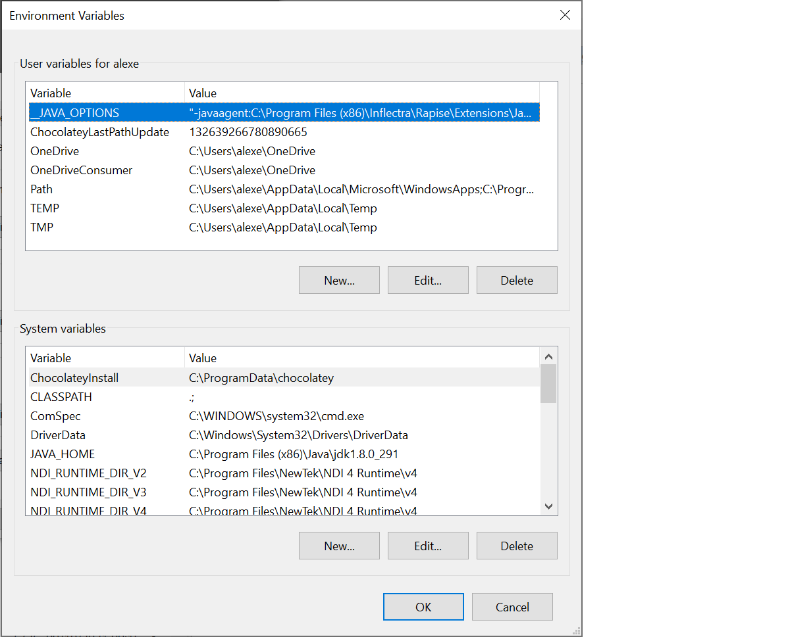
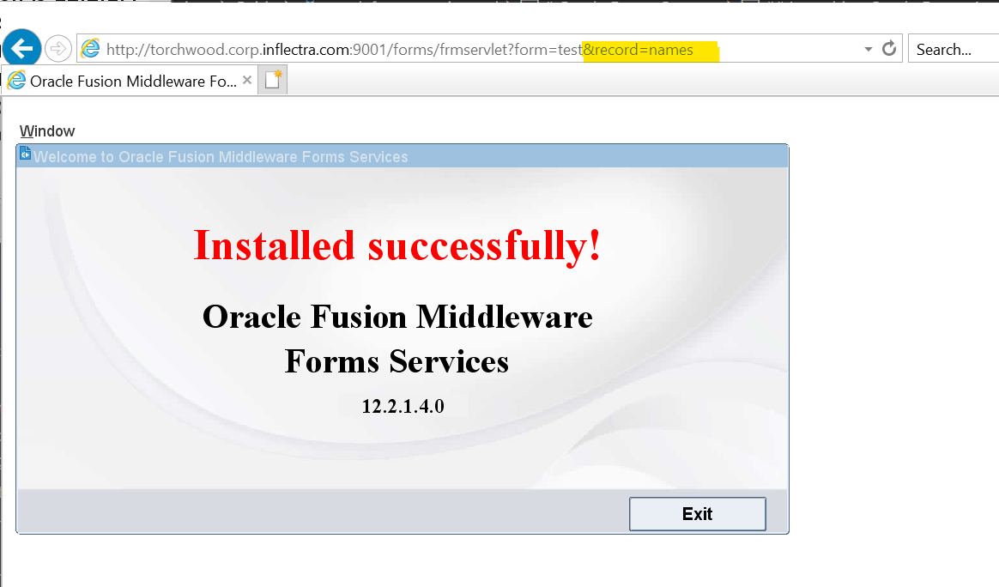
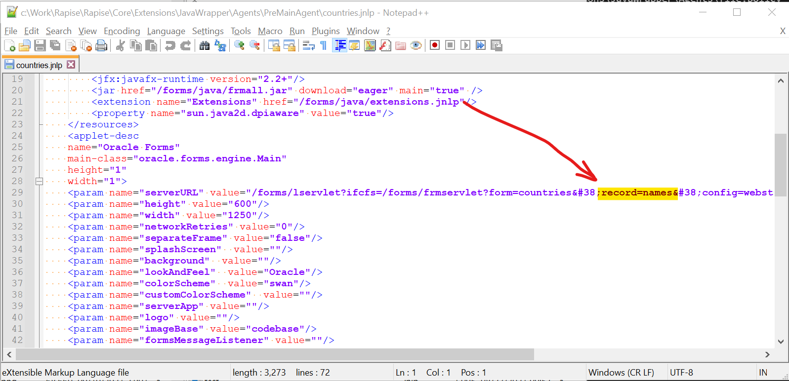

# Oracle Forms Support

## Overview
Rapise [Oracle Forms Library](../Libraries/ses_lib_oracleforms.md) enables recording, learning and playback of various [Oracle Forms](https://www.oracle.com/application-development/technologies/forms/forms.html) controls. 


## Supported Oracle Forms Versions
Rapise 7.1 has support for **Oracle Forms** version 10 and higher.

## Supported Java Versions

Integration should work with other versions of Java (5 and higher). 

## Preparing Environment

### 1. Java Support
Don't forget to deploy Rapise Java bridge as described [here](./java_awt_swing_testing.md#java-bridge-installation).

### 2. _JAVA_OPTIONS
You need to set environment variable `_JAVA_OPTIONS`.

```
"-javaagent:C:\Program Files (x86)\Inflectra\Rapise\Extensions\JavaWrapper\Agents\PreMainAgent.jar" "-Djava.security.policy=C:\Program Files (x86)\Inflectra\Rapise\Extensions\JavaWrapper\Agents\file.policy"
```



It may be set it through system or user Environment variables. Also, if your application is launched through the .bat file, you may assign `_JAVA_OPTIONS` there:

```cmd
...
set _JAVA_OPTIONS="-javaagent:C:\Program Files (x86)\Inflectra\Rapise\Extensions\JavaWrapper\Agents\PreMainAgent.jar" "-Djava.security.policy=C:\Program Files (x86)\Inflectra\Rapise\Extensions\JavaWrapper\Agents\file.policy"
...
rem <launch of the application.jar>
```

Setting `_JAVA_OPTIONS` globally may affect other software or tools, so, in case of any problems you may remove this variable or rename it to something else.

### 3. Change the Launch URL
See [Launching Oracle Forms Application](#launching-oracle-forms-application) to learn more about the changes to the launch process that needs to be done to enable testing


## Launching Oracle Forms Application
There are two major ways on how your application may be started: using **Internet Explorer** or using **Java Web Start** (`.jnlp` file).

In either case, you need to make sure that the URL to the application contains the following parameters:

### From Internet Explorer
You need to append the following parameter to the URL:
`...&record=names`

In case of **Internet Explorer** this means that URL contains this part:



### From Java Web Start .jnlp File
``...&38;record=names`




## Global Object
Rapise [Oracle Forms Library](../Libraries/ses_lib_oracleforms.md)  includes [OracleForms](../Libraries/OracleForms.md) global object. It mostly used to deal with main menu, notifications and status bar.