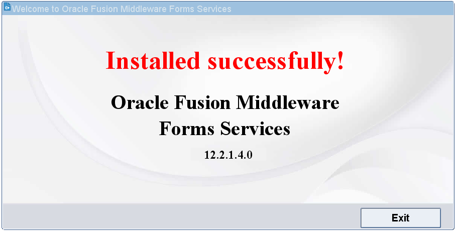
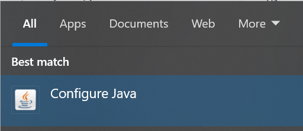
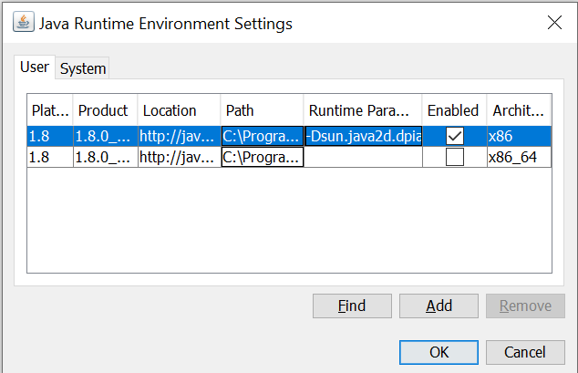
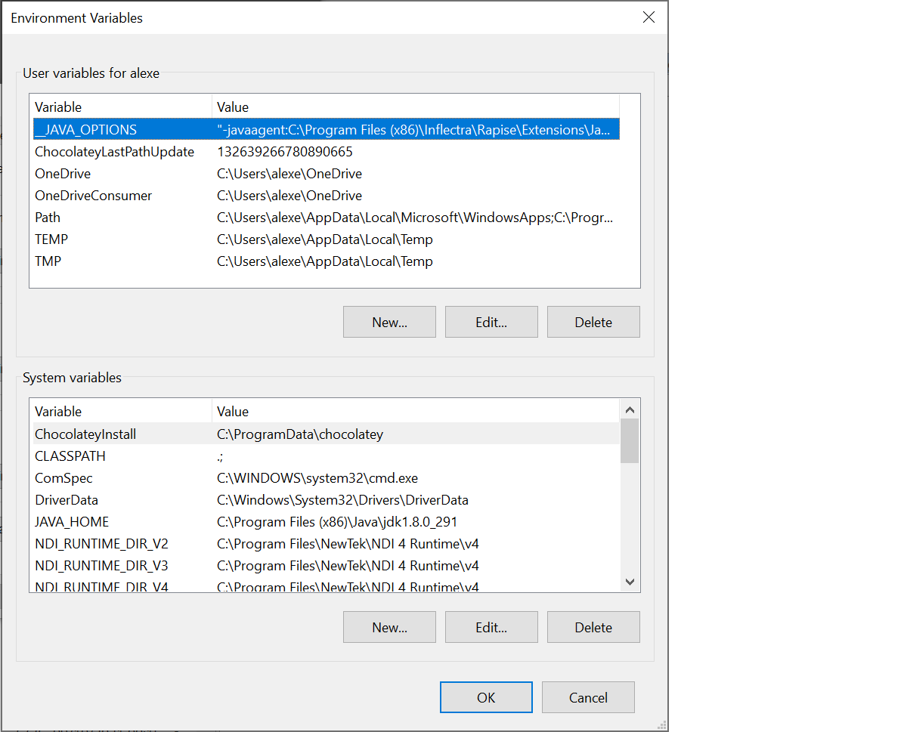
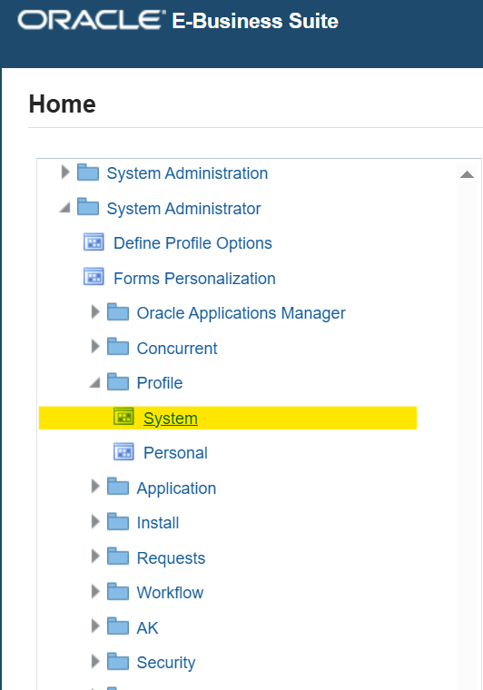
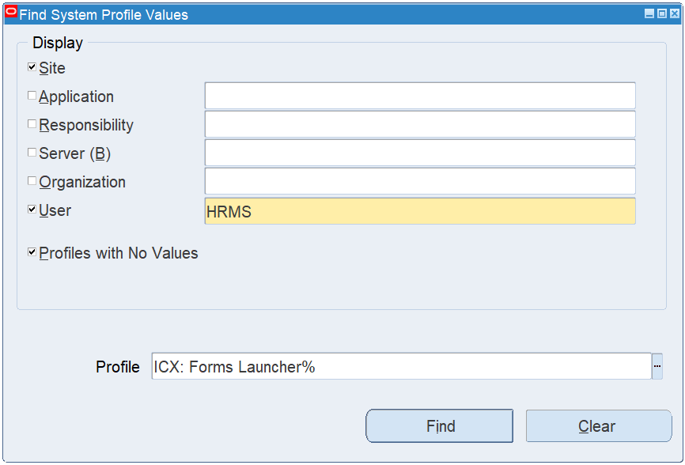
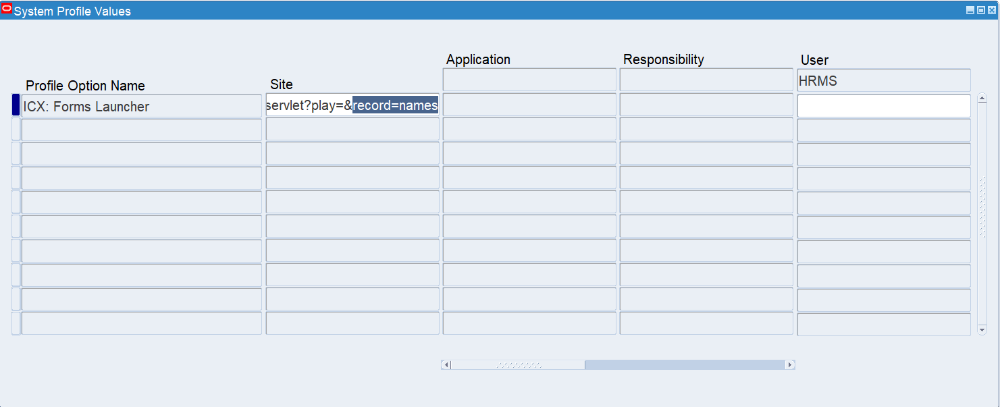
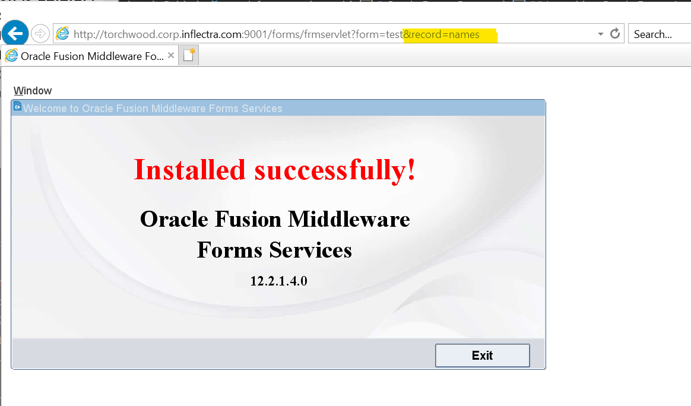
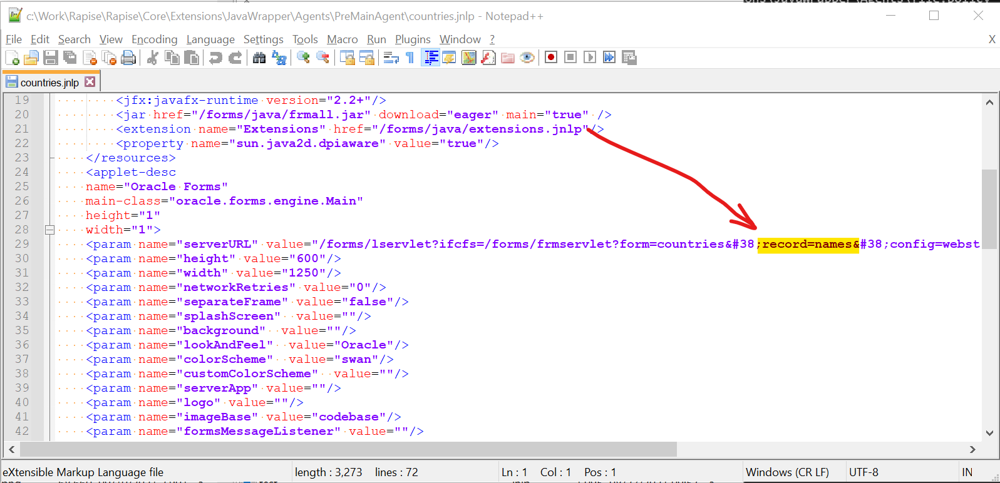

# Oracle Forms Support

## Overview

Rapise [Oracle Forms Library](../Libraries/ses_lib_oracleforms.md) enables recording, learning, and playback of various [Oracle Forms](https://www.oracle.com/application-development/technologies/forms/forms.html) controls.



## Supported Oracle Forms Versions

Rapise supports **Oracle Forms** versions 10 and higher.

## Supported Java Versions

Integration works with Java versions 5 and higher. If you launch Oracle Forms from a browser using `.jnlp` files, this requires Java Web Start. In most cases, this means you are using the legacy JRE 1.8, as Java Web Start was removed from Java 11 and later versions.

## What Needs to be Configured

To enable Rapise integration with Oracle Forms, configuration changes are required in two places:

1. **Client-side (Java environment)**: The Java Control Panel or environment variables must be configured to load the Rapise Java Bridge agent. This is covered in the [Preparing Java Environment](#preparing-java-environment) section below.

2. **Server-side (EBS/Oracle Forms)**: The Oracle Forms application URL must include the `record=names` parameter. This can be configured at the system level by an EBS administrator or in individual `.jnlp` files. See the [Launching Oracle Forms Application](#launching-oracle-forms-application) section for details.

## Preparing Java Environment

There are two ways of configuring Java environment: through Java Control Panel and through Command Line options.

### 1. Java Control Panel

Run Java Control Panel:



Go to *Java* > *View* > *Runtime Parameters*



*Runtime Parameters* value to:

```cmd
-Dsun.java2d.dpiaware=true -Dsun.java2d.uiScale=1.0 -javaagent:C:\PROGRA~2\Inflectra\Rapise\Extensions\JavaWrapper\Agents\PreMainAgent.jar
-Djava.security.policy=C:\PROGRA~2\Inflectra\Rapise\Extensions\JavaWrapper\Agents\file.policy -Djavax.accessibility.assistive_technologies=com.smartesoft.smartestudio.accessibility.AccessBridge
```

### 2. _JAVA_OPTIONS or JAVA_TOOL_OPTIONS

You can also configure the Java environment by setting environment variables. There are two options:

- **`_JAVA_OPTIONS`**: This is an unofficial Oracle JVM variable that is processed early during JVM initialization. It prints a message to the console when used (e.g., `Picked up _JAVA_OPTIONS: ...`).

- **`JAVA_TOOL_OPTIONS`**: This is a standard JVMTI variable supported by all compliant JVMs. Use this if you need cross-platform compatibility, if `_JAVA_OPTIONS` conflicts with other software, or if the console output from `_JAVA_OPTIONS` is undesirable.

> **Note:** If both variables are set, `JAVA_TOOL_OPTIONS` is processed first, then `_JAVA_OPTIONS`. In most Oracle Forms scenarios, `_JAVA_OPTIONS` works well, but switch to `JAVA_TOOL_OPTIONS` if you encounter issues.

You need to set one of these environment variables with the following value:

```cmd
-Dsun.java2d.dpiaware=true -Dsun.java2d.uiScale=1.0 -javaagent:C:\PROGRA~2\Inflectra\Rapise\Extensions\JavaWrapper\Agents\PreMainAgent.jar
-Djava.security.policy=C:\PROGRA~2\Inflectra\Rapise\Extensions\JavaWrapper\Agents\file.policy -Djavax.accessibility.assistive_technologies=com.smartesoft.smartestudio.accessibility.AccessBridge
```



It can be set through system or user environment variables. Alternatively, if your application is launched from a .bat file, you can set `_JAVA_OPTIONS` there:

```cmd
...
set _JAVA_OPTIONS=-Dsun.java2d.dpiaware=true -Dsun.java2d.uiScale=1.0 -javaagent:C:\PROGRA~2\Inflectra\Rapise\Extensions\JavaWrapper\Agents\PreMainAgent.jar
-Djava.security.policy=C:\PROGRA~2\Inflectra\Rapise\Extensions\JavaWrapper\Agents\file.policy -Djavax.accessibility.assistive_technologies=com.smartesoft.smartestudio.accessibility.AccessBridge
...
rem <launch of the application.jar>
```

Setting `_JAVA_OPTIONS` globally may affect other software or tools. Therefore, if you encounter any problems, you can remove this variable or rename it to another name.

## Launching Oracle Forms Application

There are two major ways your application can be started: using **Internet Explorer** or **Java Web Start** (`.jnlp` file).

### Configure EBS as Administrator

Login as *SYSADMIN*.

#### Step 1: Open the System Profile Window

1. On the left menu, under **System Administrator**, look inside the **Profile** folder.
2. Click on **`System`**.

*(This will download/launch the Forms window).*



---

#### Step 2: Search for the User and Profile

In the **Find System Profile Values** popup window:

1. Check the **User** checkbox and type the target **User Name**.
2. In the **Profile** field, enter:

   ```text
   ICX: Forms Launcher%
   ```

   
3. Click the **Find** button.

---

#### Step 3: Add `&record=names` to the User Level

In the **System Profile Values** table:

1. Look at the existing URL under the **Site** column (e.g., `http://hostname:port/forms/frmservlet`).
2. Copy that exact URL and paste it into the **User** column.
3. Append `record=names` to the end:

   

   * If the Site URL has no `?`, add:

     ```text
     ?record=names
     ```

   * If the Site URL already contains a `?`, add:

     ```text
     &record=names
     ```

4. Click the **Disk/Save icon** in the top toolbar (or press `Ctrl + S`).

---

#### ⚠️ Note (If the User field is greyed out / read-only):

If the system does not let you edit the User column:

1. Go back to your menu and click **`Define Profile Options`** (located right under System Administrator).
2. Query `ICX_FORMS_LAUNCHER`.
3. Under the **User Access** section, ensure the **User** checkboxes for **Visible** and **Updatable** are checked, then click **Save**.
4. Return to **Profile > System** and set the URL.

### Configure Individual Forms or .jnlp files

In either case, you need to make sure that the application URL contains the following parameters:

#### From Internet Explorer

You need to append the following parameter to the URL:
`...&record=names`

For **Internet Explorer**, this means the URL must contain this part:



#### From Java Web Start .jnlp File

`...&record=names`



## Global Object

Rapise [Oracle Forms Library](../Libraries/ses_lib_oracleforms.md) includes the [OracleForms](../Libraries/OracleForms.md) global object. It is mostly used to deal with the main menu, notifications, and status bar.
