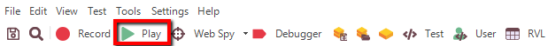
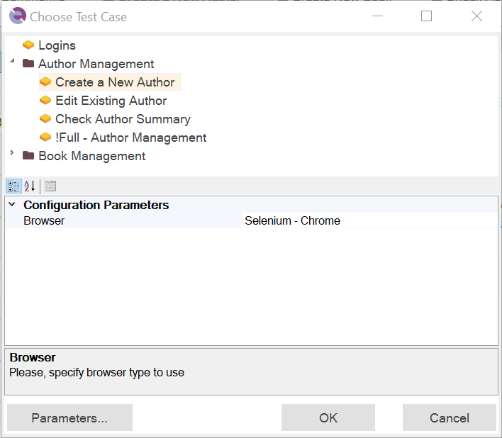
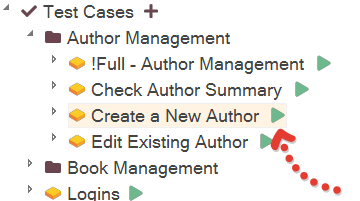
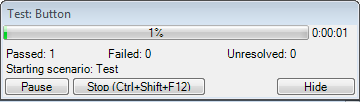

# Playback

## Purpose

When you record a test, Rapise translates your actions into a script. When you **play back** the test, the script is executed.

## Usage

You can either run your script from the [Command Line](command_line.md) or play it back while Rapise is open (as described below):

1. You will first need to [open your test or framework](open_a_test.md). There is no need to have the AUT (Application Under Test) open. Rapise will open the AUT before it begins test execution.

2. Now, press the Play button at the top of the Rapise toolbar.

3. In [testing framework](Frameworks/frameworks.md) mode, you may be prompted to select a test case to execute:

    

4. Alternatively, you can select a specific test case from the [object tree](object_tree.md) by clicking the `Play` button next to it:

    

5. During test execution, Rapise displays an execution monitor dialog box that allows the user to see the progress of test playback. This dialog is only shown during test execution and can be turned off in the [Options](options_dialog.md) dialog. The following is a screenshot of the test execution monitor.

    

    The user can pause or stop test execution by clicking either the `Pause` or `Stop` button.

6. When Rapise has finished executing the test, results are displayed in a table. Rows with green text indicate passed steps; rows with red text indicate failed steps. The following screenshot shows test results where every step passed:

    

## Test Execution Monitor

Shows test execution status during playback.

* The progress bar shows test execution progress. This is an estimate (based on the number of actions executed relative to the total estimated actions).
* `Passed:`, `Failed:`, `Unresolved:` - Number of actions with the corresponding execution status.
* **Stop** (++ctrl+shift+f12++) - Terminates execution.
* **Pause** - Holds test execution until the button is pressed again.
* **Hide** - Hides the execution monitor. The monitor can be permanently disabled in the [Options](options_dialog.md) dialog.

## See Also

* For more information about the report, see [Automated Reporting](automated_reporting.md).
* For information about recording a test, see [Recording](recording.md).
* For instructions on using the **Command Line**, see [Command Line](command_line.md).