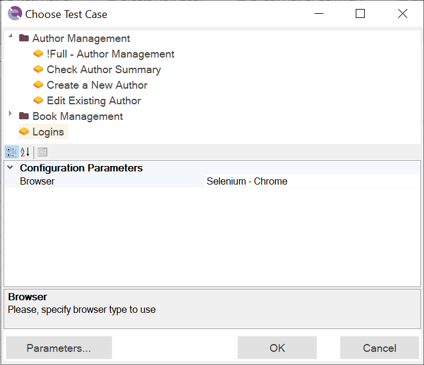

# Playback

## Purpose

When you record a test, Rapise translates your actions into a script When you **playback** the test, the script is executed.

## Usage
You can either run your script from the [Command Line](command_line.md), or you can play it back while Rapise is open (described below):

1. You will first need to [open your test or framework](open_a_test.md).  There is no need to have the AUT (Application Under Test) open. Rapise will open the AUT before it begins execution of the test.

2. Now, press the play button at the top of the Rapise toolbar.

3. In [testing framework](/Guide/Frameworks/frameworks.md) mode you may be prompted to select test case to executed:

4. Alternatively, you have the option to select a specific test case from the beginning by clicking on the `Play` button next to it in the [object tree](/Guide/object_tree.md):

5. During test execution, Rapise displays an execution monitor dialog box that lets the user see the progress of testing playback. The dialog is only shown during test execution and can be turned off in the [Options](options_dialog.md) dialog.  The following is a screenshot of the test execution monitor.

    

    The user can pause or stop the test execution by clicking either the `Pause` or `Stop` button.

6. When Rapise is done executing the test, results will be displayed in a table.  The rows with green text are steps that passed; the rows with red text are steps that failed.  The following is a screenshot of test results where every step passed:

    

## Test Execution Monitor

Shows test execution status during playback.

* Progress bar shows test execution progress. This is just an estimate (number of actions executed compared to previous number of actions)
* `Passed:`, `Failed:`, `Unresolved:` - number of actions with corresponding execution status.
* **Stop** (++ctrl+shift+f12++) - terminate execution.
* **Pause** - hold test execution until another press of the same button.
* **Hide** - hide execution monitor itself. The monitor can be turned off at all in the [Options](options_dialog.md) dialog.

## See Also

* For more information about the report, see [Automated Reporting](automated_reporting.md).
* For information about recording a test, see [Recording](recording.md).
* For instructions on using the **Command Line**, look [HERE](command_line.md).
