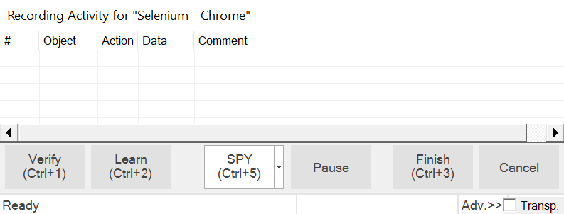

# Recording

## Purpose

Recording refers to Rapise tracking your interactions with an application.

Rapise observes the actions you take while using the [AUT](glossary.md) and transforms them into a script ([RVL](/RVL/Overview/) or JavaScript) that you can execute using the `Play` button. The script can be extended and modified for specific purposes.

## Usage

The **Recording Activity (RA) Dialog** opens when you start a recording using the `Record` toolbar button. In [Testing Framework](Frameworks/frameworks.md) mode, you must also [select a destination test case](Frameworks/frameworks.md#recording-test-cases-and-page-objects) for the new recording. When the Recording Activity dialog appears, Rapise has connected to your AUT and is ready to monitor and record your interactions. You'll find instructions [here](recording_activity_dialog.md). Alternatively, you can refer to one of the examples:

-   [Tutorial: Windows Testing](twodialogs_sample.md)
-   [Tutorial: Web Testing](tutorial_record_and_playback.md)
-   [Tutorial: Mobile Testing](mobile_testing2.md).

Rapise can record across multiple applications. For example, you might perform some steps in a web browser and then proceed to a desktop client. The quality of recording results depends on the selected libraries. For instance, if your application includes components developed with both Managed and Java technologies, then you need to have both Managed and Java libraries selected in the [library chooser](change_the_libraries_being_use.md).

You'll notice that the RA dialog has a grid. As you interact with the AUT, your actions will be listed in the grid.

If you record an incorrect action, you can right-click on the action and delete it.

To ensure successful recording of your interactions with the AUT, navigate slowly through it. Wait a second or two between each action to allow Rapise sufficient time to interpret and record your actions. Once your actions are updated in the RA dialog grid, you are free to continue with the next action.

When you are done recording, press the `Finish` button in the RA dialog or press ++ctrl+3++. The RA dialog will disappear, and you will see an automatically generated script opened in Rapise.

For **Mobile Testing**, you will need to use the `Spy` button, which allows you to select a specific object using the [Mobile Spy](../object_spy_mobile/):

## See also

-   If you have already recorded a script and want to record additional interactions in the same test, be sure to read [Making Multiple Recordings](multiple_recordings.md).
-   The RA dialog is described more thoroughly in [Recording Activity > Dialog](recording_activity_dialog.md).
-   To learn how to run the script, see [Playback](playback.md). To learn how to modify the script, see [Scripting](scripting.md).
-   For a detailed tutorial, see [Tutorial: Record and Playback](tutorial_record_and_playback.md) in the Getting Started section.
-   For more information on the Spy capability, see [Object > Spy](../object_spy/).