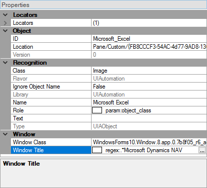

# Regular Expressions

## Purpose

A **regular expression** is a sequence of characters that defines a search pattern for strings. It is composed of character literals and [special characters](https://developer.mozilla.org/en-US/docs/Web/JavaScript/Guide/Regular_Expressions). Each character literal represents a single character (such as "a", "b", "C", "1"). Special characters can represent a character, multiple characters, or define choices for matching characters.

## Usage

In Rapise, you must prefix regular expressions with the string **regex:**. For example, the regular expression to match all strings is: **regex:.\***

Regular expressions have three uses in Rapise: (1) in [Object Locators](object_locator.md), (2) in [action overriding code](actions.md), and (3) in [Custom Libraries](custom_libraries.md).

## Examples

Within an [Object Locator](object_locator.md) to match a dynamic Window Title:

`regex:.*Microsoft Dynamics NAV` matches any Window Title ending with `Microsoft Dynamics NAV`, for example:

    Posted Sales Shipments - Microsoft Dynamics NAV

or

    Sales Invoices - Microsoft Dynamics NAV