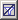
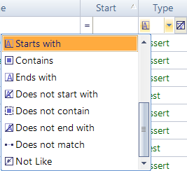
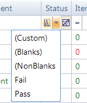
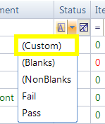
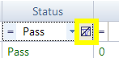

# Report Filtering

## Purpose

**Report Filtering** lets you specify criteria to filter your view of the [test execution report](automated_reporting.md). Rows that do not match your criteria are hidden.

## Usage

You can filter the report view while the file is open. Directly above the report's first row, you will find a row of filter cells. Each one has a **matching criteria** button , a text box for specifying a filter value, a drop-down menu with **predefined filter values**, and a **clear** button :

## Matching Criteria

Matching criteria determine how to compare the filter string value you input with the values in the report. You can select from 16 matching criteria. Press the button marked **A** above the column you are filtering to see the possible criteria:

## Predefined Filter Values

Expanding the filter cell's drop-down menu reveals a list of predefined filtering options:

- **(Custom)**: This option relates to the next section, *Custom Filter Options*.
- **(Blanks)**: Matches all rows where the value for this column is blank.
- **(NonBlanks)**: Matches all rows where the value for this column is not blank.
- All other predefined values are copied from cells in the column you are filtering.

## Custom Filter Option

To create a filter with multiple matching criteria and filter values, select **(Custom)** from the filter cell's drop-down menu. The **Enter filter criteria for... Dialog** will open. Instructions for how to use it are [here](enter_filter_criteria_for____d.md).

## Undo Filtering

To undo filtering for a particular column, press the clear button for that column:

## See Also

- [Automated Reporting](automated_reporting.md)
- [Enter filter criteria for... Dialog](enter_filter_criteria_for____d.md)