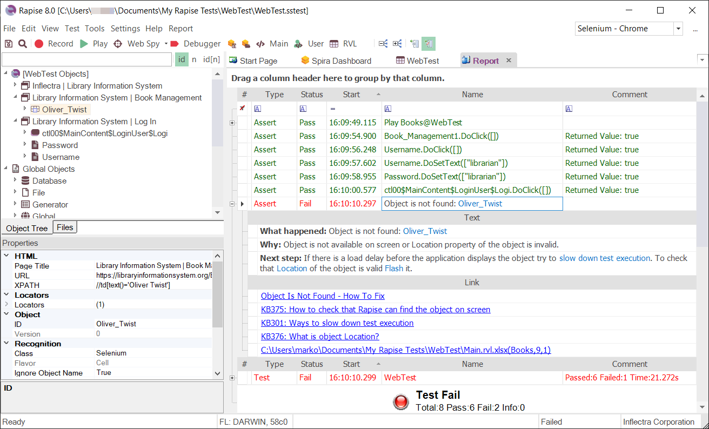

# Report Viewer

## Purpose

The **Report Viewer** displays test result (`.trp`) files.

## How to Open

Use the [Test Files View](test_files_dialog.md) to open a report (trp) file.  The report file will be opened in a **Report Viewer** in the [Content View](content_view.md).  The [report toolbar](menu_and_toolbars.md#report-viewer-toolbar) and [report menu](menu_and_toolbars.md#report) will also open.

Or, you can [Playback](playback.md) the test script.  The report file will display in a **Report Viewer** after the test completes.

## See Also

* For more info on Reports, see [Automated Reporting](automated_reporting.md).
