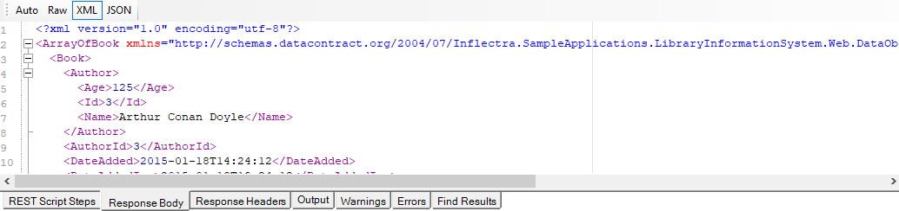
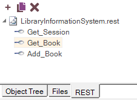

# REST Definition Editor

## Purpose

The **REST Definition Editor** allows you to edit [REST web service](rest_web_service.md) definition files (`.rest`).

## How to Open

Use the [Add Web Service Dialog](dialog_add_web_service.md) to create a new REST definition (`.rest`) file.  The definition file will be opened in a **REST Editor** in the [Content View](content_view.md).

Or, you can double-click on an existing `.rest` file in the [Test Files View](test_files_dialog.md) explorer window. The definition file will be opened in a **REST Editor** in the [Content View](content_view.md).  The [REST Toolbar](toolbar_rest.md) is also open on the top of the editor.

## Request

The request form has several sections that you need to populate:
*   **Method** - the type of HTTP request being made (GET, POST, PUT, DELETE, etc.)
*   **URL** - the URL of the web service request with any parameter tokens included (e.g. {session_id} in our example above)
*   **Credentials** - Any HTTP Basic Authentication Headers
*   **Headers** - Any other HTTP headers (both standard and custom)
*   **Parameters** - Any parameters that have been defined in the URL that will be called from the Rapise test script.
*   **Body** - The body of the request (for POST and PUT requests). This can be in any text-serialized format such as XML or JSON.

## Response

The HTTP Response Headers are displayed:

The HTTP Response in XML format is formatted and displayed:

The HTTP Response in JSON format is formatted and displayed:

This displays the output from the last web service request. It has several tabs:
*   **Response Header** - Displays a list of the HTTP response headers (name and value). If the request received a `200 OK` code back, it's displayed in green, if it receives an error code back, it's displayed in red.
*   **Response Body**
* *   **Raw** - Displays the raw text of the HTTP response body received from the server.
* *   **XML** - If the received body content is identified as XML, this tab displays nicely formatted XML that is easier to read than the raw response body.
* *   **JSON** - If the received body content is identified as JSON, this tab displays nicely formatted, indented JSON that is easier to read than the raw response body.

## Operation Explorer

This section lets you add, open, delete and clone REST requests in the definition file.

*   `Add request` - Adds a new REST operation to the current `.rest` definition file.

    

*   `Clone request` - Makes a copy of the currently selected REST operation and allows you to give the copy a new name.

    

*   `Delete request` - Deletes the currently selected REST operation from the current REST definition file.

    

## Script Steps

The **REST Script Steps** tab in the bottom view lets you see the list of recorded REST operations and use them to create your [test script](scripting.md) in the main test file.

* `Create Script` - This takes all of the recorded steps and
automatically creates the matching JavaScript code in your test script.

* `Remote Step` - This removes the recorded step from the script box

* `Clean` - This removes all of the recorded steps from the script box.

> Each of the steps displayed in the script box will contain the name of the REST operation along with its HTTP method (GET, POST, PUT, DELETE, etc.). Steps displayed in **bold\*** with an asterisk also have a [verification point recorded](checkpoints.md). That means when the script is generated, it will include a `Tester.Assert` function to verify the results.

## See Also
*   For more info on REST Web Services, see [REST Web Services](rest_web_service.md).
*   For a tutorial on creating a REST web service test, see the [Web Services REST Tutorial](tutorial_web_services_rest.md).
