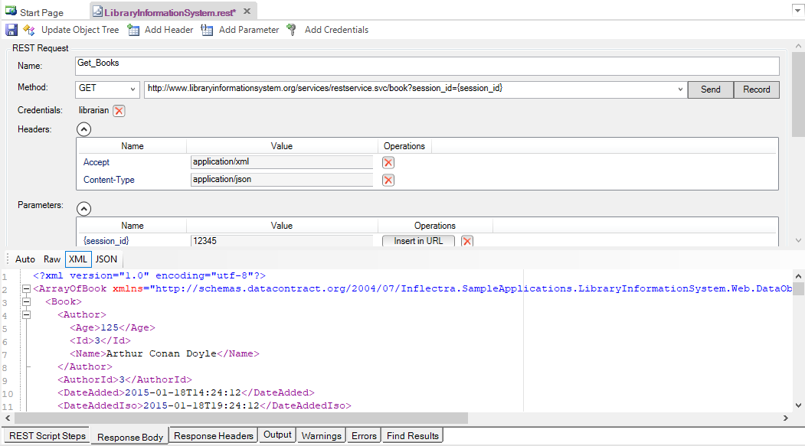
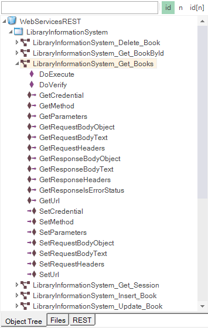
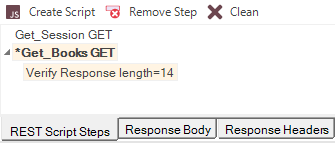
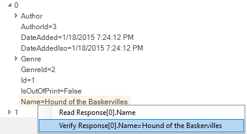
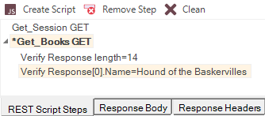
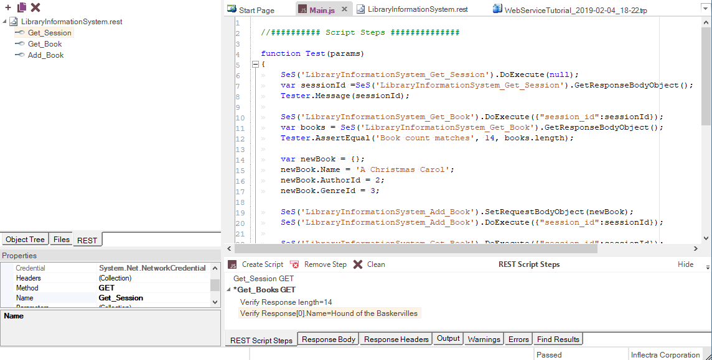
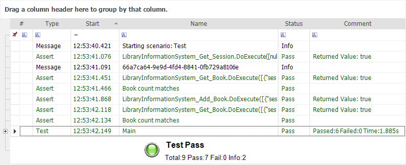

# Testing REST Web Services

## What is REST and what is a RESTful web service?

> **RE**presentational **S**tate **T**ransfer (**REST**) is a style of software architecture for distributed systems such as the World Wide Web. REST has emerged as a web API design model that offers greater simplicity over other web service protocols such as SOAP and XML-RPC.

> A RESTful web API (also called a RESTful web service) is a web API implemented using HTTP and REST principles. Unlike SOAP-based web services, there is no "official" standard for RESTful web APIs. This is because REST is an architectural style, unlike SOAP, which is a protocol.

## How does Rapise test REST web services?
Creating a REST web service test in Rapise consists of the following steps:
1.   Using the [REST definition builder](rest_definition_editor.md) to create the various REST web service requests and verify that they return the expected data in the expected format.

2.   Parameterizing these REST web service requests into reusable templates and saving as Rapise learned objects.

3.   Generating the [test script](scripting.md) in Javascript that uses the learned Rapise web service objects.

## Rapise REST Definition Builder
When you add a web service to your Rapise test project, you get a new REST definition file (`.rest`) that will store all of your prototyped requests against a specific REST web service. The various REST requests are then created in the REST definition builder:

Each REST request can then include the following items:

*   **Method** - the type of HTTP request being made (GET, POST, PUT, DELETE, etc.)

*   **URL** - the URL of the web service request with any parameter tokens included (e.g. {session\_id} in our example above)

*   **Credentials** - Any HTTP Basic Authentication Headers

*   **Headers** - Any other HTTP headers (both standard and custom)

*   **Parameters** - Any parameters that have been defined in the URL that will be called from the Rapise test script.

*   **Body** - The body of the request (for POST and PUT requests). This can be in any text-serialized format such as XML or JSON.

When you execute the request, it will return back the HTTP response headers and if it recognizes the MIME content-type as either XML or JSON, it will format it to make it more readable by the tester:

Once you have finished with your prototyping of the web service test operations, you can then save the request definitions and use the `Update Object Tree` option to populate the main Rapise [Object Tree](object_tree.md).

## Web Service Object Recognition

Each of the REST web service requests that has been prototyped in the REST definition editor is converted by Rapise into a scriptable object:

Each of the [REST service](../Libraries/RESTService.md) objects in the tree has operations designed to let you call the method and access the returned body either in its raw text format, or if it's a web service that returns data in JSON format, it will be able to send/receive data as native JavaScript objects.

Rapise provides you with access to the following attributes of the HTTP request before/after the request has been executed:

*   **Request:**

* *   Method

* *   Url

* *   Headers (inc. authentication)

* *   Body

*   **Response:**

* *   Headers

* *   Body

## Generating Rapise REST Test Scripts

Once all the REST operations have been defined and saved as Rapise learned objects, you can call the REST operations from within your Rapise test scripts.

The easiest way to do this is to click on the `Record` button in the REST definition editor (next to the `Send` button) which will add the request to list of recorded steps:

Usually you need to verify the data returned as well as call the REST method. To do this, go to the **Verify** text box underneath the Body section:

If you select the overall array **response\[14\]** and click the main `Verify` button next to the Record button, the system will automatically add a verification step that verifies all of the values. To try this, click the `Verify` button. This will add a bold verification step to the recorded script:

You will see a script step recorded with a verification test added (it's shown in bold with an asterisk\*).

However, in many cases you only want to verify certain properties. For example, we might want to just verify that 14 books are returned, and that the first book has the right name. To do this, right-click on the **response\[14\]** entry to display the verification content menu:

Choose the option **Verify Response length=14**. This adds the following step to the recorded script:

Now we want to verify the name of the first book returned. To do that, expand the “0” index entry and then right-click on the “Name” property returned:

Choose the option to **Verify Repsonse\[0\].Name = Hound of the Baskervilles**. This will add a verification step for this specific property: 

Once you are ready, click the `Create Script` and the test script will be created for you:

As well as simply calling the `DoExecute()` method of each REST web service object to call the previously defined operation, you can use the various properties on the REST service object to send through specific parameter values, add/remove headers, change the authenticated user, change the request body as well as inspect all of the attributes in the request and response.

This allows you unparalleled control over the web service request, with the ability to debug and diagnose web service issues in addition to being able to quickly call the learned operations.

Since the REST objects are just like any other Rapise object, you can have hybrid test scripts that call web service methods and also test GUI objects. This is very useful when you want to test how the user interface changes in response to specific web service API interactions, or when you have a user interface that connects to the sever using a web service (for example with a JSON-based AJAX web user interface).

Once you have created your REST web service test, you can use the standard [Playback](playback.md) functionality in Rapise to execute your test and display the report:

