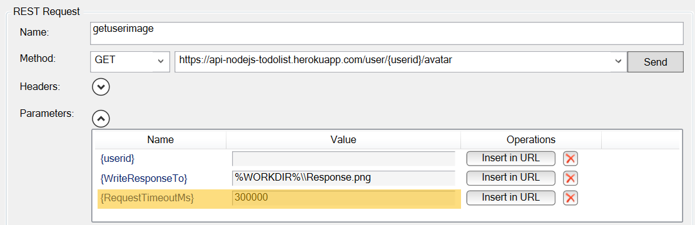
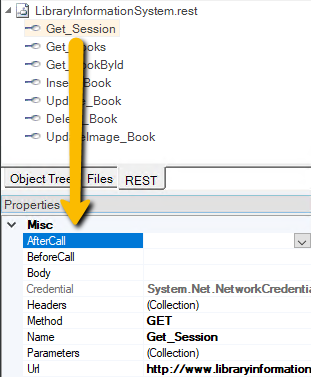
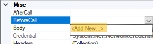
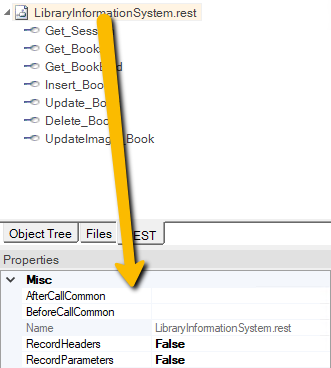
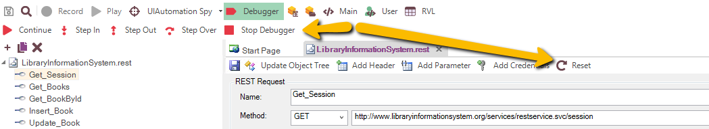
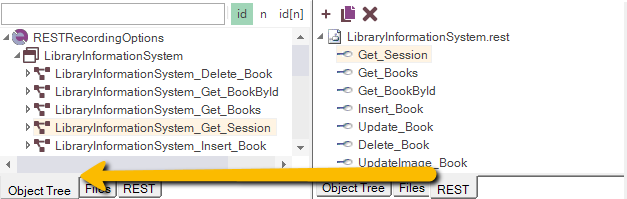

# Testing REST Web Services

## What is REST and what is a RESTful web service?

<!-- /* cSpell:disable */ -->
> **RE**presentational **S**tate **T**ransfer (**REST**) is a style of software architecture for distributed systems such as the World Wide Web. REST has emerged as a web API design model that offers greater simplicity over other web service protocols such as SOAP and XML-RPC.
<!-- /* cSpell:enable */ -->
> A RESTful web API (also called a RESTful web service) is a web API implemented using HTTP and REST principles. Unlike SOAP-based web services, there is no "official" standard for RESTful web APIs. This is because REST is an architectural style, unlike SOAP, which is a protocol.

## How does Rapise test REST web services?

Creating a REST web service test in Rapise consists of the following steps:

1. Using the [REST definition builder](rest_definition_editor.md) to create the various REST web service requests and verify that they return the expected data in the expected format.

2. Parameterizing these REST web service requests into reusable templates and saving as Rapise learned objects.

3. Generating the [test script](scripting.md) in Javascript that uses the learned Rapise web service objects.

## Rapise REST Definition Builder

When you add a web service to your Rapise test project, you get a new REST definition file (`.rest`) that will store all of your prototyped requests against a specific REST web service. The various REST requests are then created in the REST definition builder:


Each REST request can then include the following items:

* **Method** - the type of HTTP request being made (GET, POST, PUT, DELETE, etc.)

* **URL** - the URL of the web service request with any parameter tokens included (e.g. {session_id} in our example above)

* **Credentials** - Any HTTP Basic Authentication Headers

* **Headers** - Any other HTTP headers (both standard and custom)

* **Parameters** - Any parameters that have been defined in the URL that will be called from the Rapise test script.

* **Body** - The body of the request (for POST and PUT requests). This can be in any text-serialized format such as XML or JSON.

When you execute the request, it will return back the HTTP response headers and if it recognizes the MIME content-type as either XML or JSON, it will format it to make it more readable by the tester:


Once you have finished with your prototyping of the web service test operations, you can then save the request definitions and use the `Update Object Tree` option to populate the main Rapise [Object Tree](object_tree.md).

## Web Service Object Recognition

When **Record REST Objects** [API Recording option](options_dialog.md#api) is set to `true`, each of the REST web service requests that has been prototyped in the REST definition editor is converted by Rapise into a scriptable object:


Each of the [REST service](../Libraries/RESTService.md) objects in the tree has operations designed to let you call the method and access the returned body either in its raw text format, or if it's a web service that returns data in JSON format, it will be able to send/receive data as native JavaScript objects.

Rapise provides you with access to the following attributes of the HTTP request before/after the request has been executed:

* **Request:**

*    * Method

*    * Url

*    * Headers (inc. authentication)

*    * Body

* **Response:**

*    * Headers

*    * Body

## Generating Rapise REST Test Scripts

Once all the REST operations have been defined and saved as Rapise learned objects, you can call the REST operations from within your Rapise test scripts.

The easiest way to do this is to click on the `Record` button in the REST definition editor (next to the `Send` button) which will add the request to list of recorded steps:


Usually you need to verify the data returned as well as call the REST method. To do this, go to the **Verify** text box underneath the Body section:


If you select the overall array **response\[14\]** and click the main `Verify` button next to the Record button, the system will automatically add a verification step that verifies all of the values. To try this, click the `Verify` button. This will add a bold verification step to the recorded script:


You will see a script step recorded with a verification test added (it's shown in bold with an asterisk\*).

However, in many cases you only want to verify certain properties. For example, we might want to just verify that 14 books are returned, and that the first book has the right name. To do this, right-click on the **response\[14\]** entry to display the verification content menu:


Choose the option **Verify Response length=14**. This adds the following step to the recorded script:


Now we want to verify the name of the first book returned. To do that, expand the “0” index entry and then right-click on the “Name” property returned:


Choose the option to **Verify Response\[0\].Name = Hound of the Baskervilles**. This will add a verification step for this specific property: 


Once you are ready, click the `Create Script` and the test script will be created for you:


The script is always generated within the `Test()` function of the current `Main.js` file. The term *current* refers to the `Main.js` file of the test, test case, or Page Object / Module to which this `.soap` definition belongs.

In the case of a Page Object, you would need to cut the generated code from `Test()` and paste it into the corresponding `<PageObject>_DoAction` function.

As well as simply calling the `DoExecute()` method of each REST web service object to call the previously defined operation, you can use the various properties on the REST service object to send through specific parameter values, add/remove headers, change the authenticated user, change the request body as well as inspect all of the attributes in the request and response.

This allows you unparalleled control over the web service request, with the ability to debug and diagnose web service issues in addition to being able to quickly call the learned operations.

Since the REST objects are just like any other Rapise object, you can have hybrid test scripts that call web service methods and also test GUI objects. This is very useful when you want to test how the user interface changes in response to specific web service API interactions, or when you have a user interface that connects to the sever using a web service (for example with a JSON-based AJAX web user interface).


Once you have created your REST web service test, you can use the standard [Playback](playback.md) functionality in Rapise to execute your test and display the report:


## Handling Request Timeout

Special request or Session parameter named `RequestTimeoutMs` allows changing the timeout for the request. Otherwise default timeout (100000 = 100 seconds) is used.



## Handling Binary Downloads

Special parameter value `WriteResponseTo` allows defining a path to the file where full binary version of the server response is saved.

It should be a full path. It may contain environment variable reference (`%WORKDIR%`, `%ROOT%` etc).


## Handling File Uploads and Multipart Requests

Each Request with **Content-Type** set to `multipart/form-data` is assumed to be a special request and handled in a special way.

The **Body** part should be a valid `JSON` with the following structure:

```javascript
{
    "multipart":
    [
        {
            "Name": "name_of_text_field",
            "ContentType": "text/plain",
            "Value": "value"
        },
        {
            "Name": "uploadfile",
            "ContentType": "image/png",
            "FileName": "image.png",
            "FilePath": "path_to_file_for_upload"
        }
    ]
}
```


For the text fields **ContentType** is optional. By default it is set to `text/plain`.

For file upload fields **ContentType** and **FileName** are optional. By default content-type and **FileName** are auto-detected from the **FilePath**.

So here is an example of the minimal multipart request with one text field and one file upload:

```javascript
{
    "multipart":
    [
        {
            "Name": "name_of_text_field",
            "Value": "value"
        },
        {
            "Name": "uploadfile",
            "FullPath": "c:\\some\\path\\to\\image.png"
        }
    ]
}
```

### JSON as Field Value

Here is how you can pass JSON value of the field:

```javascript
{
    {
      "Name": "jsonText",
      "ContentType":"text/json",
      "Value": {
        "One":"Value1",
        "Two":123
      }
    },
    ...
}
```

### Params in Multipart Request

It is typical that you want to parameterize text value or file path. It is important to make sure that you properly quote custom value. I.e.

If we have a parameterized JSON Body:

```javascript
{
  "multipart": [
    {
      "Name": "jsonText",
      "ContentType":"text/json",
      "Value": {StringParam}
    },
    {
      "Name": "uploadfile",
      "FilePath": {FilePathParam}
    }
  ]
}
```


Once parameters are defined for the `multipart` request, you should make sure that they are properly escaped. Consider using `JSON.stringify` appropriately, i.e.:

```javascript
RestMultipart_UploadFileParams.SetParameter('StringParam', JSON.stringify("Some Value"));
RestMultipart_UploadFileParams.SetParameter('FilePathParam', JSON.stringify( Global.GetFullPath('NewAvatarImage.png') ));
```

## Passing Data Between API Calls

There are certain scenarios when it is convenient to pass dynamic data into a REST call or between consequent REST calls, i.e.:

1. We want to use credential from external configuration file to avoid hard-coding them as REST headers or REST parameters.
2. One call returns values that are needed by subsequent calls. Good example is a bearer token returned by authorization calls that should then be used as a header in all subsequent calls. The token has short life range and should be requested again and again between testing sessions.
3. We want to test service in exploratory mode. I.e. do some sequence of calls manually. Maybe then checking something via the UI or getting some value that is easier to get via the API and then needed elsewhere.

So we enabled pre- and post- request callbacks that work both in REST editor and in runtime when tests executes API calls. We call them **Before**Request and **After**Response.

### Before-Request and After-Response REST Callbacks.

Callbacks are defined in the REST editor. 

Request-specific callback may be defined in the properties editor when action is  selected:



When callback is required, it may be either selected from the dropdown or generated using `<Add New...>` option:



Callback function always created in the `User.js` of the current test.

#### BeforeRequest REST Callback

**BeforeRequest** callback has a signature:

```javascript
function Before_<Rest_FileName>_<Entry_Name>(/**RESTRequest*/request)
```

i.e.:

```javascript
function Before_LibraryInformationSystem_Get_Session(/**RESTRequest*/request)
{
	request.SetHeader('Accept', 'application/json');
	request.SetHeader('Content-Type', 'application/json');
	request.SetCredential('librarian', 'librarian');
}
```

It is executed right before the action. It may access pre-defined Headers, Properties and URL of given request and alter them. All this may be done by accessing `Session` global object and `request` object passed as a parameter. Parameter type is [RESTRequest](../Libraries/RESTRequest.md).

#### AfterResponse REST Callback

**AfterResponse** callback has a signature:

```javascript
function After_<Rest_FileName>_<Entry_Name>(/**RESTResponse*/response)
```

i.e.

```javascript
function After_LibraryInformationSystem_Get_Session(/**RESTResponse*/response)
{
	var sessionid = response.GetResponseBodyObject();
	Session.SetParameter('session_id', sessionid);
}
```

It is executed right after the action.  It may access `response` object passed as a parameter. Parameter type is [RESTResponse](../Libraries/RESTResponse.md).

#### Common REST Callbacks

Sometimes it is more convenient to define one common callback that will be executed for all request inside a given endpoint. 

Common callbacks are defined in the property window for the whole endpoint.



When both common callback and entry callback are defined, both are executed in the following order:

1. Common Before_*Rest_FileName*
2. Before_*Rest_FileName*_*Entry_Name*
3. Send *request* and get *response*
4. After_*Rest_FileName*_*Entry_Name*
5. Common After_*Rest_FileName*

### REST Callback Limitations

If given request has no explicit callback defined and no common callback defined then in REST Editor mode values of Session will be ignored. If you have important parameters or headers stored in the session, then it is recommended to define one common 'Before' callback.

### REST Callback Session

Once request has a callback and it is executed from the Editor, debugger session starts and keeps running. You may see it by presence of debugger panel:



All variables and session parameters assigned in the callbacks stay active while debugger panel is running.

If you want to modify something in the callback code, then you need to use **Stop Debugger** or **Reset** button first to be able to save the modifications. In this case variables, session parameters and collected cookies get lost.

### REST Callback Breakpoints

You may set a breakpoint in any REST callback function, and Rapise will stop when doing a call. If you function is long and debugging implies many steps, the request may proceed while you are debugging. To avoid this you may change the value of [global option](options_dialog.md) **API Callback Timeout** 

## Recording

The way Rapise records captured REST actions may differs depending on the [API recording options](options_dialog.md#api). 

**Record REST Objects** is `true`, each step creates an object in the object tree:



and it is used by the produced script:

```javascript
	var LibraryInformationSystem_Get_Session=SeS('LibraryInformationSystem_Get_Session');
	LibraryInformationSystem_Get_Session.DoExecute();
```

When **Record REST Objects** is `false` then nothing is added to the object tree and generated script uses REST definition file directly by means of [Session.GetRESTRequest](../Libraries/Session.md#getrestrequest):

```javascript
	var LibraryInformationSystem_Get_Session =/**RESTService*/Session.GetRESTRequest("LibraryInformationSystem.rest", "Get_Session");
	LibraryInformationSystem_Get_Session.DoExecute();
```

When **Generate Full Name** is `false` then shorter object name is used, both when **Record REST Objects** is `true`:

```javascript
	var Get_Session=SeS('Get_Session');
	Get_Session.DoExecute();
```

and when **Record REST Objects** is `false`:

```javascript
	var Get_Session =/**RESTService*/Session.GetRESTRequest("LibraryInformationSystem.rest", "Get_Session");
	Get_Session.DoExecute();
```

The way how `Session.GetRESTRequest` is recorded depends on **Generate Short REST Path**. In short mode the 1st parameter is just `<filename>.rest`, i.e.:

```javascript
Session.GetRESTRequest("LibraryInformationSystem.rest", "Get_Session");
```

While in long mode it is:

```javascript
Session.GetRESTRequest("%WORKDIR%\\LibraryInformationSystem.rest", "Get_Session");
```

### Negative REST Tests

Some actions are expected to return failure and we need to work with them to produce negative tests. There are two ways of doing it. First is global, so failures of all actions ignored. It is active when you choose [Session.SetIgnoreStatus](../Libraries/Session.md#setignorestatus). I.e.:

```javascript
Session.SetIgnoreStatus(true);
FailingEndpoint1.DoExecute();
PassingEndpoint.DoExecute();
FailingEndpoint2.DoExecute();
Session.SetIgnoreStatus(false);
```

If automatic status verification is disabled you expected to explicitly check the response returned from `DoExecute`.

**Record Failed REST Actions** [controls](options_dialog.md#api) what to record when action returns status other than **200**. If it is `true` then recorded step has additional parameter `ignoreStatus=true`. This flag is only added then action has also failed during recording.

```javascript
FailingEndpoint1.DoExecute({}, true);
PassingEndpoint.DoExecute();
FailingEndpoint2.DoExecute({}, true);
```
