# RVL Editor

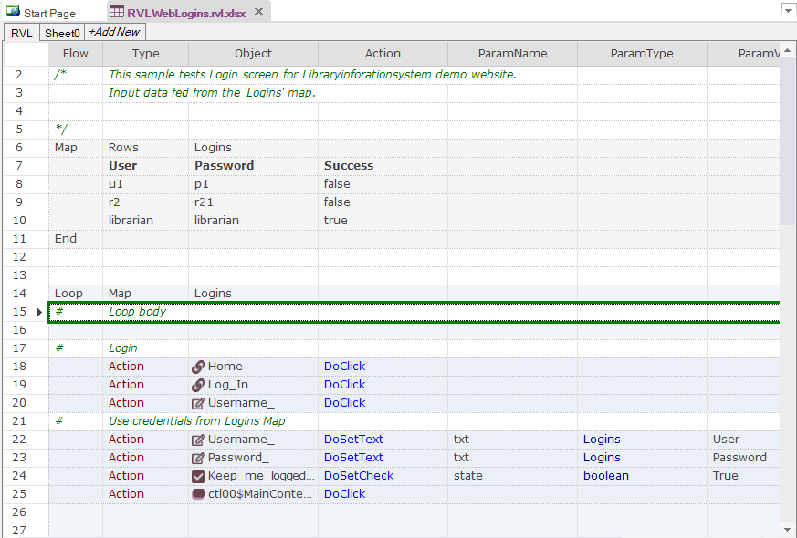

## Purpose

[Rapise Visual Language](visual_language.md) Editor

## How to Open

Use the **RVL** button on the main toolbar to open an RVL (`.rvl.xlsx`) file. The file will be opened by the **RVL Editor** in the [Content View](content_view.md).

## Features

Editor has support for all RVL statements including

- [Variables](../RVL/Variables.md),
- [Actions](../RVL/Actions.md),
- [Assertions](../RVL/Assertions.md),
- [Maps](../RVL/Maps.md),
- [If-Else](../RVL/IfElse.md),
- [Loops](../RVL/Loops.md)

statements.

RVL is a recordable language. Rapise recorder is translates captured actions to objects stored in the [object repository](object_tree.md) and a set of actions. Each recorded chunk may be inserted into desired place in the selected sheet:


Usually recording is with together with scripting and, maybe, some JavaScript for advanced tasks.

## RVL Scripting

In addition to recording one may use RVL editor for authoring scripts. You may drag&drop actions from the Object Tree into the RVL. Also RVL editor is both keyboard and mouse friendly. You may either type whole or parts of commands and rely on auto-completion OR simply select a dropdown in each cell of the row.

When writing or modifying a script it is recommended to go left-to-right for script creation.

## Auto Completion

RVL Editor supports Auto completions. For example, if you type `I` in the flow column:

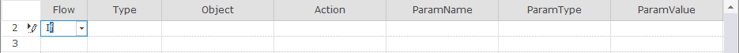

And hit ++tab++ key the whole **If** statement is created:

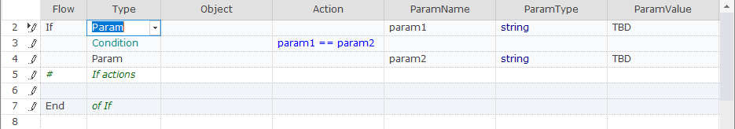

> **Note**: ++tab++ is a trigger for auto-completion. If you use cursor keys or mouse to leave the cell then auto completion will not be executed.

If you go to last line and change **End** with **ElseIf**

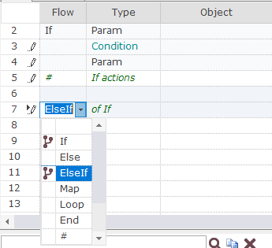

then alternative branch is appended:

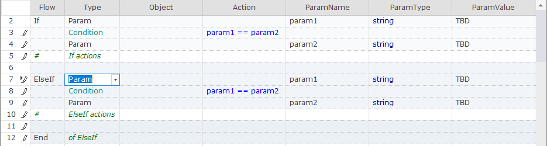

Similar logic works for Params, Conditions, Maps, Loops, Assertions and so on.

## Disabling Cell Auto Correction

Sometimes autocompletion prevents one from entering a desired value. For example, you have a global object `navigator` and typing it into the **Object** columns automatically changes it to `Navigator`.

The solution is to enter the cell for editing text and pressing `F2`. It will disable all autocompletion for this cell and then you may type any value.

## Action Params

When you select an action from the list **RVL Editor** automatically fills default action params. For example, if we choose: 

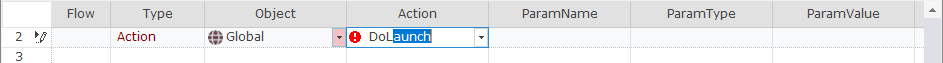

And press ++tab++ after `DoLaunch` **RVL Editor** fills default param:


`DoLaunch` has one required parameter `cmdLine`. Also it has a number of optional parameters. They are not added by default to make script more concise. However, you may need all or some of them. So you may add them by pressing `Params` button on [RVL Toolbar](menu_and_toolbars.md#rvl-toolbar):

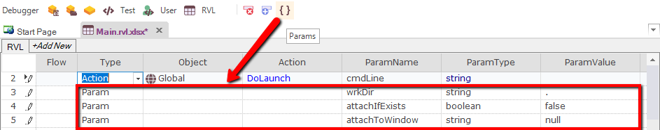

It is also possible to add params one-by-one using the dropdown in the **ParamName** column:


## Password Param Value

Once column **ParamType** set to `password`, **ParamValue** should be an encrypted string. Setting encrypted value is simple:

1. Change **ParamType** to `string`.

2. Type plain value to be encrypted into **ParamValue**.

3. Switch **ParamType** to `password` - plain value becomes encrypted.

## Param Dropdowns

It is possible to define own list of dropdown values for any parameter. In most cases it is defined for custom functions.

For example, we may have function `SetState(stateCode)` where we expect pre-defined limited set of state code values.

```javascript
function SetState(/**string*/stateName)
```

We may define dropdown for `stateName` parameter, so that RVL editor suggest the following list:

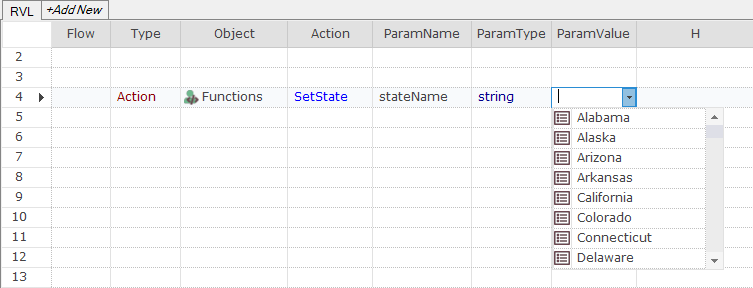

The values for this dropdown are defined in the spreadsheet:


Moreover, we define a code for each state name, so it may be re-mapped in the implementation of the `SetState` function using 

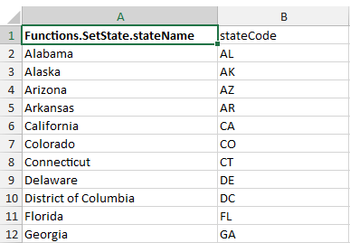

Dropdown values are defined in file `Dropdowns.xlsx`, that may be added to the test using the[Create/Spreadsheet...](test_files_dialog.md#context-menu-folder) menu item.

The full key to find matching dropdown is `objectid`.`method`.`paramName`. If not found, it will check `method.paramNam` and `paramName` columns:

| Key | Example |
|- |- |
| `objectid.method.paramName` | `Global.DoLaunch.cmdLine` |
|  | `Functions.SetState.stateName` |
|  | `MyButton.DoClick.clickType` |
| `object_type.method.paramName` | `VSFlexGrid.DoClickCell.row` |
| `method`.`paramName` | `SetState.stateName` |
| `paramName` | `stateName` |

The dropdown may be defined in the current (next to `Main.rvl.xlsx`), in parent test and so on up to the framework root (the folder pointed by the `%WORKDIR%`).


RVL Editor always tries to find best match for dropdown column starting from nearest `Dropdowns.xlsx` and climbing up to the framework root.

Dropdowns may also be mapped to other values. I.e. human-readable menu area names to learned object IDs, state names to state codes, element names to XPath statements and so on. This mapping is done by adjacent columns in `Dropdowns.xlsx`. The mapping may be one to many, so we may define both state code, state order number, state capital for the same state name by adding corresponding columns.

## Full Line Comments

Anything typed into the **Type** cell of the commented line is expanded to as many cells as needed to show the text. This is similar to the way Excel extends cell text across sibling empty cells:


## Context Menu

{: width="215" }

- **Find '`<object>`' in Object Tree** - this menu item is only available when you click on the cell from the **Object** column.
- **Flash '`<object>`'** - flash the object.
- **Show XPath/Location for '`<object>`'** - show the location string for the object.
- **Rename '`<object>`'...** - rename object in the object repository and fix all references in the current sheet.
- **Play This Sheet** - execute actions from the active sheet.
- **Play Selection** - execute selected range of actions only. Useful for tweaking tricky actions and checking the result immediately.
- **Play From Here** - start execution at selected line and proceed until the end. Useful to continue script from the point where it stopped.
- **Ins Row** - insert new row before the active one.
- **Del Row** - delete all selected rows.
- **Cut**, **Copy**, **Paste** - standard clipboard operations.
- **Clear in Selection** - clears cell values in selected region.
- **Select All Rows** - select full sheet.
- **Insert Selected Rows Here** - clone rows at the current location.
- **Move Selected Rows Here** - move rows to the current location.
- **Copy Selection as JavaScript** - translate selected range to the equivalent JavaScript and put its text to the clipboard.
- **Copy Selection as Text** - put selected range as tab-separated text to the clipboard.
- **Wrap Selection Info If** - enclose selected range into [branch](../RVL/IfElse.md).
- **Wrap Selection Into Loop** - enclose selected range into [loop](../RVL/Loops.md).
- **Extract Selection as new Sheet** - make new sheet and move selected range into it.

## Sheet Tab Context Menu

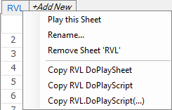

- **Play this Sheet** - execute given sheet.
- **Rename...** - change sheet tab name.
- **Remove Sheet '`<sheet name>`'** - delete sheet form the workbook.
- **Copy RVL DoPlaySheet** - copy call statement for the selected sheet for inserting into the other RVL sheet in the same workbook.
- **Copy RVL DoPlaySheet** - copy call statement for the selected sheet for inserting into the other RVL workbook.
- **Copy RVL.DoPlayScript(...)** - copy JavaScript code to execute this sheet (call sheet from JavaScript).

## Functions Object

Suppose we have some functions defined in the `User.js` file:

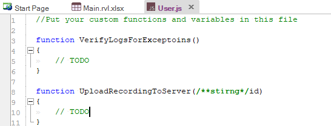

Calling JavaScript from RVL is done via the `Functions` Object. It is not available in the object repository and is only shown in RVL Objects dropdown:


Once selected it shows all user defined functions from the `User.js` file:


## File Extensions

RVL has following file extensions:

- `rvl.xlsx`
- `rvl.xls`

RVL is designed to be a simple grid language and it may be edited in any spreadsheet editor supporting `.xls` or `.xlsx` files (i.e. Microsoft Excel)

## RVL Editor Shortcuts

- ++shift+enter++ - inserts an empty line after the selected cell.
- ++ctrl+d++ - deletes the line of the selected cell.
- ++ctrl+p++ - reveals optional parameters for an action in the current line, acts as click on `Params` button on the RVL toolbar.

## RVL Toolbox

Since Rapise 6.7 you may use RVL Toolbox to quickly find RVL snippets, KB articles and documentation links. The toolbox is located on the right side of the RVL editor.

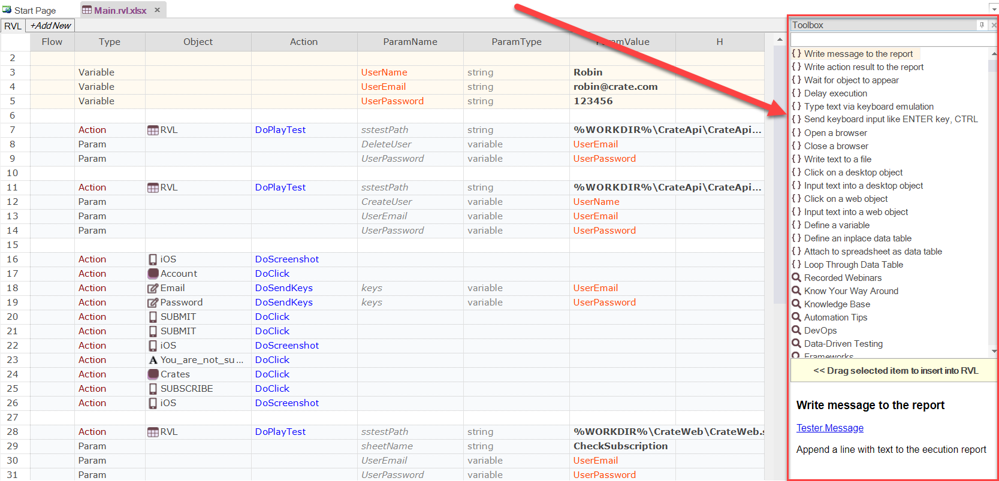

The toolbox consists of three parts.

1. Search field. Enter text here to filter the list of items.
2. List of items. Select an item to preview. Some of the items can be dragged right into RVL area.
3. Preview pane. It has description of selected item. Click links to get more information.

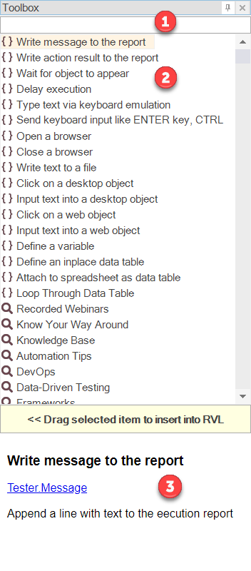

If you select an item in the toolbox and see a yellow box with text `Drag selected item to insert into RVL` you may drag the item to RVL area.

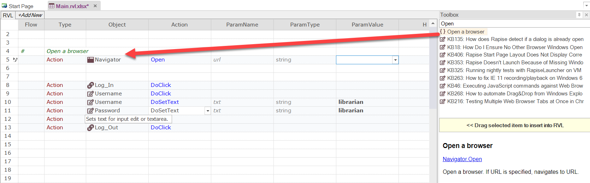

There is also and advanced way of using the toolbox:

1. Start typing what you want to do in Actions column (the line must be empty),
2. then hit ++enter++ and choose an item from the list using arrow keys,
3. then hit ++enter++ again to insert the snippet into RVL.

<iframe width="560" height="315" src="https://www.youtube.com/embed/rWgcl4eWyJ0" frameborder="0" allow="accelerometer; autoplay; clipboard-write; encrypted-media; gyroscope; picture-in-picture" allowfullscreen></iframe>

If you want to keep the toolbox hidden then unpin it.


Move mouse over the Toolbox label to reveal the list of items.

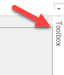

## Navigate to Definition (F12)

To quickly navigate to the location where a specific function or Page Object action is defined, follow these steps:

1. Click on the function name or action.
2. Press the F12 key.
3. Rapise will attempt to locate and open the corresponding definition.

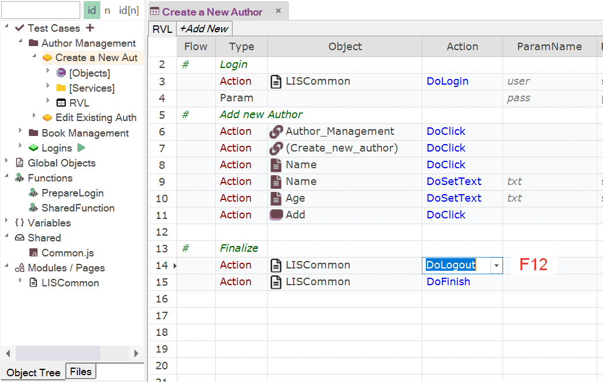

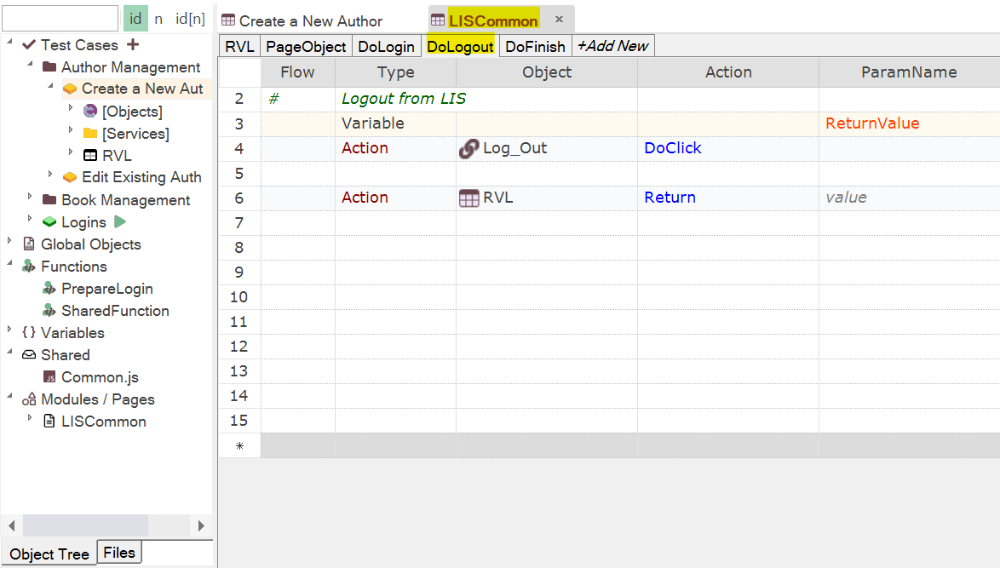

## Define a Map by Drag&Drop

When you drag and drop a spreadsheet (`.xlsx`) into RVL, a [map](/RVL/Maps.md) is created. This map refers to the data file using an absolute path, starting from the framework root represented by `%WORKDIR%`.

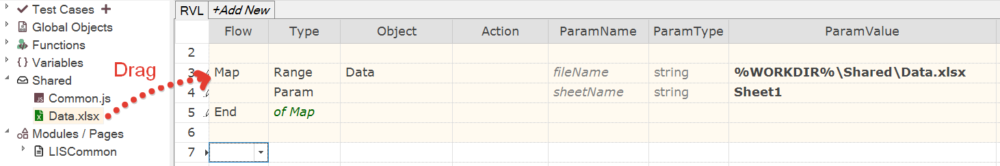

However, if you hold the ++shift++ key while performing the same action, the map is created with a relative path instead. This relative path is based on the current `rvl.xlsx` file.

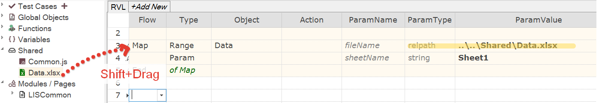

## DoPlayTest via Drag&Drop

When you drag and drop a test case into RVL, a `RVL.DoPlayTest` call is created. The call refers to the test case using an absolute path, starting from the framework root represented by `%WORKDIR%`.

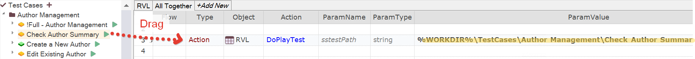

However, if you hold the ++shift++ key while performing the same action, the map is created with the test alias name (short name) instead:

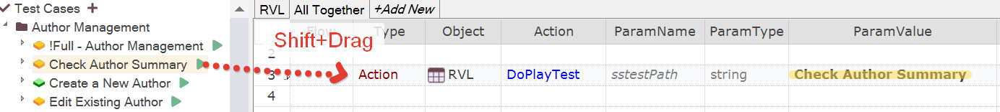

Short names are useful when all test cases have unique names. Usually it means longer naming, i.e. instead of `Invoices/Create` test case should be named `Invoices/Create new Invoice` so it does not collide with `Orders/Create`.

## Drag&Drop for DoPlayTest

When you drag and drop a [test case](/Guide/Frameworks/frameworks#test-cases) into RVL, it generates a `RVL.DoPlayTest` call. This call references the test case using an absolute path starting from the framework root, represented by `%WORKDIR%`.


However, if you hold the ++shift++ key while performing the same action, the same call is created with the test alias name (short name) instead:


Short names are particularly useful when each test case has a unique name. In such cases, longer naming conventions can be used to differentiate test cases, for example, using `Invoices/Create new Invoice` instead of `Invoices/Create` to avoid collisions with other test cases like `Orders/Create`.

## See Also

- [About RVL](visual_language.md)
- [Why RVL?](../RVL/Overview.md)
- [KB 357](https://www.inflectra.com/Support/KnowledgeBase/KB357.aspx) Data-driven testing with spreadsheets and RVL
- [KB 340](https://www.inflectra.com/Support/KnowledgeBase/KB340.aspx) How to Do a Nested Loop with Rapise Visual Language (RVL)
- [KB 371](https://www.inflectra.com/Support/KnowledgeBase/KB371.aspx) Sample Spira-Friendly Framework with Multiple RVLs and Common Library
