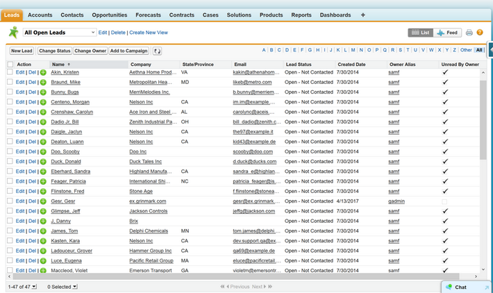

# Salesforce.com

## Overview

**Salesforce.com** is a cloud-based Customer Relationship Management (CRM) and Sales Force Automation (SFA) platform that is delivered as a Software as a Service (CRM) solution. It provides companies with an interface for case management and task management, and a system for automatically routing and escalating important events.


Rapise provides out of the box support for testing Salesforce.com and provides [additional libraries](recording_library.md) for making the testing even easier and more productive.

## Recording a Salesforce.com Test

**Salesforce.com** is completely web-based and you use a web browser to access the user interface. Therefore when recording a test using Rapise, you use the same web browser libraries that you use to record other web tests:

- Most of the Salesforce.com user interface will be tested using the **standard browser library** for your web browser of choice (e.g. Internet Explorer HTML, Firefox HTML, and Chrome HTML).
- In addition, there are special controls inside Salesforce.com that Rapise has specialized support for. For that reason you'll also see the DomSalesforce library added to your test as well as the browser one. This **DomSalesforce** library adds additional rules that identify certain Salesforce.com objects (e.g. the main Grid) to make testing easier.

When you record your first test, you'll see the following library selection code generated automatically by Rapise:

```javascript
g_load_libraries=["%g\_browserLibrary:Internet Explorer HTML%", "DomSalesforce"];
```

If you don’t see the **DomSalesforce** library listed in your test, then you will need to [manually change it](change_the_libraries_being_use.md) using the `[ ] Libraries` button on the tool menu.

## Tips for Interacting with Objects

Many of the screens in Salesforce.com use simple HTML form fields such as text boxes, dropdown lists, etc.:


Rapise will recognize these objects using the standard web browser HTML libraries.

***Salesforce.com Grid***
One of the the most important UI elements inside Salesforce.com is the sortable, filterable grid:



The Salesforce.com Grid is used in lots of different screens inside Salesforce.com (e.g. leads, quotes, etc.) and it is very common to need to interact with it in test scripts.

When you record operations on such a grid or simply learn the entire grid using ++ctrl+2++ you will learn the **SalesforceGrid** object
In additional to the standard HTML object methods and properties, you have [the following special functions that you can perform on the grid](/Libraries/DomSalesforceGrid/):

- **DoClickCell()** - Clicks the specified cell when you specify the x-index, y-index, the type of click (left-click, right-click, etc.).
- **DoClickText()** - Clicks on a specific text inside the grid.
- **GetCell** - Gets the text of the specified cell.
- **GetColumnCount** - Gets the number of columns in grid.
- **GetColumnName** - Gets the caption of a column.
- **GetRowCount** - Gets the number of rows in grid.

## See Also

- [Get the framework for testing Salesforce (github)](https://github.com/Inflectra/rapise-sfdc)
- [KB: Testing Visualforce components in Salesforce](https://www.inflectra.com/Support/KnowledgeBase/KB313.aspx)
- [Webinar: Testing Salesforce.com with Rapise](https://youtu.be/Ge24OgI0VJ8)
- [Webinar: Testing Salesforce Lightning with Rapise](https://youtu.be/2JBBMzYkil8)
