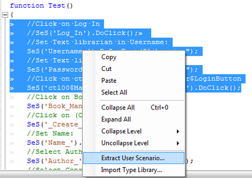

# Scenarios

## Purpose

Scenarios are a way to create reusable building blocks that can be incorporated into your test scripts. These scenarios can be either included as part of a purely automated test script, or they can be included into a predominantly [manual test script](semi_manual_testing.md).

## Creating Scenarios

Let's say for example that you have the following Rapise test that was recorded from our sample library information web application:
<!-- /* cSpell:disable */ -->
```javascript
function Test()
{
    //Click on Log In
    SeS('Log_In').DoClick();        
    //Set Text librarian in Username:
    SeS('Username_').DoSetText("librarian");
    //Set Text librarian in Password:
    SeS('Password_').DoSetText("librarian");
    //Click on ctl00$MainContent$LoginUser$LoginButton
    SeS('ctl00$MainContent$LoginUser$Logi').DoClick();
    //Click on Book Management
    SeS('Book_Management').DoClick();
    //Click on (Create new book)
    SeS('_Create_new_book__').DoClick();
    //Set Name:
    SeS('Name_').DoSetText(g_book_name);
    //Select Author:
    SeS('Author_').DoSelect(g_book_author);
    //Select Genre:
    SeS('Genre_').DoSelect(g_book_genre);
    //Click on ctl00$MainContent$btnSubmit
    SeS('ctl00$MainContent$btnSubmit').DoClick();
    //Click on Log Out
    SeS('Log_Out').DoClick();
}
```
<!-- /* cSpell:enable */ -->
If we want to break up this monolithic test into individual functions (called scenarios), simply highlight the test you want to extract (for example the Login steps):


Then right-click on the section and choose the option to **Extract User Scenario**:



Now in the dialog box that appears, give the scenario a name (e.g. Login):


This will extract the highlighted section into its own scenario.

In `Main.js` we get

```javascript
function Test()
{
    //Call scenario Login
    Login();

    //Click on Book Management
    SeS('Book_Management').DoClick();
    //Click on (Create new book)
    SeS('_Create_new_book__').DoClick();
    //Set Name:
    SeS('Name_').DoSetText(g_book_name);
    //Select Author:
    SeS('Author_').DoSelect(g_book_author);
    //Select Genre:
    SeS('Genre_').DoSelect(g_book_genre);
    //Click on ctl00$MainContent$btnSubmit
    SeS('ctl00$MainContent$btnSubmit').DoClick();
    //Click on Log Out
    SeS('Log_Out').DoClick();
}
```

In `User.js` we get
<!-- /* cSpell:disable */ -->
```javascript
/** @scenario Login */
function Login()
{
    //Click on Log In
    SeS('Log_In').DoClick();        
    //Set Text librarian in Username:
    SeS('Username_').DoSetText("librarian");
    //Set Text librarian in Password:
    SeS('Password_').DoSetText("librarian");
    //Click on ctl00$MainContent$LoginUser$LoginButton
    SeS('ctl00$MainContent$LoginUser$Logi').DoClick();
}
```
<!-- /* cSpell:enable */ -->
## Usage in Automated Tests

When you create a new test in Rapise it will contain a `Main.js` file that contains the main test code and a `User`.js file that contains any user-defined functions (called Scenarios). For example in the following test:

```javascript
function Test()
{
    Login();
    CreateBook(g_book_name, g_book_author, g_book_genre);
    Logout();
}
```

The test function calls three **scenarios** that comprise the main test. The scenarios themselves are JavaScript functions:
<!-- /* cSpell:disable */ -->
```javascript
/** @scenario Login */
function Login()
{
    //Click on Log In
    SeS('Log_In').DoClick();        
    //Set Text librarian in Username:
    SeS('Username_').DoSetText("librarian");
    //Set Text librarian in Password:
    SeS('Password_').DoSetText("librarian");
    //Click on ctl00$MainContent$LoginUser$LoginButton
    SeS('ctl00$MainContent$LoginUser$Logi').DoClick();
}

/** @scenario Logout */
function Logout()
{
    //Click on Log Out
    SeS('Log_Out').DoClick();
}

/** @scenario CreateBook */
function CreateBook(name, author, genre)
{
    //Click on Book Management
    SeS('Book_Management').DoClick();
    //Click on (Create new book)
    SeS('_Create_new_book__').DoClick();
    //Set Name:
    SeS('Name_').DoSetText(name);
    //Select Author:
    SeS('Author_').DoSelect(author);
    //Select Genre:
    SeS('Genre_').DoSelect(genre);
    //Click on ctl00$MainContent$btnSubmit
    SeS('ctl00$MainContent$btnSubmit').DoClick();

    //Verify that the Book is added to the grid
    //We need to xpath query the grid to see if any
    //added rows match the item added
    var tr = FindRowByName(name);
    Tester.Assert('Book was added successfully [TS:5]', tr.length != 0);
}
```
<!-- /* cSpell:enable */ -->
If you go to the [Object Tree](object_tree.md) you will see these user functions/scenarios displayed:


You can then drag and drop those into the test script editor to include in the main test script.

## Usage in Manual Tests

When you create a new test in Rapise it will contain a `Main.js` file that contains the main test code and a `User.js` file that contains any user-defined functions (called Scenarios). For example you may have the following scenario defined in the `User.js` file:
<!-- /* cSpell:disable */ -->
```javascript
/** @scenario Login */
function Login()
{
    //Click on Log In
    SeS('Log_In').DoClick();        
    //Set Text librarian in Username:
    SeS('Username_').DoSetText("librarian");
    //Set Text librarian in Password:
    SeS('Password_').DoSetText("librarian");
    //Click on ctl00$MainContent$LoginUser$LoginButton
    SeS('ctl00$MainContent$LoginUser$Logi').DoClick();
}
```
<!-- /* cSpell:enable */ -->
You can now include that in a [manual test step](semi_manual_testing.md), by simply making the test step description start with an "@" symbol to denote that it is a scenario:

```javascript
@Login();
```

Then when the manual test is executed, that one step will be passed to the scripting engine for automated execution.

## Example

If you open the **CreateNewBook** sample (located in `C:\\Users\\Public\\Documents\\Rapise\\Samples\\CreateNewBook`) you will see a test that has multiple scenarios.

## See Also

- [Semi-Manual Testing](semi_manual_testing.md)
- [Object Tree](object_tree.md)
