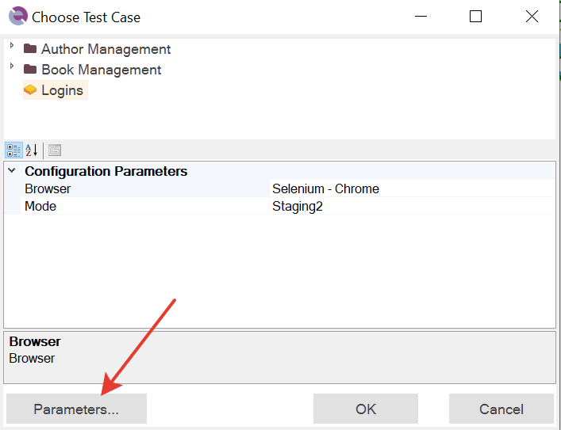
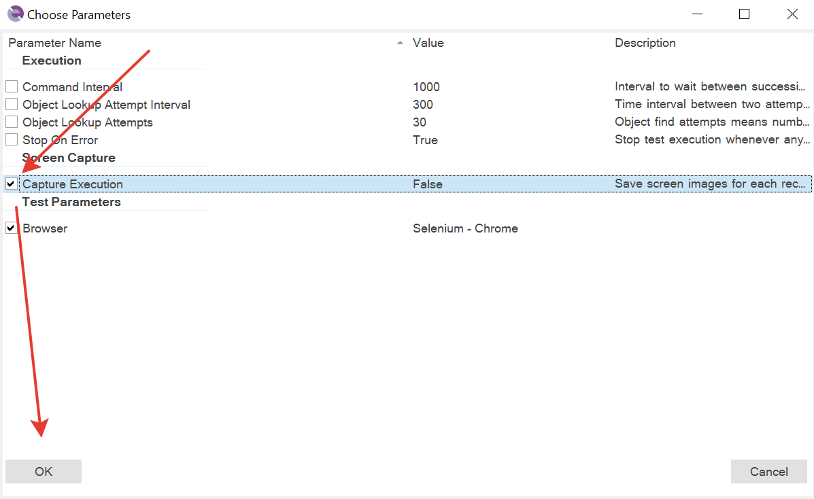
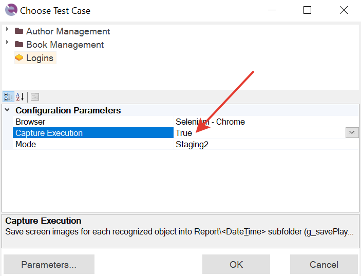
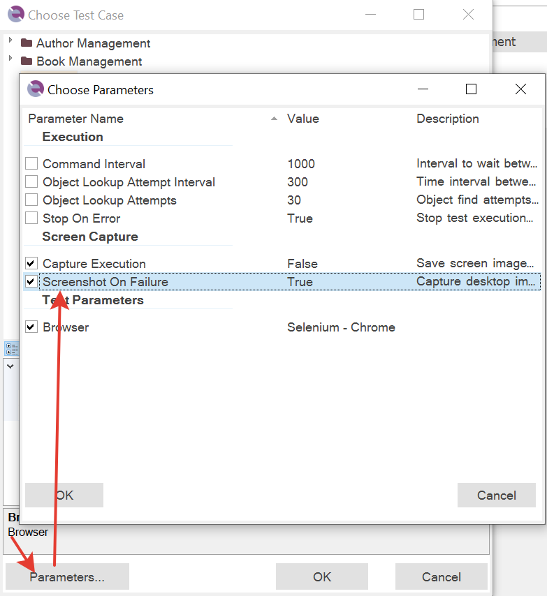
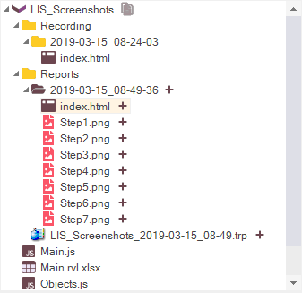
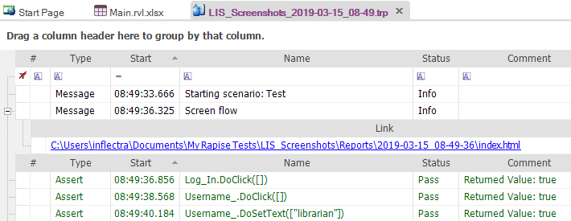
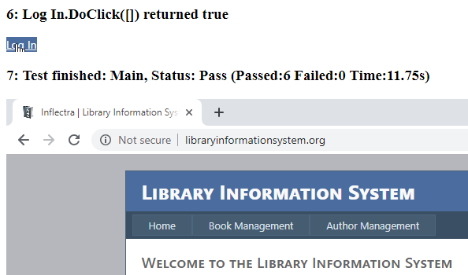
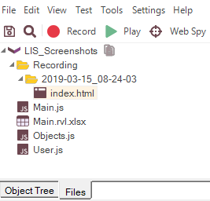
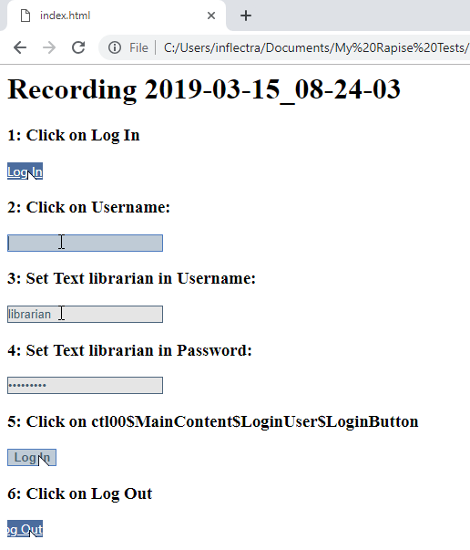

# Taking Screenshots

Taking screenshots during test playback may serve various purposes:

1. Provide clues for test failure analysis
2. Document test execution. It may be required by a company policy.
3. Screenshots can be used to generate test documentation and even user's guides.

Rapise can make screenshots automatically after every action or on-demand at specific points of test execution.

## Automatic Screenshots

To enable automatic screenshots after every action use [Screen Capture](settings_dialog.md#screen-capture) test settings.

> **Note:** Automatic screenshots are supported for Desktop and Web applications and not supported for Mobile.

## Screenshots in Framework Mode

Simplest way to enable screenshots is to use `Parameters...` section in the `Choose Test Case` dialog:

Then choose `Capture Execution`:

Pres OK, and set a value:

## Taking Screenshot when Test Fails

By default the option is enabled to take screenshot whenever test fails:

## Playback

If before execution you will set in [Screen Capture](settings_dialog.md#screen-capture)

- `Capture Cursor = True`
- `Capture Execution = True`
- `Widget Only = True`

then after playback Rapise will generate the screen flow document

Link to the document is also available in the report

Content of the document looks like

> **Note:** If an object is not available on screen after action on it then Rapise takes screenshot of the whole desktop window. You can see it in step #5 above, login button disappeared after clicking it.

> **Note**: Also Rapise always takes additional screenshot of the whole desktop window at the end of test execution. Even if the test was terminated because of a failed assertion. See step #7 below.

## Embed Screenshots Into Report

Execution screenshots described above are stored in the local file system and if a test report is uploaded to [SpiraTest](spiratest_integration.md) then these screenshots are not uploaded.

To embed screenshots into execution reports and make them available in [SpiraTest](spiratest_integration.md), set

- `Include in Report = True`

in [Screen Capture](settings_dialog.md#screen-capture) settings.

In Rapise screenshots are embedded before each action

Screenshots in SpiraTest

## Suppressing Screenshots

Sometimes it makes sense to temporarily disable screenshot capturing. Learn how to do this in

- [KB291](https://www.inflectra.com/Support/KnowledgeBase/KB291.aspx) How to Enable/Disable screenshots during script execution

## On-Demand Screenshots

It is also possible to take screenshots at specific points of test execution. The way of doing it depends on the test target.

## Desktop

This method works both for desktop applications and web applications running on the same machine as Rapise.

Use global [Tester](../Libraries/Tester.md) object and it's action to take screenshot of an object, specific window or whole desktop.

- [Tester.CaptureObjectImage](../Libraries/Tester.md#CaptureObjectImage)
- [Tester.CaptureWindowImage](../Libraries/Tester.md#CaptureWindowImage)
- [Tester.CaptureDesktopImage](../Libraries/Tester.md#CaptureDesktopImage)

## Web

This method works well if you plan to run a web test on remote machines via [Selenium WebDriver](selenium_webdriver.md).

Use global [Navigator](../Libraries/Navigator.md) object and it's [Navigator.DoScreenshot](../Libraries/Navigator.md#DoScreenshot) action.

## Mobile

To make a screenshot on mobile target use

- [Android.DoScreenshot](../Libraries/Android.md#DoScreenshot)
- [iOS.DoScreenshot](../Libraries/iOS.md#DoScreenshot)

## Recording

If before recording session you will set in [Screen Capture](settings_dialog.md#screen-capture)

- `Capture Cursor = True`
- `Capture Recording = True`
- `Widget Only = True`

then after recording Rapise will generate the screen flow HTML document

with content like

> **Note:** We recorded `Login/Logout` scenario on [Library Information System](http://libraryinformationsystem.org/) sample application, see [web testing tutorial](tutorial_record_and_playback.md) for more details.

## See Also

- [KB291](https://www.inflectra.com/Support/KnowledgeBase/KB291.aspx) How to Enable/Disable screenshots during script execution
