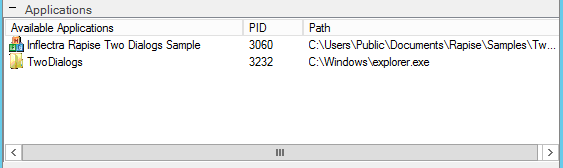
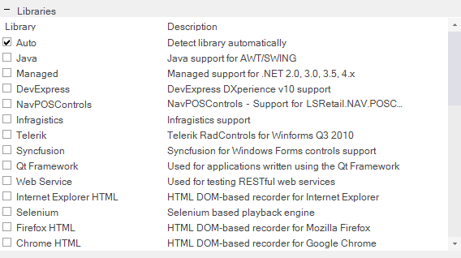
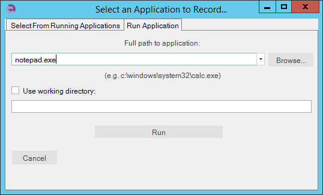

# Select an Application to Record... Dialog

## Purpose

The **Select an Application to Record**... dialog appears before [Recording](recording.md) when testing **desktop applications**.

It prompts the user to choose which program to record and which [Recording Library](recording_library.md) to use. If you are recording the same application for a second time, the dialog will not be shown. Instead, recording proceeds automatically with the last used application, if it is still available on screen.

## How To Open

To open the dialog, press the **Record** button on the toolbar.

## Available Applications

The **Available Applications** table lists all processes running when you open **the dialog**. If the process you would like to record is already open, you can select it from the table.

If the application you want to record is not listed:

1.  Click the **Refresh** button at the bottom of the dialog. This is useful if you launched the application after opening the dialog.
2.  Use the **Finder Tool** to manually select the application window. This is useful if the window is not shown in the Windows taskbar.

## Libraries

The **Library** table lists the available Recording Libraries. Select the one appropriate for the process or program you will record. If you select **Auto**, Rapise will attempt to choose the correct recording library for you. See the [Recording Library](recording_library.md) section for more information.

## Dialog Buttons

-   The **Cancel** button closes the dialog.
-   **Refresh** button: Press this button to refresh the **Available Applications** table. After refreshing, you will see processes that started after the dialog was opened.
-   **Select** button: To record a process from the **Available Applications** table, select the process and then press the `Select` button.

## Run Application Tab

-   **Full path to application**: If the program you want to record is not already open, you can specify its path here. If the program is already running, you can select it from the **Available Applications** table.
-   **Browse** button: Browse for an application to open and record.
-   **Use working directory**: To set a specific working directory when launching the application, check this box and enter a value for the **working directory**.
-   **Run** button: To record a program that is not currently open, enter its path in the **Path** text box and press the **Run** button.
-   The **Cancel** button closes the dialog.