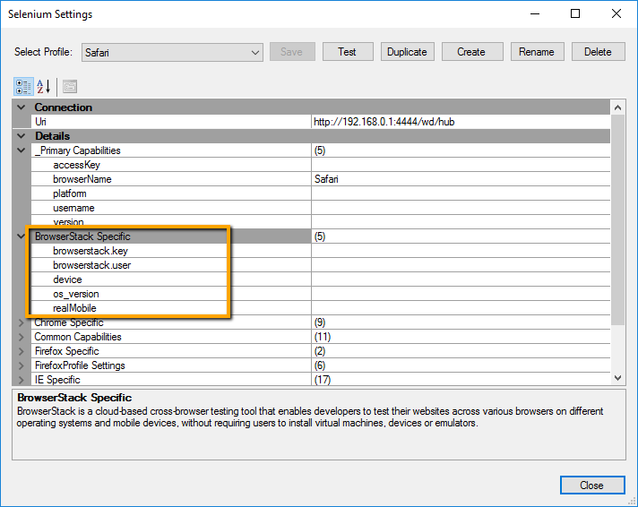

# Selenium Settings Dialog

## Purpose

This dialog box displays the list of Selenium targets that have been configured for use by Rapise and lets you create a new profile, modify a profile or make a new profile based on an existing one.


## How to Open

You can open this dialog box from the Rapise `Settings > Selenium` menu.

## Menu Options

This dialog box has the following menu options:

- **Select Profile** - This dropdown list lets you select a different Selenium profile to be displayed in the dialog.
- **Save** - This button will save the changes to the current Selenium profile.
- **Test** - This button will test the Connection (URL) from Rapise to [Selenium WebDriver](selenium_webdriver.md) (which is used to connect to the web browsers) and the connection from Selenium to the web browser.
- **Duplicate** - This button will create a new Selenium profile based on the currently viewed one.
- **Create** - This button will create a new empty Selenium profile that you can edit.
- **Rename** - This button will change the name of the current Selenium profile being edited.
- **Delete** - This button will delete the currently displayed Selenium profile. There is no undo, so be careful!

## Connection

This section lets you enter the URI used to connect to the [Selenium WebDriver](selenium_webdriver.md) server which hosts the web browsers being tested. It is typically of the form: 

```
http://server:4444/wd/hub
```
Where the port number used by Selenium is `4444` (default) and the `/wd/hub` suffix is added.

**If you are using web browsers on the local machine (that is running Rapise) you don't need to enter in a URI and can leave the entire field blank.**

## Details

This section has various settings, some of which are used by all web browsers, some are browser specific:

### Primary Capabilities

For the list of standard capabilities please refer to [Selenium repository](https://github.com/SeleniumHQ/selenium/wiki/DesiredCapabilities).

### BrowserStack Settings

In addition, there are some settings, unique to running Selenium WebDriver tests through the BrowserStack cloud platform:



- **BrowserStack**
    - **browserstack.key** - This needs to be populated with your Browserstack cloud access key.
    - **browserstack.user** - This needs to be populated with your Browserstack username.
    - **device** - Specifies a particular mobile device for the test environment (mobile web only).
    - **os_version** - Use this capability to specify the OS version of the device.
    - **realMobile** - Use this flag to test mobile websites on a physical mobile device.
