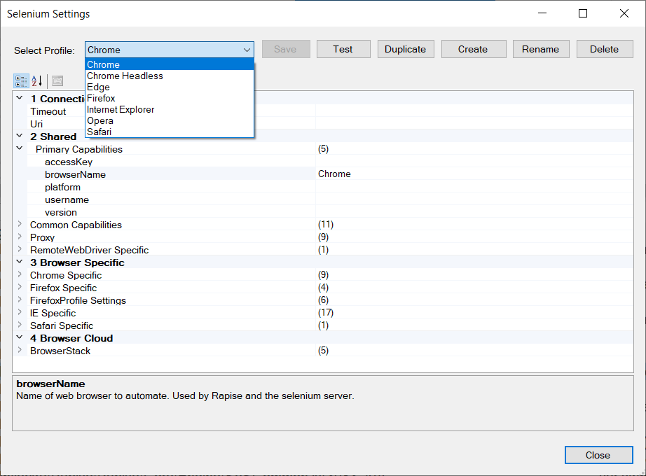
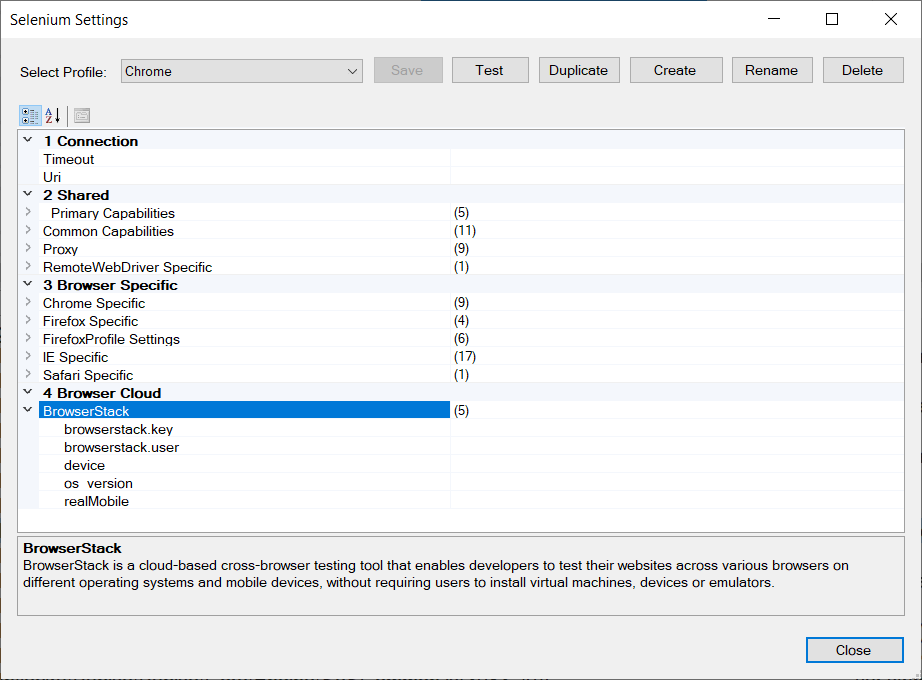

# Selenium Settings Dialog

## Selenium Profiles

Rapise can [playback web tests](cross_browser_testing.md) on Selenium nodes. Configure each Selenium node you need for testing in a separate profile using `Selenium Settings Dialog`.

This dialog box displays the list of `Selenium Profiles` and lets you create a new profile, modify a profile or make a new profile based on an existing one.



## How to Open

You can open this dialog box from the Rapise `Settings > Selenium` menu.

## Menu Options

This dialog box has the following menu options:

- **Select Profile** - This dropdown list lets you select a different Selenium profile to be displayed in the dialog.
- **Save** - This button will save the changes to the current Selenium profile.
- **Test** - This button will test the Connection (URL) from Rapise to [Selenium WebDriver](selenium_webdriver.md) (which is used to connect to the web browsers) and the connection from Selenium to the web browser.
- **Duplicate** - This button will create a new Selenium profile based on the currently viewed one.
- **Create** - This button will create a new empty Selenium profile that you can edit.
- **Rename** - This button will change the name of the current Selenium profile being edited.
- **Delete** - This button will delete the currently displayed Selenium profile. There is no undo, so be careful!

## Local Selenium Profiles

Rapise version 6.3+ enables creation of profiles local to a test. It allows storing profiles together with tests (inside `SpiraTest` or `Git` repository) and eliminates the need to configure profiles manually on each execution host.

To create a local profile just press `Duplicate` for one of global profiles and set `Local` checkbox before clicking `OK` button. Global and Local profile may have same name, in this case Local profile is used for execution.


If a test contains local Selenium profiles they can be seen in the dropdowns.


Local Selenium profiles are stored inside `<Test Root>\Profiles\SeleniumProfiles` folder.

## Profile Options

### Connection

This section lets you enter the URI used to connect to the [Selenium WebDriver](selenium_webdriver.md) server which hosts the web browsers being tested. It is typically of the form: 

```
http://server:4444/wd/hub
```
Where the port number used by Selenium is `4444` (default) and the `/wd/hub` suffix is added.

!!! important
    If you are using web browsers on the local machine (that is running Rapise) you don't need to enter in a URI and can leave the entire field blank.

### Shared

This section contains common capabilities.

### Browser Specific

In this section set browser specific options. Use `Chrome Specific` section for configuring both `Chrome` and `Edge` browsers.

### BrowserStack Settings

In addition, there are some settings, unique to running Selenium WebDriver tests through the BrowserStack cloud platform:



- **[BrowserStack](https://www.browserstack.com/automate?utm_source=rapise&utm_medium=partnered)**
    - **browserstack.key** - This needs to be populated with your [Browserstack](https://www.browserstack.com/automate?utm_source=rapise&utm_medium=partnered) cloud access key.
    - **browserstack.user** - This needs to be populated with your Browserstack username.
    - **device** - Specifies a particular mobile device for the test environment (mobile web only).
    - **os_version** - Use this capability to specify the OS version of the device.
    - **realMobile** - Use this flag to test mobile websites on a physical mobile device.

## Parameterizing a Profile

Since Rapise 8.3 it is possible to use [framework parameters](Frameworks/parameters.md) in browser profiles. The syntax is

```
{Parameter Name}
```

For example [permanent browser profile path](https://www.inflectra.com/Support/KnowledgeBase/KB686.aspx) can be defined by a framework parameter and then used as

```
["user-data-dir={UserDataDir}"]
```

Another example is setting [download folder location](https://www.inflectra.com/Support/KnowledgeBase/KB683.aspx).

```
{"download.default_directory": "{DownloadFolder}"}
```

Note that the values of parameters may have to contain double backslash as they must be valid escaped JavaScript strings.

```
UserDataDir=C:\\ProgramData\\Inflectra\\Rapise\\Temp\\Chrome
DownloadFolder=C:\\ProgramData\\Inflectra\\Rapise\\Temp\\Downloads
```


## See Also

- For the list of standard capabilities please refer to [Selenium repository](https://github.com/SeleniumHQ/selenium/wiki/DesiredCapabilities).