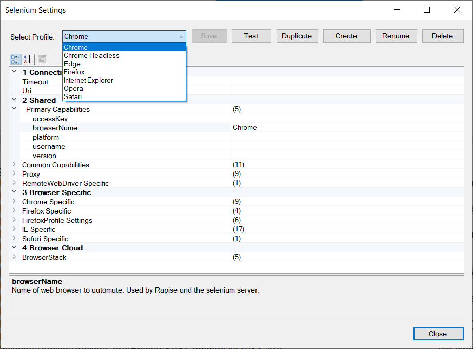
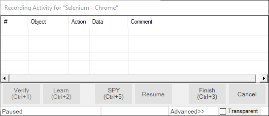
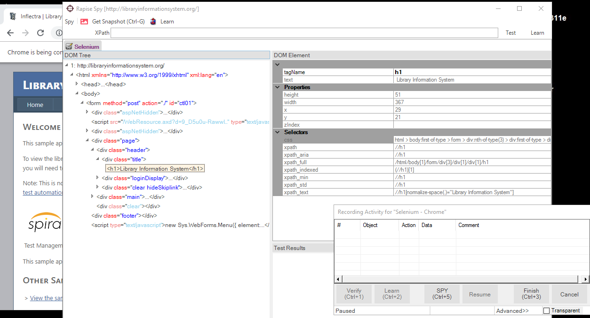
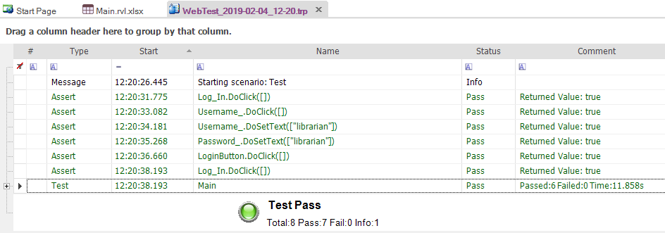

# Selenium WebDriver

When developing and testing a web application you naturally need to test it with [different web browsers](cross_browser_testing.md) and
multiple version of each web browser. With Rapise [natively](browser_settings.md) you can record a test script using one browser and then play it back using **Mozilla Firefox, Google Chrome or Microsoft Internet Explorer**.

In addition, you can use Rapise with the open-source **Selenium WebDriver framework** to play back the same tests against other browsers
such as **Apple Safari and Opera** (as well as IE, Firefox and Chrome). You can also use Rapise to write [native Selenium code](using_native_selenium_code.md) for cases where you want to use existing Selenium WebDriver logic.

## Playing & Recording Tests

Once you have [installed and configured the integration between Rapise and Selenium](setting_up_selenium.md), we shall discuss how to use Selenium with Rapise to record and play tests.

Now one of the important points is that there are some limitations as to the operations that can be performed using Selenium-based web browsers as opposed to the native browsers supported by Rapise:

**Feature**| **Rapise Native Browser**| **Selenium Browser**
:--        |:--                       |:--
Learn HTML Objects| Yes| **(Only in Web Spy)**
Record HTML Events| Yes| **No**
Playback HTML Events| Yes| Yes
Web Spy| Yes| Yes
Learn Java Applets| Yes| **No**
Manual Testing| Yes| **No**

So if you are planning on using Rapise to record a test script by clicking HTML objects and having Rapise create the script using the
learned objects and adding the events (DoClick, SetText, etc.) then you will need to use one of the native browsers (Chrome, IE, Firefox) to create the test script. You can then playback the same test in either the native or Selenium browsers.

If you are planning on using Rapise to learn objects using the Web Spy, and then create the test script from those objects by either dragging the object methods and properties from the Object Tree into the test script or just using Intellisense to type the methods (DoClick, SetText, etc.) then you can use either a native or Selenium web browser just as easily.

For most users, the primary reason for using the Selenium web browsers will be to playback their tests on a greater number of browsers or to leverage existing [Selenium WebDriver scripts created outside of Rapise](using_native_selenium_code.md).

## Managing the Selenium Profiles

Rapise allows you to maintain different profiles for your different installed Selenium web browsers (both on the same machine as Rapise and also those running on a remote Selenium WebDriver server), To see the different [Selenium profiles](selenium_settings_dialog.md),
in the main menu select `Settings > Selenium`. It will bring up the [Selenium profile manager](selenium_settings_dialog.md):

By default there is one profile for each of the Selenium WebDriver supported web browsers (Chrome, Firefox, Internet Explorer, Opera,
Safari). However you can clone and change the profiles if you want to have different versions of the browsers (e.g. a local instance of
Firefox and one running on a remote Selenium server).

Most users will only need to change the **Uri** field of the Safari web browser since the defaults are typically sufficient for most testing needs.

## Recording using Selenium

To start [recording](recording.md) a web testing using a Selenium WebDriver based browser, make sure you change the test’s web browser parameter to one of the Selenium profiles:

When you click the `Record` button on the main toolbar you will see the following [**Recording Activity Dialog**](recording_activity_dialog.md):

You will notice that the `Verify` and `Learn` options are not available. If you want to use these tools you will need
to use a [native browser](browser_settings.md) (non-Selenium) instead.

When using a Selenium profile for recording, you will need to use the [**Spy (Ctrl+5)**](object_spy.md) tool to do the learning of objects on the web page. This brings up the [Web Spy](web_spy.md):

When using the [Web Spy](web_spy.md) with a Selenium profile you will notice that the web browser icon / name shows “Selenium” rather than the browser name and the option to Track an item (CTRL+T) is not present. That means you need to **select the HTML
DOM object in the DOM Tree and learn it from there** (rather than clicking on the web page itself which is possible when using a native
browser profile).

When you choose to Learn an object in the DOM tree it will be displayed in the [Recording Activity Dialog](recording_activity_dialog.md) as a new Learned Object:

Objects Learned using a Selenium profile will be added to the Rapise [Object Tree](object_tree.md) in the usual way and as is typical with [Learning](learn_object.md), you have the option to specify an Action in the Recording Activity Grid (e.g. change
Learn to Click) in which case test script code is also generated.

**Tip:** *Due to the inherent limitations in recording using a Selenium browser profile (vs. a native browser profile) most users will record their scripts using a native browser and then use Selenium primarily for debugging using the Web Spy and playback.*

## Playback using Selenium

To playback a web test using a Selenium web browser profile, simply choose the appropriate profile in the dropdown located in the top right corner of the main Rapise window:

Then click the `Play` button on the main toolbar. The test will now start [execution](playback.md). Unlike recording there is nothing different in the way Rapise handles the [playback](playback.md) of a Selenium test. The only difference will be that if the test uses non-HTML technologies such as Java, etc. those parts of the test will fail.

