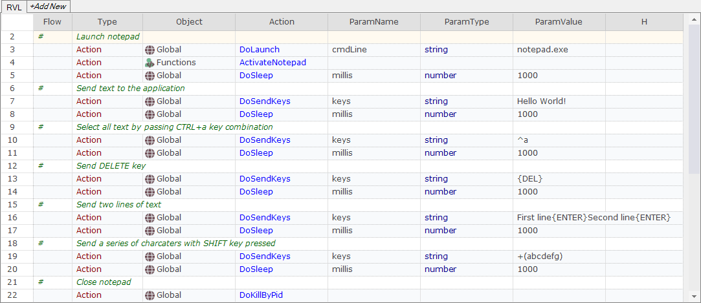

# Sending Special Keys to the Current Application

## Overview

You can use the [Global.DoSendKeys](/Libraries/Global/#DoSendKeys) action to send keypresses to the current application. Sometimes you will want to send special control keys to the application (e.g. `Page Down`, or `CTRL + Key`). This article explains the way to do this.


## Special Characters

To send special characters, you just use the list available in the Windows API `SendKeys.Send` function:

[http://msdn.microsoft.com/en-us/library/system.windows.forms.sendkeys.send(v=vs.110).aspx](http://msdn.microsoft.com/en-us/library/system.windows.forms.sendkeys.send%28v=vs.110%29.aspx)

To specify characters that aren't displayed when you press a key, such as `ENTER` or `TAB`, and keys that represent actions rather than characters, use the codes in the following table:

| **Key**                                | **Code**                            |
| -------------------------------------- | ----------------------------------- |
| BACKSPACE                              | {BACKSPACE}, {BS}, or {BKSP}        |
| BREAK                                  | {BREAK}                             |
| CAPS LOCK                              | {CAPSLOCK}                          |
| DEL or DELETE                          | {DELETE} or {DEL}                   |
| DOWN ARROW                             | {DOWN}                              |
| END                                    | {END}                               |
| ENTER                                  | {ENTER} or ~                        |
| ESC                                    | {ESC}                               |
| HELP                                   | {HELP}                              |
| HOME                                   | {HOME}                              |
| INS or INSERT                          | {INSERT} or {INS}                   |
| LEFT ARROW                             | {LEFT}                              |
| NUM LOCK                               | {NUMLOCK}                           |
| PAGE DOWN                              | {PGDN}                              |
| PAGE UP                                | {PGUP}                              |
| PRINT SCREEN                           | {PRTSC} (reserved for future use)   |
| RIGHT ARROW                            | {RIGHT}                             |
| SCROLL LOCK                            | {SCROLLLOCK}                        |
| TAB                                    | {TAB}                               |
| UP ARROW                               | {UP}                                |
| F1                                     | {F1}                                |
| F2                                     | {F2}                                |
| F3                                     | {F3}                                |
| F4                                     | {F4}                                |
| F5                                     | {F5}                                |
| F6                                     | {F6}                                |
| F7                                     | {F7}                                |
| F8                                     | {F8}                                |
| F9                                     | {F9}                                |
| F10                                    | {F10}                               |
| F11                                    | {F11}                               |
| F12                                    | {F12}                               |
| F13                                    | {F13}                               |
| F14                                    | {F14}                               |
| F15                                    | {F15}                               |
| F16                                    | {F16}                               |
| Keypad add                             | {ADD}                               |
| Keypad subtract                        | {SUBTRACT}                          |
| Keypad multiply                        | {MULTIPLY}                          |
| Keypad divide                          | {DIVIDE}                            |

The plus sign (+), caret (^), percent sign (%), tilde (~), and parentheses () have special meanings to SendKeys. To specify one of these characters, enclose it within braces ({}). For example, to specify the plus sign, use "{+}". To specify brace characters, use "{{}" and "{}}".

## SHIFT, CTRL and ALT

To specify keys combined with any combination of the SHIFT, CTRL, and ALT keys, precede the key code with one or more of the following codes:

| **Key**   | **Code**  |
| --------- | --------- |
| SHIFT     | +         |
| CTRL      | ^         |
| ALT       | %         |

## Example

In this example Rapise sends various key combinations to Windows Notepad.

> Note: [Global.DoSleep](/Libraries/Global/#DoSleep) is used to slow down test execution and make test steps visible.

**RVL version**



**JavaScript version**

```javascript
// Launch notepad
Global.DoLaunch("notepad.exe");
// Set focus to notepad
ActivateNotepad();
Global.DoSleep(1000);
// Send text to the application
Global.DoSendKeys("Hello World!");
Global.DoSleep(1000);
// Select all text by passing CTRL+a key combination
Global.DoSendKeys("^a");
Global.DoSleep(1000);
// Send DELETE key
Global.DoSendKeys("{DEL}");
Global.DoSleep(1000);
// Send two lines of text
Global.DoSendKeys("First line{ENTER}Second line{ENTER}");
Global.DoSleep(1000);
// Send a series of charcaters with SHIFT key pressed
Global.DoSendKeys("+(abcdefg)");
Global.DoSleep(1000);
// Close notepad
Global.DoKillByPid();
```

To run RVL or JavaScript version of this example place the following function to User.js.

```javascript
function ActivateNotepad()
{
    var wnd = g_util.FindWindow("regex:.*", "Untitled - Notepad");
    if (wnd)
    {
        wnd.SetFocus();
    }
}
```

## See Also

- [How-Tos](howtos.md)