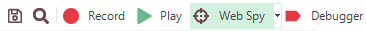

# Object Spy Dialog

## Purpose

The **Spy dialog** is used to investigate hierarchy of UI elements in the application under test.

## How to Open

There are three ways to open the Spy dialog:

1. Click the **Spy** button on the toolbar

    

2. Select `Tools > Spy` from the main menu
3. Click the **Spy** button on the [Recording Activity Dialog](recording_activity_dialog.md)

    > Note: If you use this method, the dialog has an extra **Learn Object** button.

## Choosing the type of Spy

You can change the type of Spy that will be launched by clicking on the down arrow to the right of the Spy icon in the main application toolbar:

There are [**six** types of Spy available](object_spy.md).

## See Also

- [Object Spy](object_spy.md)
