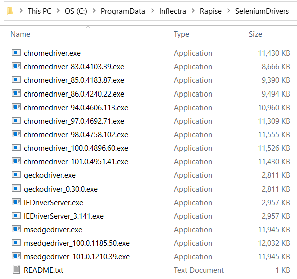
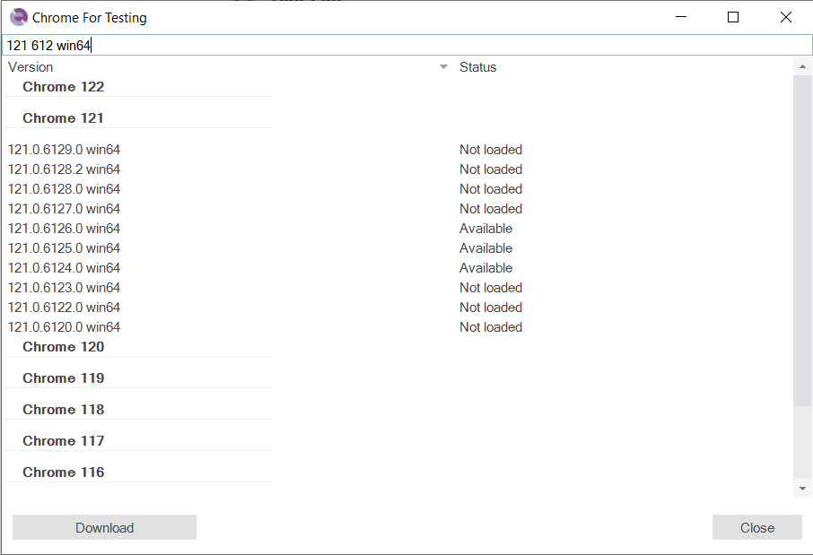
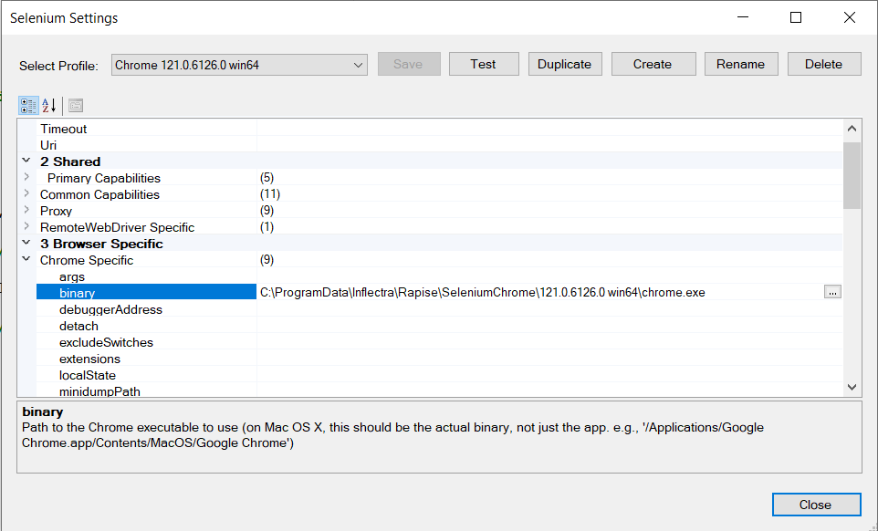

# Setting Up Selenium

This section describes the process for setting up Rapise to work with [Selenium](selenium_webdriver.md). Since Rapise is a Windows® application, you can use a single computer running Rapise to test with the following web browsers:

- Google Chrome
- Microsoft Edge
- Internet Explorer
- Mozilla Firefox

However, because Safari only runs on Apple Mac computers, testing with Apple Safari requires two computers: a Mac running Safari and a PC running Rapise.


## Configuring Selenium on a PC

Once Rapise is installed on your local computer, you need to perform the following steps to configure each web browser for use with Selenium and Rapise:

### Rapise 7.3+

The process of configuring Rapise for interaction with browsers via Selenium WebDriver is now fully automatic.

Rapise downloads WebDriver executables (chromedriver.exe, geckodriver.exe, etc.) when needed. It automatically detects the version of the required driver executable for both standalone and embedded browsers (e.g., Chrome in Microsoft Teams, Skype, Microsoft Unified Service Desk, etc.). Each downloaded driver executable is saved with version information in its name. Rapise automatically switches executables based on the executed test.

Here is an example of the

```
c:\ProgramData\Inflectra\Rapise\SeleniumDrivers 
```

folder on a machine with Rapise:

{width="474px"}
### Rapise 7.2

This method is applicable to all browsers except Safari.

1.  Open [Selenium Settings Dialog](selenium_settings_dialog.md)
2.  Select the desired profile.
3.  Configure profile settings.
4.  Press the `Test` button on the toolbar.

If the Selenium driver for the selected browser is not yet installed or is not compatible with the current version of the browser, Rapise will then prompt you. If you answer `Yes`, Rapise will download the driver executable and place it into

```
c:\ProgramData\Inflectra\Rapise\SeleniumDrivers 
```

This is the default folder where Rapise searches for Selenium drivers.

To run tests that use Selenium profiles on machines without downloaded Selenium drivers, you can add the following into `TestInit` function:

```javascript
WebDriver.DownloadDriver();
```

#### See Also

- [WebDriver.DownloadDriver](../Libraries/WebDriver.md#downloaddriver)

### Legacy

#### Chrome

To use Selenium with Google Chrome, you will need to download the latest version of ChromeDriver:

<http://chromedriver.storage.googleapis.com/index.html>

At the time of writing, the list of versions was:


Clicking the folder for the latest version displays the various files available for download:


Download **chromedriver_win32.zip** to your local PC.

The **chromedriver.exe** file inside the zip archive needs to be copied into the **C:\\Program Files
(x86)\\Inflectra\\Rapise\\Bin** folder (or your Rapise installation directory).

#### Firefox

To use Selenium with Mozilla Firefox, download the latest version of GeckoDriver:

<https://github.com/mozilla/geckodriver/releases>

Download **geckodriver-vx.xx.x-win32.zip** to your local PC.


The **geckodriver.exe** file inside the zip archive needs to be copied into the **C:\\Program Files
(x86)\\Inflectra\\Rapise\\Bin** folder (or your Rapise installation directory).

#### Microsoft Edge

To use Selenium with Microsoft Edge, download the latest version of Edge WebDriver from the Microsoft website:

<https://developer.microsoft.com/en-us/microsoft-edge/tools/webdriver/#downloads>


Create a new folder on your local PC, named:

**C:\\Program Files (x86)\\Microsoft Web Driver**

Download **MicrosoftWebDriver.exe** to the local folder you just created:


#### Internet Explorer

To use Selenium with Internet Explorer, download the latest version of IEDriver:

<http://selenium-release.storage.googleapis.com/index.html>

At the time of writing, the list of versions was:


Clicking the folder for the latest version displays the various files available for download:


Download **IEDriverServer_XXXX_X.X.X.zip** to your local PC:

- IEDriverServer\_Win32\_X.X.X.zip (for 32-bit Internet Explorer)
- IEDriverServer\_x64\_X.X.X.zip (for 64-bit Internet Explorer)

The **IEDriverServer.exe** file inside the zip archive needs to be copied into the **C:\\Program Files
(x86)\\Inflectra\\Rapise\\Bin** folder (or your Rapise installation directory).

## Chrome for Testing

In 2023, Google [introduced](https://developer.chrome.com/blog/chrome-for-testing) `Chrome for Testing`—a new Chrome flavor that specifically targets web app testing and automation use cases. It addresses the problem of `auto-update: great for users, painful for developers`. In Rapise, we implemented an easy way to manage `Chrome for Testing` binaries. It allows for downloading Chrome binaries and automatic creation of [browser profiles](selenium_settings_dialog.md#selenium-profiles).

### Chrome for Testing Dialog

To open the `Chrome for Testing` dialog, use the main menu `Tools > Chrome for Testing`. This will display a list of available Chrome versions.



The list is retrieved from:

```
https://googlechromelabs.github.io/chrome-for-testing/known-good-versions-with-downloads.json
```

#### Filters

You can filter the list by using search tokens separated by spaces; Rapise will search within the text of the **Version** and **Status** columns. A space serves as an AND logical operator. Here are a few filter examples:

-   `available` - Displays all downloaded Chrome versions.
-   `121 win64` - Finds all 64-bit versions of Chrome whose version number contains '121'.

#### Actions

-   When a `Not loaded` version is selected, use the `Download` button to download the binaries and create a profile.
-   When an `Available` version is selected, the button name changes to `Create Profile`; use it to create a profile referencing the selected Chrome version.



#### Binaries Location

Chrome binaries are downloaded to:

```
c:\ProgramData\Inflectra\Rapise\SeleniumChrome
```

## Updating WebDriver DLLs in Rapise

If the version of WebDriver DLLs shipped with Rapise is not compatible with your browser, you can update the corresponding DLLs. Go to the main Selenium website: [http://www.seleniumhq.org/download/](http://www.seleniumhq.org/download/) and download **C# WebDriver Bindings**:


Download **Selenium-dotnet-x.x.x.zip** from the website. Unzip the archive, then navigate to the **net40** subfolder, extract the following two files, and copy them into the **C:\\Program Files (x86)\\Inflectra\\Rapise\\Bin** folder (or your Rapise installation directory):

-   WebDriver.dll
-   WebDriver.Support.dll

*Note: You must close Rapise before copying these files into the Bin folder.*

## Installing Selenium on a Mac

The primary reason for running Selenium on a Mac is to execute tests against the Safari web browser. While you can also use the Mac to test with Firefox, Opera, and Chrome, we do not recommend this approach, as it adds needless complexity.

### Safari

First, download the latest version of the Selenium server for Apple Mac computers:

<http://selenium-release.storage.googleapis.com/index.html>

At the time of writing, the list of versions was:


Clicking the folder for the latest version displays the various files available for download:


Download **selenium-server-standalone-X.XX.X.jar** to the Mac.

Run this Java application by double-clicking the downloaded .JAR file in Finder. This will start the Selenium server.

*Note: You must have Java (ideally the latest version) installed on the Mac first.*

You are now ready to test web applications in Safari. The final step is to tell Rapise where to find that Selenium instance. To do this, open Rapise (on your PC), click `Settings > Selenium`, and then select the **Safari** profile:


Now, change the **Uri** field to point to your Mac. The URI format is:

-   http://&lt;IP or DNS name of MAC computer&gt;:4444/wd/hub

(for example it could be `http://test-mac01.local:4444/wd/hub` or `http://192.168.0.52:4444/wd/hub`)

### See Also
- [Testing with WebDriver in Safari](https://developer.apple.com/documentation/webkit/testing_with_webdriver_in_safari)